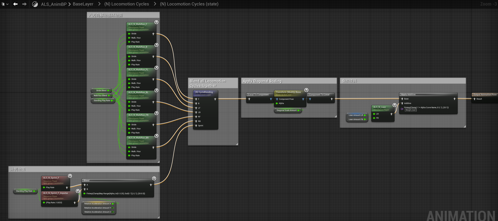
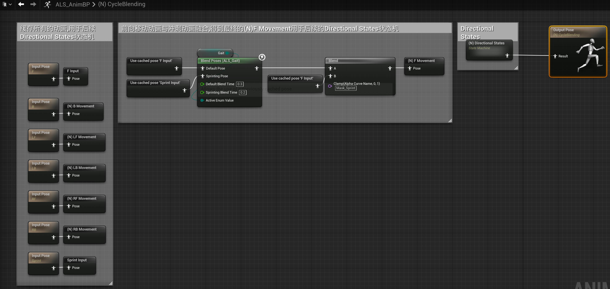
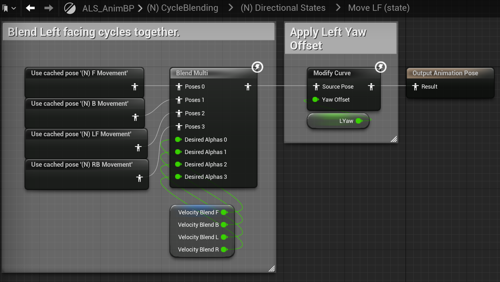
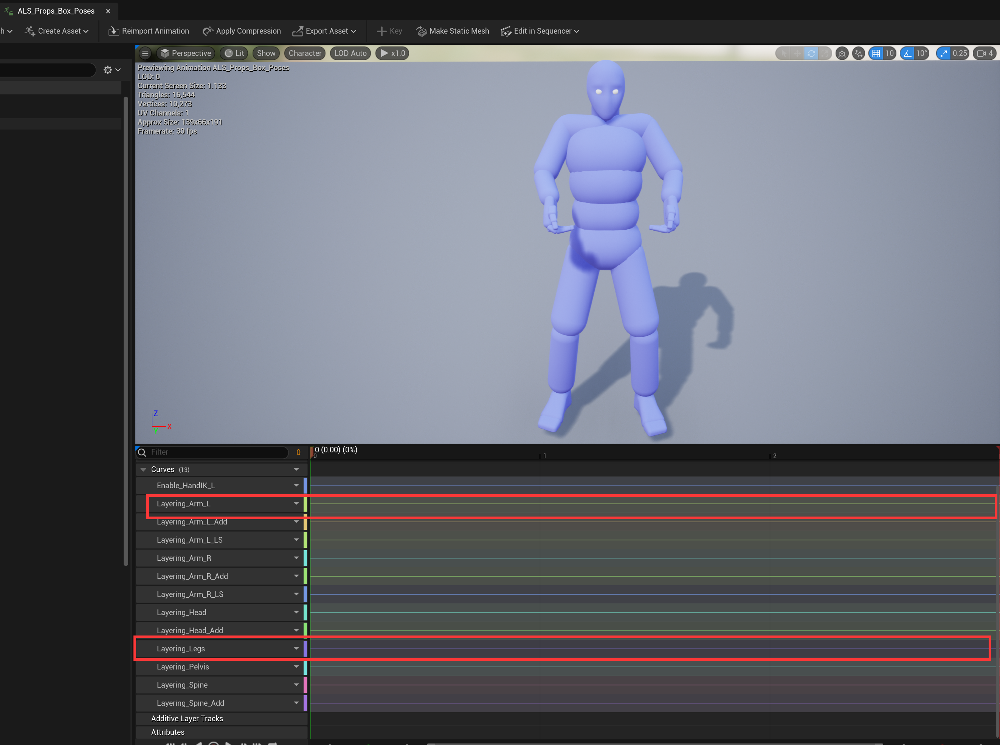

## Animation Blueprint

ALS的动画蓝图部分逻辑划分十分清晰,从左到右被不同颜色的注释框圈出来的依次是基础动画->瞄准动画->IK->布娃娃系统.

基础动画的输出由全身动画BaseLayer,上半身叠加动画OverLayLayer以及静止动作BasePoses三个部分的输出混合得到.

本文主要分析LayerBlending部分逻辑的实现,如下图:

红色箭头表示状态机间的引用关系,也可以理解为箭头源是子状态机,指向目标是父状态机.

(N) XXX States是站立姿势的动画状态机,(CLF) XXX States则是蹲姿的动画状态机.两种状态机的实现逻辑十分相似,站姿状态下,角色会有冲刺,转身等细节叠加,会比蹲姿状态机更为复杂.

## LocomotionCycles

LocomotionCycles状态机实现了角色移动状态下的状态机.

 | 
:---:|:---:
|MoveFoward|MoveForwardLeft|

首先用StrideBlend(步幅),WalkRunBlend(走/跑)两个参数控制动画融合(BlendSpace2D)得到六方向移动循环动画.

(N) CycleBlending这部分则是将生成的六方向移动动画缓存,并将前向移动的动画与冲刺动画融合,得到最终的(N)FMovement用于Directional States状态机.

这里为什么是六方向移动循环动画[F,B,FL,BL,FR,BR]而不是[前,后,左,右,左前,右前,左后,右后]八个方向的动画?实际上这里的FL(左前)移动动画是角色胸口朝向左前的正左移动动画,同理BL,FR,BR也只是胸口朝向不同的正左正右的移动动画,实际的左前移动动画是F和FL融合而成.

## Directional States状态机

Directional States状态机是六个状态间的切换.与前面的六方向移动动画对应,这里的Move LF,Move RF,Move LB,Move RB也是胸口面朝不同方向的移动状态,真正的斜向移动动画则是在子层级进行动画融合来实现的.

### 状态构成

以Move F为例:

MoveF输出动画由FMovement,BMovement,LFMovement,RFMovement四个动画用多引脚动画融合而成,控制这四个动画融合的参数为VelocityBlend[F,B,L,R],计算过程位于ALS_AnimBP->Calculate Velocity Blend.

首先由移动速度方向(MovementComponent.Velocity)与Character的旋转方向计算相对旋转方向LocRelativeVelocityDir,并归一化为RelativeDirection.

再根据根据相对旋转方向RelativeDirection的x,y值计算F(前),B(后),L(左),R(右).

VelocityBlend.F=Clamp(RelativeDirection.x,0,1)

VelocityBlend.B=ABS(Clamp(RelativeDirection.x,-1,0))

VelocityBlend.L=ABS(Clamp(RelativeDirection.y,-1,0))

VelocityBlend.R=Clamp(RelativeDirection.y,0,1)

考虑极端的正前,后,左,右移动,VelocityBlend变量以及MoveF这个状态的输出分别为:

VelocityBlend=(1,0,0,0),MoveFState=cachedPos'(N) F Movement'

VelocityBlend=(0,1,0,0),MoveFState=cachedPos'(N) B Movement'

VelocityBlend=(0,0,1,0),MoveFState=cachedPos'(N) LF Movement'

VelocityBlend=(0,0,0,1),MoveFState=cachedPos'(N) RF Movement'

其余的情况的输出则是其中两组动画(F,B)与(LF,RF)的融合.

其他状态的构成与MoveF类似,不过为了左前移动<->右前移动,左后移动<->右后移动的切换自然,左右四个状态(LF,LB,RF,RB)的动画融合有一些变化:

|
|:---:|:---:|
|Move LF|Move RB|

以MoveLF状态为例,MoveLF动画融合中VelocityBlend.R参数控制的动画是cachedPos '(N) RB Movement'而不是MoveF中的cachedPos '(N) RF Movement',与Move RB的动画融合完全一致.

这样设计的目的是从左前移动切换到右前移动时,状态机的切换路径不是MoveLF->MoveRF而是MoveLF->MoveRB->MoveRF.

若是直接从MoveLF->MoveRF切换,人物的胸口朝向会瞬间切换(面向左前瞬切到面向右前)显得不自然.而MoveLF->MoveRB的切换过程中,胸口的面向不会发生变化,MoveRB->MoveRF的切换则会有一个融合过渡的过程.

### 状态切换

状态机中的每个状态间的Transition都与MovementDirection变量相关,例如图中绿色为MovementDirection==Forward,紫色为MovementDirection==Right...

MovementDirection的计算逻辑位于ALS_AnimBP->Calculate Movement Direction

(ps:AmingRotation的获取位于ALS_Base_CharacterBP->BPI Get Essential ,其实就是将ControlRotation赋值给AimingRotation)

在VelocityDirection模式下(Character面朝速度方向,多数第三人称视角自由旋转相机的移动模式可以归为此类)MovementDirection的计算结果永远为Forward.

在LookingDirection和Animing模式下(Character面朝相机方向,第三人称视角锁定敌人的模式可以归为此类)MovementDirection由移动速度方向(MovementComponent.Velocity)与相机旋转方向(ControlRotation)的夹角计算得到,可以简单理解为两者夹角在-70°~70°为Forward,70°~110°为Right,110°~-110°为Backward,-110°~-70°为Left.

详细的计算过程为

## LocomotionDetail

LocomotionDetail会引用Locomotion Cycles的输出,并进一步叠加细节动画:

(N) Walking和(N) Running会直接使用Locomotion Cycles输出的动画,(N)Run Start和(N) Walk->Run则是叠加了倾斜动画:

(N)RunStart状态中使用VelocityBlend(也用于Locomotion Cycles->Directional States)融合四个方向的倾斜动画并叠加在基础的移动动画上:

|
|:---:|:---:|
|ALS_N_LocoDetail_Accel_F|ALS_N_LocoDetail_Accel_L|

### 状态切换

LocomotionDetail状态机中Transition多与Gait变量相关,实际上(N)Walking->(N)Running的过程就是Gait值由Walking切换到(Running,Sprinting).

Gait一个有三个枚举值(Walking,Running,Sprinting)的枚举类型,计算逻辑位于ALS_Base_CharacterBP->Update Character Movement:

Get Allowed Gait会计算当前允许的最大Gait(Walking->Running->Sprinting是依次增大的)

Desired Gait在PlayerInputGraph中根据输入设置:

GetActualGait是实际计算动画蓝图中用到的Gait过程,主要的逻辑就是根据当前速度是否大于WalkSpeed,RunSpeed...来决定Gait类型.

## Locomotion States

到LocomotionDetail这一层的状态机已经完成了运动状态的动画,Locomotion States将会引用LocomotionDetail的输出,实现运动状态与静止状态的切换:

(N) Moving直接使用了Locomotion Detail的输出:

(N) Not Moving则是播放静止动画:

(N) Stop需要处理左脚右脚停止的逻辑,是一个较为复杂的状态机:

## Crouching Left Forward States

(N) Locomotion Cycles -> (N)Locomotion Detail ->(N) Locomotion States实现了站立姿势下的动画状态机,(CLF) Locomotion Cycles-> (CLF) Locomotion States则是完成了蹲姿下的状态机.

蹲姿的运动状态循环与站姿的运动状态循环实现逻辑十分类似,不过蹲姿简化了站立运动的步幅(StrideBlend)与行走状态(WalkRunBlend),因此直接使用了原始的动画片段执行CycleBlending:

CycleBlending部分的逻辑与站姿也大致相同,不过前向移动的动画是直接使用原始动画片段,站姿则是行走动画与冲刺动画融合.

|
---|---

## Main Grounded States

Main Grounded States引用了(N) Locomotion States,(CLF) Locomotion States的输出,主要实现了角色站姿和蹲姿的切换:

(N) Standing直接使用(N) Locomotion States状态机的输出,(CLF) Crouching LF使用(CLF) Locomotion States的输出:

| 
:---:|:---:
|(N) Standing|(CLF) Crouching Left|

(N)->(CLF) Transition播放站立到蹲下的动画,(CLF)->(N) Transition与之相反播放蹲下到恢复站立的动画:

每个状态间的Transition几乎都与Stance变量相关,大致的逻辑为Stance为Crouching时站立切换到蹲下,状态依次切换[(N) Standing]->[(N)->(C)]->[(N)->(CLF) Transition]->[(CLF) Crouching LF],Stance为Standing时蹲下切换到站立.

Stance变量通过玩家输入直接修改数值:

 
## Main Movement States

Main Movement States是输出Base Layer最终动画的状态机,插件自带实现了角色的行走和跳跃的状态机,其他运动状态(攀爬,游泳)则需要在这个基础下额外实现:

Grounded状态会直接使用Main Grounded States的输出动画:

Jump状态由Jump States状态机的输出动画叠加空中倾斜动画,再融合落地动画得到最终输出动画:

Jump States状态机的构造就十分熟悉了,先播放起跳动画,再循环播放空中动画,不过ALS还区分实现了起跳时是左脚在前还是右脚在前:

Land状态用于播放从空中落地后没有进行运动的落地动画,会播放完整的落地动画再退出到GroundedState:

LandMovement状态播放落地后进行了地面的运动的落地动画,需要将落地动画与Main Grounded States的输出进行融合:

状态间的Transition则是依靠变量Movement State:

## Base Poses

BasePoses的输出结果十分简单,就是站姿和蹲姿两个基准Idle动画的融合结果,主要是为了作为基准生成Additive动画参与LayerBlending.

## Overlay States

Overlay States处理所有非Locomotion的动画效果,ALS预设实现了各种上半身动作,包括武器(枪/弓)的瞄准和射击以及搬运物体等动画.

Overlay States中简单的状态以Box(搬箱子)为例,这个状态根据[走/跑],[站姿/蹲姿],[地面行走/翻滚/爬墙]几个参数来融合动画,输出的结果对应图中黄色的骨骼,相对于BasePoses,只有上半身的骨骼有对应的变换.

弓箭的状态机则稍微复杂一点,最外层还是会用[地面行走/翻滚/爬墙]来融合动画,但是地面行走的输入则变成了一个状态机,而不是简单的几个Pose融合.

仔细分析这个状态机中状态的构成可以发现,这些状态的底层也是由[走/跑],[站姿/蹲姿]控制动画融合,与前面的Box是类似的.每个状态的Transition则主要依靠RotationMode是否为Aiming.

总的来说Overlay States作为叠加层,输出的动画可以理解为只有上半身的骨骼变换,下半身与BasePoses保持一致.

## Layer Blending

Layer Blending的工作是将BaseLayer与OverlayLayer进行融合,这里逻辑较多,可以分为四个部分来理解.

###  Make Dynamic Additives

第一部分是生成Additive动画,注意这里的Additive是BaseLayer-BasePose而不是OverlayLayer-BasePose.

有些骨骼用MeshSpace比较好,有些用LocalSpace比较好,因此这里计算了两个部分:

BaseAdditive(MS)=MakeDynamicAttiveInMeshSpace(BaseLayer-BasePose)

BaseAdditive(LS)=MakeDynamicAttiveInLocalSpace(BaseLayer-BasePose)

### Add Additives

第二部分是叠加Additive动画,侧重不同对6个部位进行了叠加(Legs,Pelvis,Spine,Head,ArmL,ArmR),这里只截取了Legs,ArmL.

核心的思路是计算BaseLayer与BasePose的差值作为Additive动画,将之叠加到Overlay动画上.

(根据前面对Overlay的分析,Overlay可以理解为有上半身动作的BasePose)

Additive = BaseLayer - BasePose

AddPose = Overlay + additiveFactor * Additive

FinalPose = Blend(BaseLayer,AddPose,blendFactor)

实现可能比较反直觉,常见的做法应该是计算Overlay与BasePose的差值,将之叠加到BaseLayer上.

Additive = Overlay - BasePose

FinalPose = BaseLayer + additiveFactor * Additive

但是这样做的话,FinalPose只能是从Locomotion(additiveFactor=0)过渡到Locomotion+Overlay(additiveFactor=1).

ALS的实现方式通过控制两个参数additiveFactor和blendFactor,FinalPose的取值可以是

Overlay(additiveFactor=0,blendFactor=1)

Locomotion(additiveFactor=any,blendFactor=0)

Locomotion+Overlay(additiveFactor=1,blendFactor=1)

亦或是三个极限情况的融合动画,相比之下更为灵活.

(ps:Legs输出的Pose大部分情况是Locomotion+Overlay的全身动画,而不是只有腿部骨骼的动画...)

叠加Additive动画的控制参数大多会取Overlay States中原始动画的Anim Curves数值.

### Blend Per Bone

前面叠加Additive动画的六个部分(Legs,Pelvis,Spine,Head,ArmL,ArmR)需要按骨骼混合,第一个节点Legs Blend Pelvis的设置:

Name:pelvis Depth:0(第一根骨骼就混合到目标位置)

Name:thigh_l Depth:-1(该骨骼及其子骨骼都不参与混合)

Name:thigh_r Depth:-1(该骨骼及其子骨骼都不参与混合)

weights[0]=1.0

也就是混合Pelvis的子骨骼spine_01以及spine_01下的所有子骨骼,后续的按骨骼混合节点逻辑与之类似就不赘述了.

### Blend Anim Curves

最后一部分的Layered blend per bone不混合任何骨骼,只是用来融合Anim Curves,左边第一个节点的Curve Blend Option = Blend by Weight,Blend Weights = 1.0效果是BaseLayer与OverlayLayer共同决定AnimCurves的数值:

Val(AnimCurves"1")=Val(AnimCurves"1"_inBaseLayer) + Val(AnimCurves"1"_inOverlayLayer)

右边第二个节点Curve Blend Option = Override,Blend Weights = 1.0效果则是剔除掉前面进行分层叠加Additive动画对Anim Curves的影响,直接使用BaseLayer和OverlayLayer融合的结果.