## LocomotionCycles

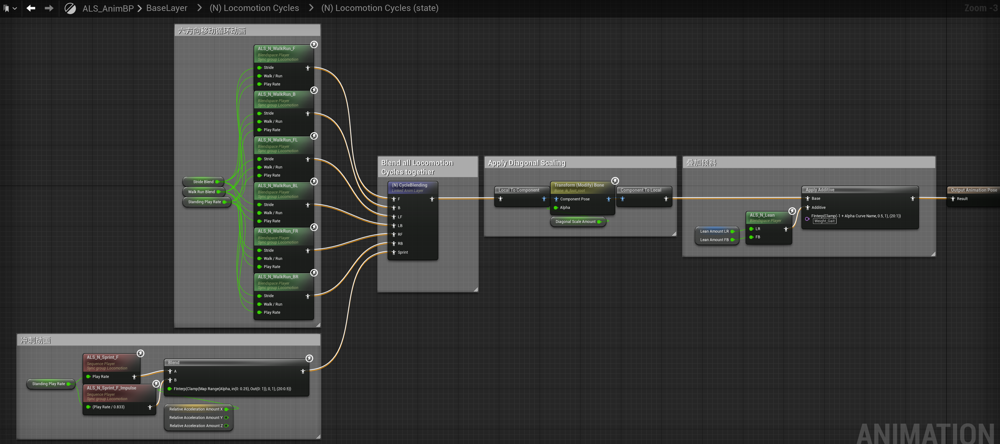

LocomotionCycles首先用StrideBlend(步幅),WalkRunBlend(走/跑)两个参数控制动画融合(BlendSpace2D)得到六方向移动循环动画:

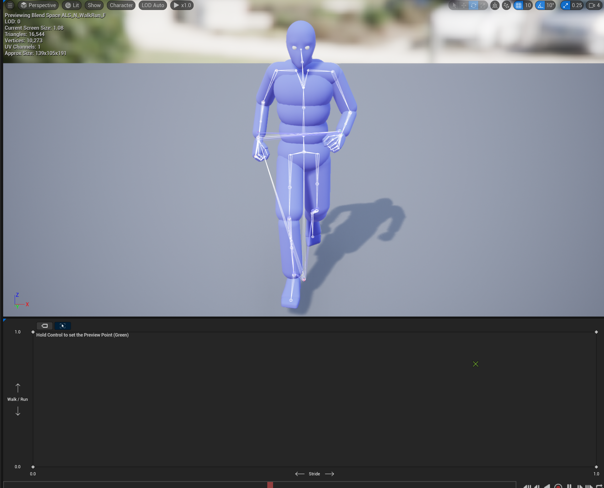
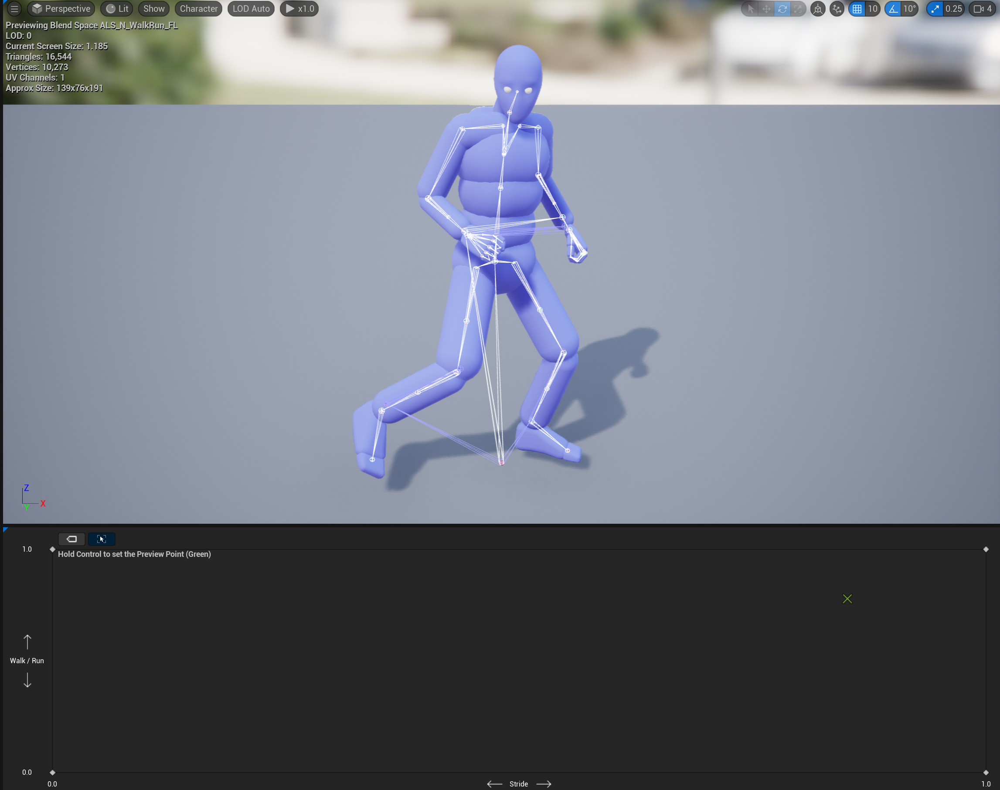

(N) CycleBlending这部分则是将生成的六方向移动动画缓存,并将前向移动的动画与冲刺动画融合,得到最终的(N)FMovement用于Directional States状态机.

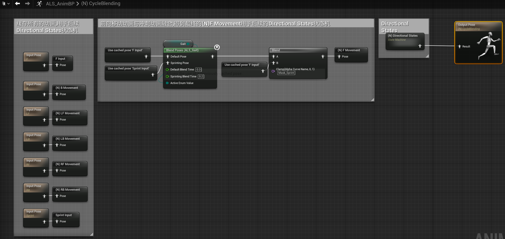

## Directional States状态机

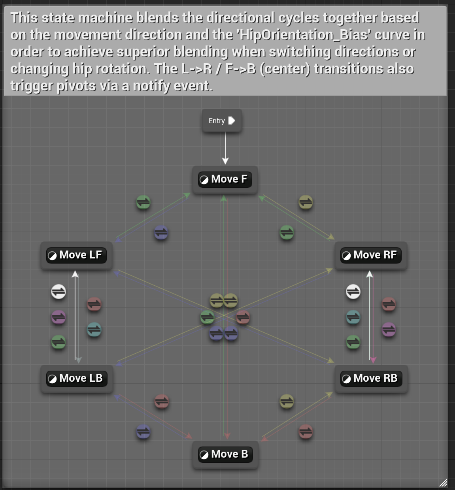

### 状态构成

以MoveF为例:

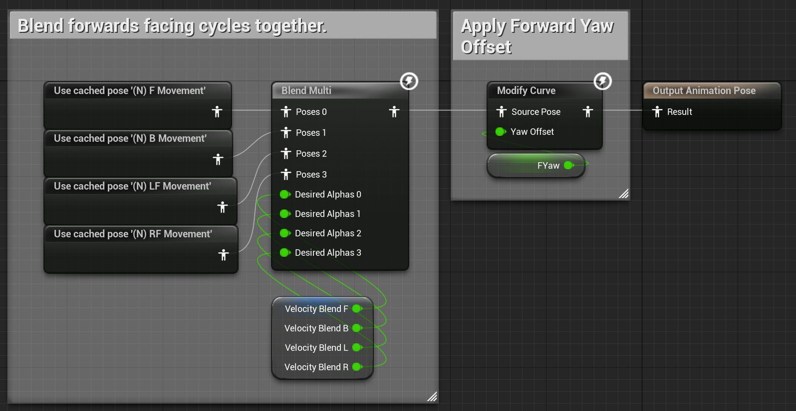

这个状态的输出动画由FMovement,BMovement,LFMovement,RFMovement四个动画用多引脚动画融合而成,控制这四个动画融合的参数为VelocityBlend[F,B,L,R],计算过程位于ALS_AnimBP->Calculate Velocity Blend.

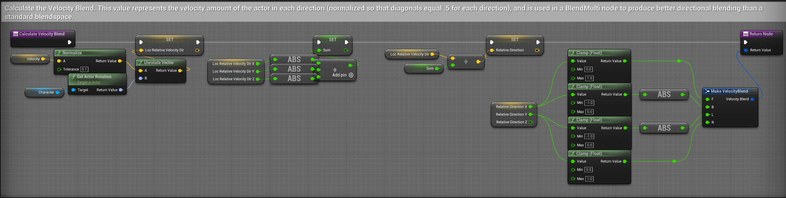

首先由移动速度方向(MovementComponent.Velocity)与Character的旋转方向计算相对旋转方向LocRelativeVelocityDir,并归一化为RelativeDirection.

再根据根据相对旋转方向RelativeDirection的x,y值计算F(前),B(后),L(左),R(右).

VelocityBlend.F=Clamp(RelativeDirection.x,0,1)

VelocityBlend.B=ABS(Clamp(RelativeDirection.x,-1,0))

VelocityBlend.L=ABS(Clamp(RelativeDirection.y,-1,0))

VelocityBlend.R=Clamp(RelativeDirection.y,0,1)

考虑极端的正前,后,左,右移动,VelocityBlend变量以及MoveF这个状态的输出分别为:

VelocityBlend=(1,0,0,0),MoveFState=cachedPos'(N) F Movement'

VelocityBlend=(0,1,0,0),MoveFState=cachedPos'(N) B Movement'

VelocityBlend=(0,0,1,0),MoveFState=cachedPos'(N) LF Movement'

VelocityBlend=(0,0,0,1),MoveFState=cachedPos'(N) RF Movement'

其余的情况的输出则是其中两组动画(F,B)与(LF,RF)的融合.

其他状态的构成与MoveF类似,不过为了左前移动<->右前移动,左后移动<->右后移动的切换自然,左右四个状态(LF,LB,RF,RB)的动画融合有一些变化:

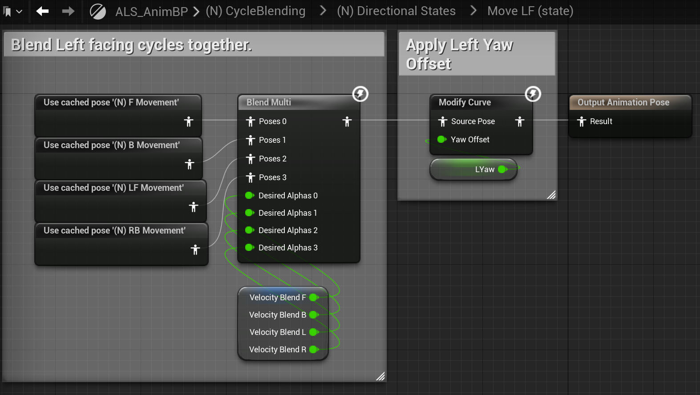

以MoveLF状态为例,MoveLF动画融合中VelocityBlend.R参数控制的动画是cachedPos '(N) RB Movement'而不是MoveF中的cachedPos '(N) RF Movement',这样设计的目的是从左前移动切换到右前移动时,状态机的切换路径不是MoveLF->MoveRF而是MoveLF->MoveRB->MoveRF.

若是直接从MoveLF->MoveRF切换,人物的胸口朝向会瞬间切换(面向左前瞬切到面向右前)显得不自然.而MoveLF->MoveRB的切换过程中,胸口的面向不会发生变化,MoveRB->MoveRF的切换则会有一个缓慢过渡的过程.

### 状态切换

状态机中的每个状态间的Transition都与MovementDirection变量相关,例如图中绿色为MovementDirection==Forward,紫色为MovementDirection==Right...

MovementDirection的计算逻辑位于ALS_AnimBP->Calculate Movement Direction

(ps:AmingRotation的获取位于ALS_Base_CharacterBP->BPI Get Essential ,其实就是将ControlRotation赋值给AimingRotation)

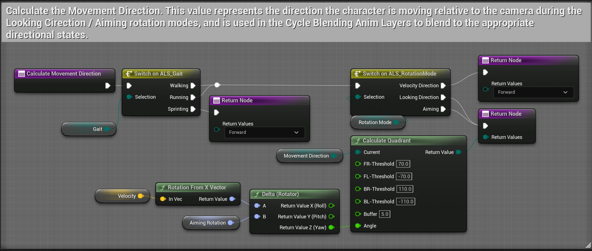

在VelocityDirection模式下(Character面朝速度方向,多数第三人称视角自由旋转相机的移动模式可以归为此类)MovementDirection的计算结果永远为Forward.

在LookingDirection和Animing模式下(Character面朝相机方向,第三人称视角锁定敌人的模式可以归为此类)MovementDirection由移动速度方向(MovementComponent.Velocity)与相机旋转方向(ControlRotation)的夹角计算得到,可以简单理解为两者夹角在-70°~70°为Forward,70°~110°为Right,110°~-110°为Backward,-110°~-70°为Left.

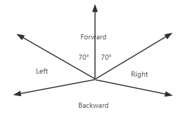

详细的计算过程为

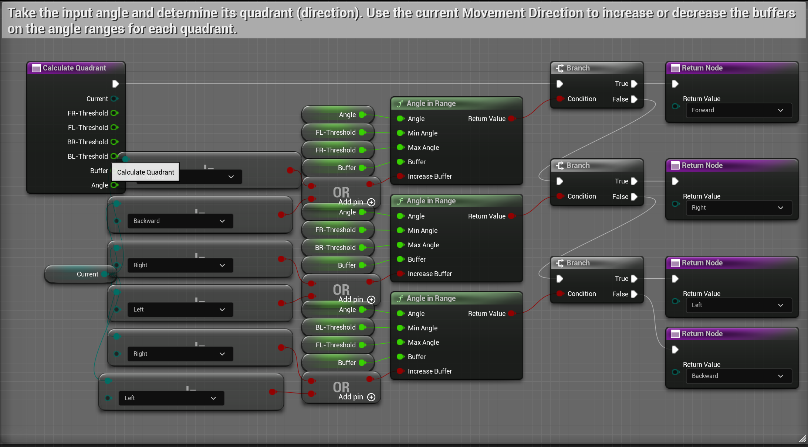