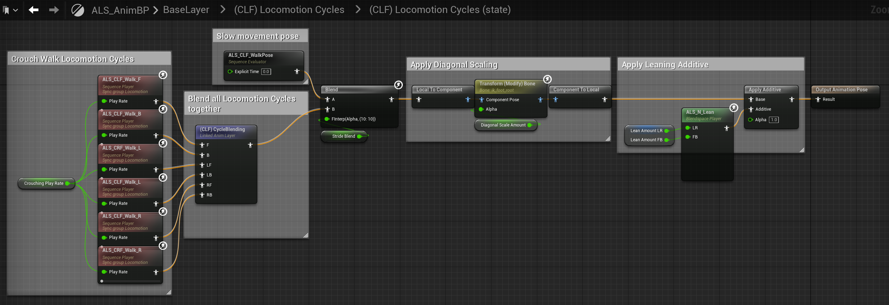
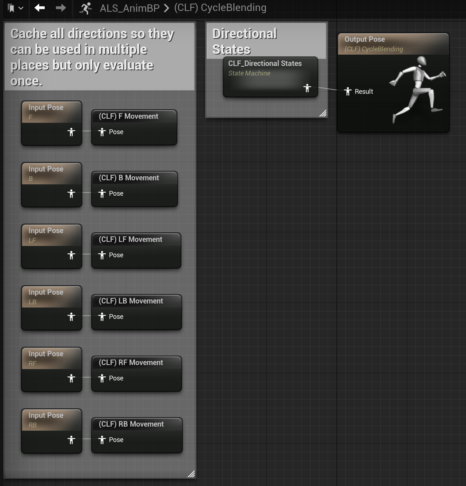
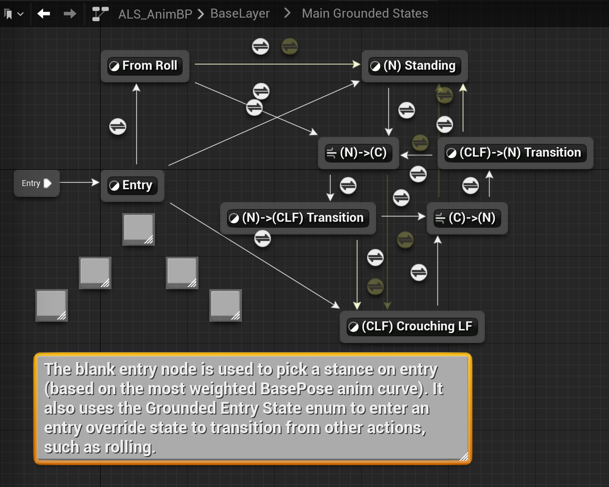
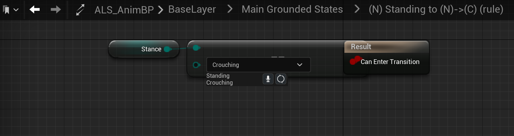
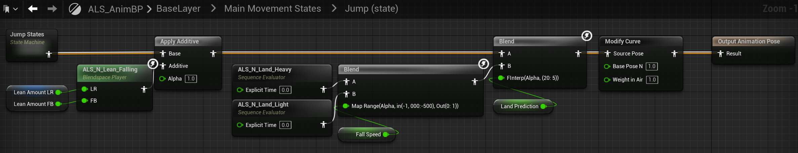
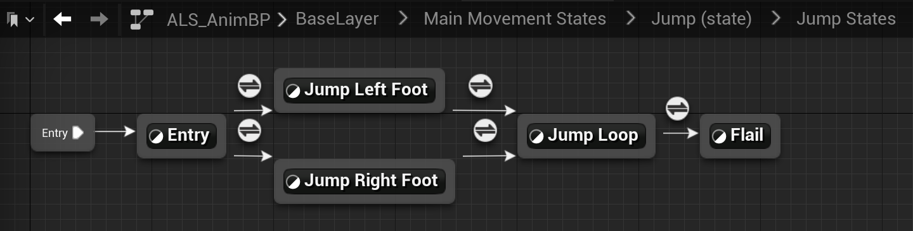
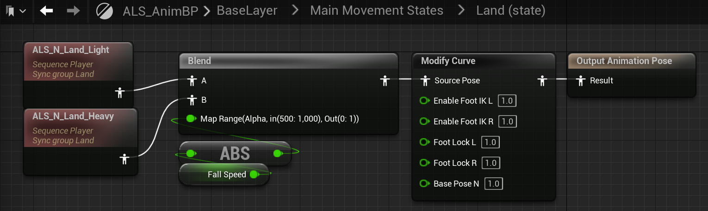

## LocomotionDetail

LocomotionDetail会引用Locomotion Cycles的输出,并进一步叠加细节动画:

(N) Walking和(N) Running会直接使用Locomotion Cycles输出的动画,(N)Run Start和(N) Walk->Run则是叠加了倾斜动画:

(N)RunStart状态中使用VelocityBlend(也用于Locomotion Cycles->Directional States)融合四个方向的倾斜动画并叠加在基础的移动动画上:

|
---|---
|ALS_N_LocoDetail_Accel_F|ALS_N_LocoDetail_Accel_L|

### 状态切换

LocomotionDetail状态机中Transition多与Gait变量相关,实际上(N)Walking->(N)Running的过程就是Gait值由Walking切换到(Running,Sprinting).

Gait一个有三个枚举值(Walking,Running,Sprinting)的枚举类型,计算逻辑位于ALS_Base_CharacterBP->Update Character Movement:

Get Allowed Gait会计算当前允许的最大Gait(Walking->Running->Sprinting是依次增大的)

Desired Gait在PlayerInputGraph中根据输入设置:

GetActualGait是实际计算动画蓝图中用到的Gait过程,主要的逻辑就是根据当前速度是否大于WalkSpeed,RunSpeed...来决定Gait类型.

## Locomotion States

到LocomotionDetail这一层的状态机已经完成了运动状态的动画,Locomotion States将会引用LocomotionDetail的输出,实现运动状态与静止状态的切换:

(N) Moving直接使用了Locomotion Detail的输出:

(N) Not Moving则是播放静止动画:

(N) Stop需要处理左脚右脚停止的逻辑,是一个较为复杂的状态机:

## Crouching Left Forward States

(N) Locomotion Cycles -> (N)Locomotion Detail ->(N) Locomotion States实现了站立姿势下的动画状态机,(CLF) Locomotion Cycles-> (CLF) Locomotion States则是完成了蹲姿下的状态机.

蹲姿的运动状态循环与站姿的运动状态循环实现逻辑十分类似,不过蹲姿简化了站立运动的步幅(StrideBlend)与行走状态(WalkRunBlend),因此直接使用了原始的动画片段执行CycleBlending:

CycleBlending部分的逻辑与站姿也大致相同,不过前向移动的动画是直接使用原始动画片段,站姿则是行走动画与冲刺动画融合.

|
---|---

## Main Grounded States

Main Grounded States引用了(N) Locomotion States,(CLF) Locomotion States的输出,主要实现了角色站姿和蹲姿的切换:

(N) Standing直接使用(N) Locomotion States状态机的输出,(CLF) Crouching LF使用(CLF) Locomotion States的输出:

| 
---|---
|(N) Standing|(CLF) Crouching Left|

(N)->(CLF) Transition播放站立到蹲下的动画,(CLF)->(N) Transition与之相反播放蹲下到恢复站立的动画:

每个状态间的Transition几乎都与Stance变量相关,大致的逻辑为Stance为Crouching时站立切换到蹲下,状态依次切换[(N) Standing]->[(N)->(C)]->[(N)->(CLF) Transition]->[(CLF) Crouching LF],Stance为Standing时蹲下切换到站立.

Stance变量通过玩家输入直接修改数值:

 
## Main Movement States

Main Movement States是输出Base Layer最终动画的状态机,插件自带实现了角色的行走和跳跃的状态机,其他运动状态(攀爬,游泳)则需要在这个基础下额外实现:

Grounded状态会直接使用Main Grounded States的输出动画:

Jump状态由Jump States状态机的输出动画叠加空中倾斜动画,再融合落地动画得到最终输出动画:

Jump States状态机的构造就十分熟悉了,先播放起跳动画,再循环播放空中动画,不过ALS还区分实现了起跳时是左脚在前还是右脚在前:

Land状态是从空中落地后没有进行运动,会播放完整的落地动画再退出到GroundedState:

LandMovement状态是落地后进行了地面的运动,需要将落地动画与Main Grounded States的输出进行融合:

状态间的Transition则是依靠变量Movement State:

