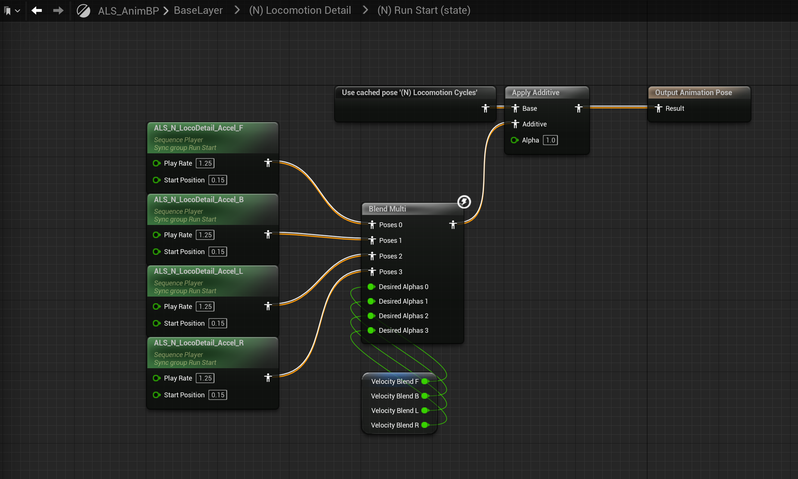
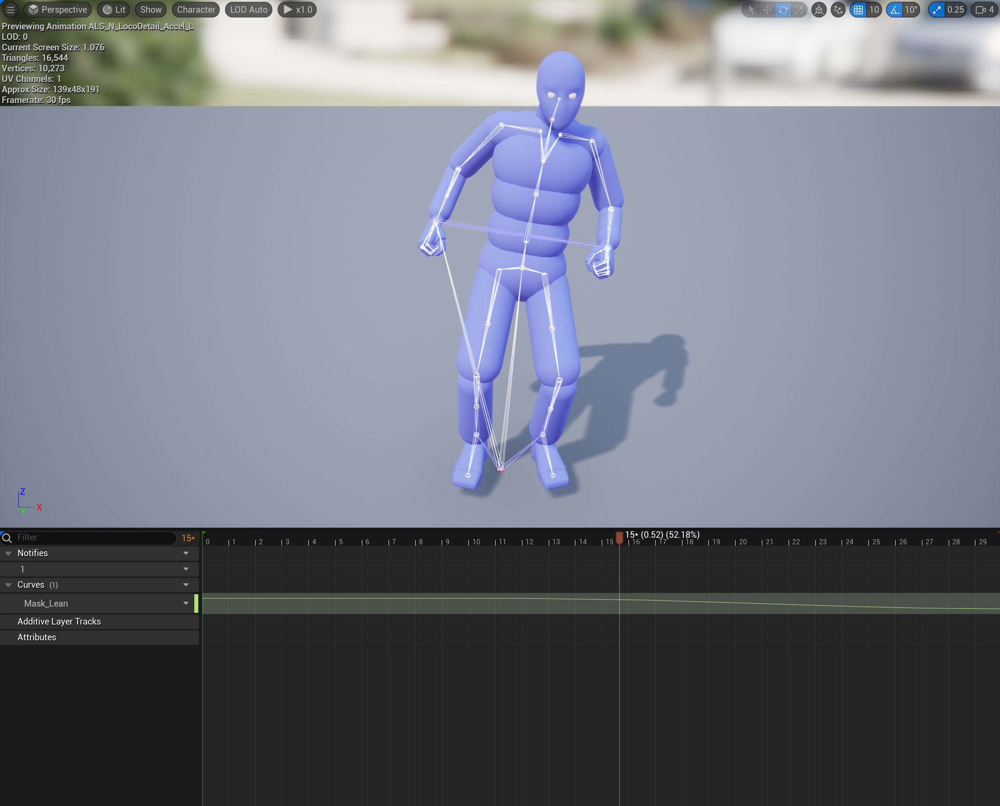
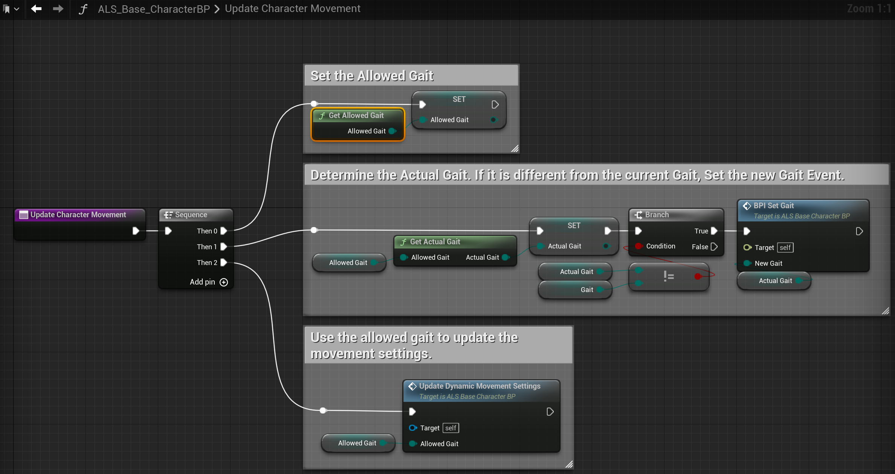

## LocomotionDetail

LocomotionDetail状态机中(N) Walking和(N) Running会直接使用Locomotion Cycles输出的动画作为结果,其余状态则是在Locomotion Cycles输出的基础上叠加动画,让表现更加自然.

(N)RunStart状态中使用VelocityBlend(也用于Locomotion Cycles->Directional States)融合四个方向的倾斜动画并叠加在基础的移动动画上:

|
---|---
|ALS_N_LocoDetail_Accel_F|ALS_N_LocoDetail_Accel_L|

### 状态切换

LocomotionDetail状态机中Transition多与Gait变量相关,这是一个有三个枚举值(Walking,Runing,Sprinting)的枚举类型,计算逻辑位于ALS_Base_CharacterBP->Update Character Movement:

Get Allowed Gait会计算当前允许的最大Gait(Walking->Sprinting是依次增大的)

Desired Gait在PlayerInputGraph中根据输入设置:

GetActualGait是实际计算动画蓝图中用到的Gait过程,主要的逻辑就是根据当前速度是否大于WalkSpeed,RunSpeed...来决定Gait类型.

## Locomotion States