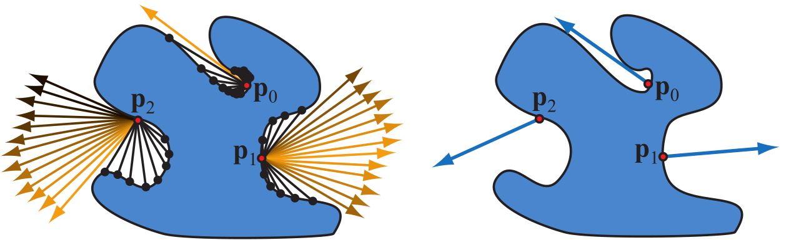
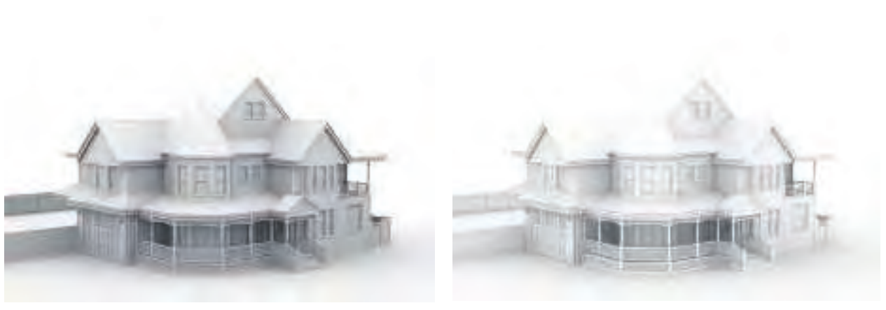

环境光遮蔽的原理可以直接从渲染方程推导出来，对Lambertian表面，任意一个着色点p的渲染结果$L_o$是$\frac{c_{albedo}}{\pi}$和Irradiance的乘积，若假设在此着色点p的所有入射方向radiance为一常量$L_A$，也就是最简单的环境光Ambient Light，那么该点接受的Irradiance就为

$E(p,n)=\int_{l \in \Omega}L_A (n·l)^+dl=\pi L_A$

积分结果十分简单，不过有一些缺陷，这里并未考虑到着色点会被本模型的面片以及场景中其他模型面片的遮挡，若简单的假设面片被遮挡的方向入射radiance是0（实际上不是，有间接光照），未被遮挡的方向为$L_A$,设可见函数$v(p,l)$表明p点的l入射方向是否被遮挡，遮挡为0反之为1，那么Irradiance的积分就可以表示为：

$E(p,n)=L_A\int_{l \in \Omega}v(p,l)(n·l)^+dl$

定义遮蔽系数$k_A(p)$，代表点p未被遮蔽的入射方向百分比：

$k_A(p)=\frac{1}{\pi}\int_{l \in \Omega}v(p,l)(n·l)^+dl$

着色点的Irradiance就可以写成：

$E(p,n)=\pi K_AL_A$

除此之外，还可以使用BentNormal替代原来的法线取得更加精确的结果，BentNormal也就是未被遮蔽的平均方向。

$n_{bent}=(\int_{l \in \Omega}l v(p,l)(n·l)^+dl).normalize$

右图各点蓝色的方向就是该点的bent normal

## Visibility And Obscurance

可见函数$v(l)$只有二值01在实时渲染的某些情况下是不太行得通的。设想在一个6个面都封闭的房间内，任选一个方向都最终会与墙壁或者房间内的物体相交，按照二值01定义，那么所有点的遮蔽系数$k_A(p)$都应为0。

(光线追踪可以递归跟踪得到被遮挡方向相交点的着色信息进而计算最终对当前着色点正确radiance的贡献，实时渲染无法得到)

在这种情况下，使用不那么物理正确的定义却能得到更好的效果，计算$k_A$时用distance mapping function $\rho(l)$来替代$v(l)$，$\rho (l)$的定义为：
$$\rho (l) = \begin{cases}  
0 & {l与场景物体相交并且距离小于d_{max}} \\
1 & {未与物体相交或相交距离大于d_{max}}
\end{cases}$$

$k_A$计算方式也就变成了：

$k_A(p)=\frac{1}{\pi}\int_{l \in \Omega}\rho(p,l)(n·l)^+dl$

使用$\rho (l)$代替$v(l)$的好处不仅在于不考虑自反射时渲染结果看起来更令人满意，还能起到加速计算的效果，超过$d_{max}$的物体可以不用参与遮蔽计算。

二值定义$v(l)$【左】与$\rho(l)$【右】的ao结果

## Accounting for Interreflections

环境光遮蔽与真正的全局光照最大的区别大于Interreflections(下记自反射orz)，计算遮蔽时将被遮挡的入射方向的radiance贡献算作0，实际上并不会是0，在离线渲染的着色中就会递归的计算视线路径上的所有着色点的radiance贡献，限于计算消耗，这样的方法并不能用在实时渲染上。

不过好在有一些经验公式可以得到与全局光照接近的效果，替换遮蔽系数$k_A$为$k_A^·$

$k_A^·=\frac{k_A}{1-c_{albedo}(1-k_A)}$

可以理解为将ao系数适当的放大了一些，得到了类似考虑了自反射的效果。

## Computation Of Ambient Occlusion

可以简单划分为两类，预先使用离线光追的方式计算ao贴图在实时渲染中使用，或者使用不那么PhysicallyBased的低消耗算法，如SSAO等。

### Precomputed 

其实就是算一个数值积分式，可以通过蒙特卡洛方法进行数值积分运算：

$k_A=\frac{1}{N}\sum_i^N v(l_i)(n·l_i)^+$

通过此式对要着色的物体的顶点生成ao值存放在贴图中，渲染时就可以直接从贴图中取值即可。

### Dynamic Computation

比较基础且常见的就是SSAO了，以及其系列的衍生算法如HBAO...，这类算法的特点在于不那么物理正确，但在实时渲染中消耗较低，并且效果还算不错。后续该实现一下SSAO)