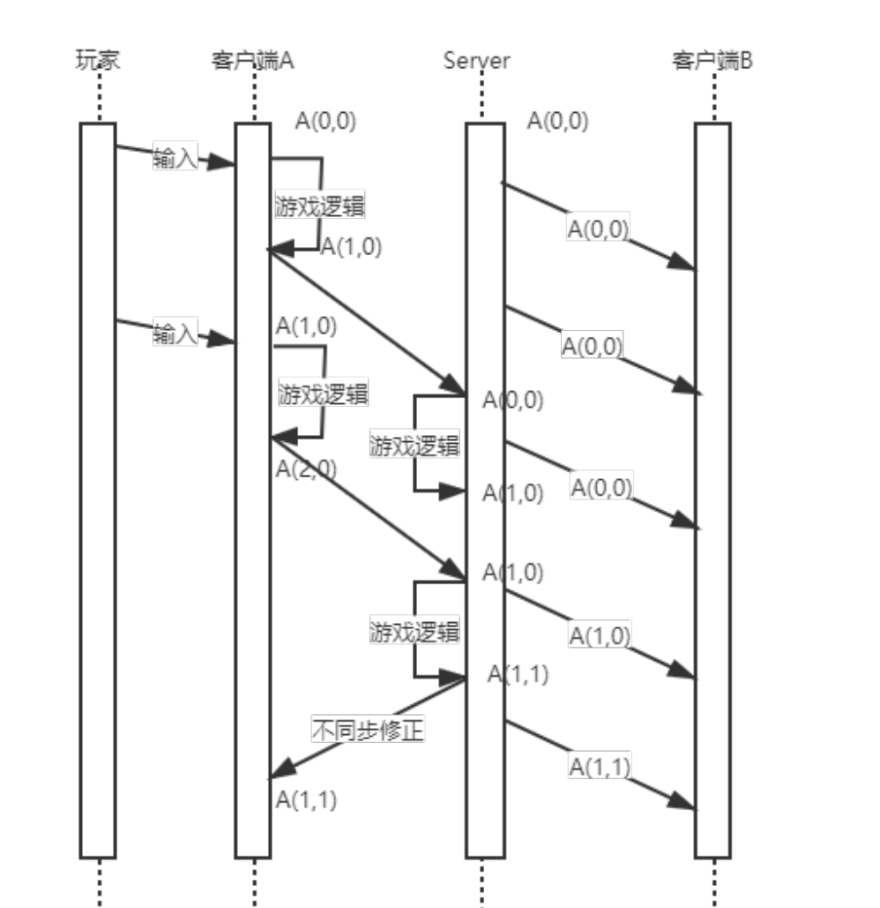
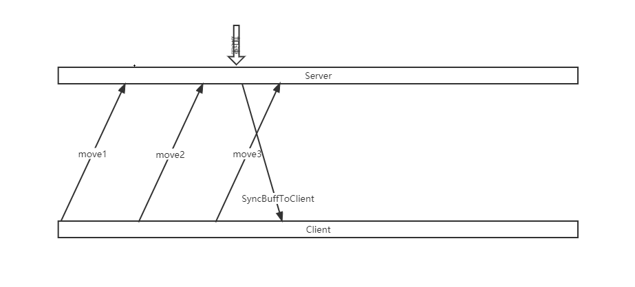
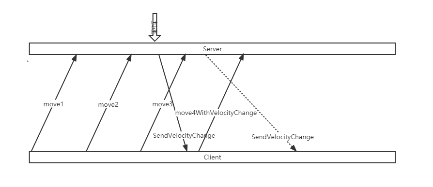
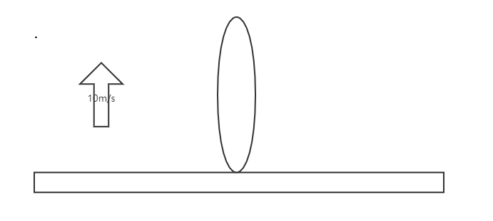
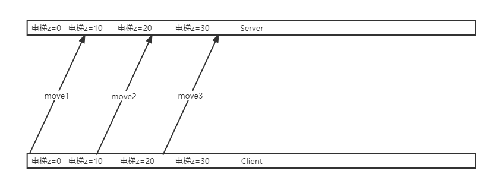

# 1P玩家移动同步

## 预表现

使用状态同步实现的联机游戏,对1P的移动预表现是个常见实现,大致的流程为:

- 接受到玩家的输入后.Client在每次Tick中[执行移动逻辑].
- Client将移动的结果和玩家输入同时发送给Server,并把本次Move的关键信息(加速度,移动后位置...)保存在列表中.
- Server收到Client的输入后执行与Client相同的移动逻辑.
- Server校验运算结果与Client的运算结果,如果Server与Client发送的运算结果一致,发送Ack到客户端确认移动生效.如果不一样,Server就会命令Client回滚.
- 将Server的运算结果推送给3P客户端。

在这个过程中[执行移动逻辑]可以理解为:

```cpp
void PerformMove(float DeltaTime)
{
    Velocity += Acceleration*DeltaTime;
    Location += Velocity*DeltaTime;
}
```

也就是简单的根据加速度速度计算位置,这个过程在Client端是每次Tick都会执行:

```cpp
void ClientTick(float DeltaTime)
{
    ...
    PerformMove(DeltaTime);
    ...
}
```

不过Server的Tick在大部分情况下并不会执行移动逻辑,而是在Client的RPC驱动下执行:

```cpp
void ServerTick(float DeltaTime)
{
    //不做实际移动的计算
}

void OnRPC_MoveFromClient(MoveData move)
{
    float DeltaTime = move.DeltaTime;
    this->Acceleration = move.Acceleration;
    PerformMove(DeltaTime)
}
```

以一个平面2D游戏玩家操作让角色从(0,0)点移动(1,0),再移动到(2,0)为例:



## 回滚前滚

一般来说Client的预表现结果与Server的校验结果是一致的.但如果不一致(比如被其他玩家眩晕了),Client就需要进行回滚和前滚操作.

回滚容易理解,就是用Server进行PerformMove后的位置信息强制覆盖Client的位置.

那前滚又是怎么回事呢?Client执行移动逻辑后,会将本次Move的信息存储到一个未被Server确认的列表中:

```cpp
void ClientTick(float DeltaTime)
{
    ...
    PerformMove(DeltaTime);
    NotAckList.Add(SaveMove(Acceleration,Location,DeltaTime));
}
```

如果Server校验通过,Server会发送AckRPC到Client,移除未被Server确认列表中在这之前的项:

```cpp
void OnRPC_AckMove(int ackSN)
{
    NotAckList.Remove([&ackSN](move){return move.sn<=ackSN;});
}
```

如果校验不通过发生了位置修正,那么Client需要把NotAckList中的Move再执行一遍:

```cpp
void OnRPC_AdjustPosition(Vector3 serverPos)
{
    Location = serverPos;
    for(auto & move :NotAckList)
    {
        float DeltaTime = move.DeltaTime;
        this->Acceleration = move.Acceleration;
        PerformMove(DeltaTime)
    }
}
```

这个在逻辑在OverWatch的[GDC分享](https://www.gdcvault.com/play/1024001/-Overwatch-Gameplay-Architecture-and)有介绍

UnrealEngine的CharacterMovementComponent中也有对应的实现.

## 联机下的一些GamePlay

### 速度修正

GamePlay中常有会影响移动同步的设计,最常见的比如速度修正就能延伸出[加速/减速Buff],[引力源吸引/排斥],[传送带]等玩法.在联机模式下如何如何正确的实现这些GamePlay的同步逻辑?

以加速Buff为例,一个联机组队玩法下,队友能给玩家加速Buff,得到这个Buff的玩家能以120%的移动速度进行移动.

Server作为权威端,是否应该在Buff生效的瞬间将Server上的玩家速度设置为120%?类似于:

```cpp
class SpeedBuff
{
    OnActive()
    {
        ownerActor.VelocityMuti = 1.2f;
    }

    OnInActive()
    {
        ownerActor.VelocityMuti = 1f;
    }
}
```

这样实现其实会导致不同步拉扯,考虑这样一种情况:



在白色箭头处触发了Buff并让速度变更生效,在移动包move3发动到Server时,Server的速度变更已经生效,但Client中并未添加此Buff,因此会有Velocity_Server!=Velocity_Client.而速度不一致必然会导致移动后的位置校验失败,导致拉扯.

一个比较合理的实现方式是在Buff触发时Server发送RPC到Client,通知触发速度变更,Client在发送Move时附加速度变更信息:

```cpp
//InServer
class SpeedBuff
{
    OnActive()
    {
        SyncModule.RPC_S2CSpeedChange(1.2f)
    }

    OnInActive()
    {
        SyncModule.RPC_S2CSpeedChange(1f)
    }
}
//InClient
void C_OnSpeedChange(float velocityMuti)
{
    ownerActor.VelocityMuti = velocityMuti;
}
void ClientTick(float DeltaTime)
{
    ...
    PerformMove(DeltaTime);
    SaveMove(Acceleration,Location,DeltaTime,ownerActor.VelocityMuti)
}
//InServer
void OnRPC_MoveFromClient(MoveData move)
{
    float DeltaTime = move.DeltaTime;
    this->Acceleration = move.Acceleration;
    this->VeloctityMuli = move.VelocityMuti;
    PerformMove(DeltaTime)
}
```

这样就能保证无论Client什么时候接受到速度变更的通知,Client发送给Server的Move包都能保持一致:



而[引力源吸引/排斥],[传送带]这些玩法与速度Buff的区别只在于一个是速度的增量,一个是在原来的速度向量基础上新增了一个新的速度向量,同步逻辑的实现可以完全参考速度Buff.

### 电梯

联机玩法中一个类似于电梯的组件,多个玩家的角色可以站在上面跟随电梯向上运动,在电梯上玩家也能自由的前后左右移动.



为了保证每个玩家看到的电梯一致,这个电梯的Owner肯定是Server,因此Server的每次Tick都会驱动电梯运动.

因为网络的不确定性,Client执行预表现移动和Server接受到move数据包时电梯位置有很大的可能不一致,如果不做任何处理Client的move几乎不会校验通过,导致频繁拉扯:



如图中move1,Client认为电梯z=0,执行了移动逻辑并发送校验包,但Server收到数据包时电梯已经在z=10的位置上了,Client的move结果与Server的结果有z=10的差值.

这类问题的同步方案是进入到电梯后,move的校验不再以Client和Server上Actor的世界坐标相等为通过标准,而是两者相对电梯的局部坐标相等即可认为move成功.

如何理解这个局部坐标相等?

- 假设初始状态Client与Server上电梯都在世界坐标(0,0,0),以电梯为坐标系,电梯最左边为(0,0,0),Actor在局部坐标系(1,0,0).

- Client Actor进行了移动,此时Client的电梯还为启动,世界坐标是(0,0,0),Actor在电梯上向X正向移动了1个单位,局部坐标位置变为(2,0,0).

- Client发送move(Acceleration=xxx,DeltaTime=xxx,WorldLocation=(2,0,0),LocalLocation=(2,0,0))到Server.

- Server在接受到Client的这个move包时已经进行了两次Tick(无论多少次都ok其实),电梯的世界坐标变为(0,0,20),在用这个move包进行移动逻辑后,Actor的位置最终是Actor_Server(WorldLocation=(2,0,20),LocalLocation=(2,0,0)).

- 可以发现,无论Client与Server上的电梯世界坐标如何,在局部坐标系的Actor局部坐标总是一致的.

同理还可以推及任意轨迹的电梯运动.