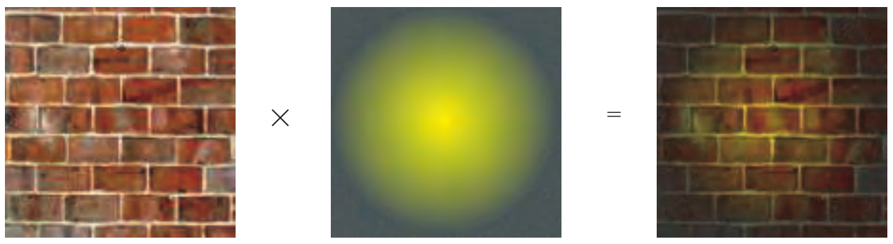
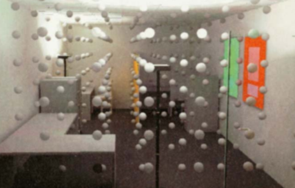
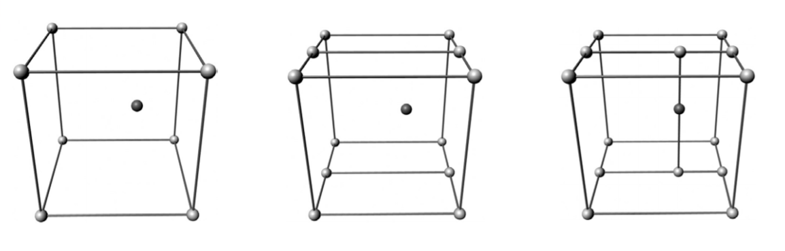
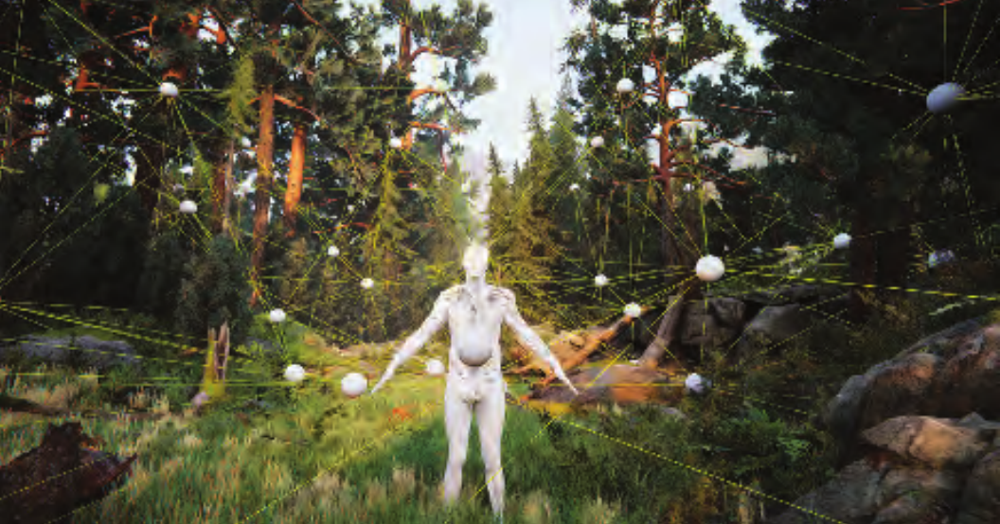

全局光照除了处理遮挡关系的AmbientOcclusion之外，还有一个关键在于物体间的间接光照，回想局部光照模型中的光线路径会发现，无论是Diffuse还是Specular部分都可以用$L(D|S)E$来描述(L:光源 D:漫反射 S:镜面反射 E:眼)，也就是到达人眼时，光线仅经过了一次弹射。但实际上物体之间是会有间接光照的，真正的光线路径应该是$L(D|S)^*E$。实时渲染中并不能像光线追踪那般递归计算光线路径(消耗太大，光栅化架构也不合适)，因此在实时渲染中，全局光照多用预计算和高效近似计算两种方式来实现。

## Surface Prelighting

简单来说就是将场景中的物体分为static和dynamic两类，static物体与光源以及其余static物体会在实时渲染之前使用离线渲染的算法预先计算好正确的光照交互的结果（通常是缓存Irradiance），实时渲染时只需要取出结果与表面材质进行计算。dynamic物体则还是使用LocalIllumination的模型进行光照计算，也可以使用一些近似算法来得到不那么PhysicallyBased的光照结果。



Unity的LightMap原理便是如此,可以参考shader中对LightMap的使用：

```CG
float4 albedo=tex2D(_MainTex,i.uv);
half3 lm = DecodeLightmap(UNITY_SAMPLE_TEX2D(unity_Lightmap, i.uv1));
float3 diffuse = albedo.rgb * lm;
```

不过预先计算表面Irradiance的方式是有缺陷的，在预计算时就需要得知法线的方向，无法在运行时通过法线贴图的方式得到更为精细的表面细节，因此又引申出了Directional Surface Prelighting

### Directional Surface PreLighting

Directional Surface PreLighting的思路很简单，既然一个既定方向的Irradiance无法满足要求，那么可以把所有方向的Irradiance都预计算好，实时渲染时通过表面法线向量来索引取值。实际上这也是最常用的做法，预计算所有方向的Irradiance，通过数值积分的方式投影到球谐函数，在Texture中存储少量的球谐系数，实时渲染时通过球谐系数来重建光照信息，传入法线来获得Irradiance参与光照计算。通常而言投影到3阶球谐系数就能得到不错的结果，不过3阶系数需要9x3=27个float量，是简单Irradiance贴图的9倍消耗，因为这个原因也有一些优化的算法。

### Volumeterically PreLighting

既然我们能将对静态物体的光照预计算结果存储于光照贴图并在实时渲染中使用，那么是否可以更进一步预计算存储场景中一些指定点（自动生成或人工指定）的Irradiance，实时渲染时用这些已知点的Irradiance信息通过插值的方式来查询场景中任意一点的Irradiance呢？答案是可以的，并且效果还不错，实际上多数游戏引擎对动态物体的GlobalDiffuseIllumination就是基于这个方法来实现的。

#### Irradiance Volume

 [这里有篇文章写很很好](http://developer.amd.com/wordpress/media/2012/10/Tatarchuk_Irradiance_Volumes.pdf)

IrradianceVolume是一个三维空间中的网格，类似下图：



图中规则排列的小球就是IrradianceVolume的节点。
构建IrradianceVolume常用的做法是在指定区域（自动或人工划分）用八叉树划分空间，为八叉树上的每个节点预计算当前空间位置的Irradiance信息（离线渲染，类似于烘焙LightMap），节点存储的并不是具体的Irradiance数值，而是Spherical Irradiance，即Irradiance随法线方向变化的函数，存储函数的方式则是将Spherical Irradiance投影球谐函数存储系数。



实时渲染使用IrradianceVolume则是查找着色点空间位置在八叉树中的划分，根据包围矩形8点顶点的预计算Irradiance信息，通过插值来获得着色点的Irradiance参与着色计算，插值方式根据划分的方式不同各有差异，比如三线性插值，立方体插值...

#### Unity Tetrahedral Interpolation

Unity引擎中实现dynamic物体的GlobalDiffuseIllumination组件是LightProbe，原理个人感觉与Irradiance Volume非常类似，只不过空间的划分和查找方式不一样。Unity采用四面体的方式来划分空间，实时渲染则查找包围四面体的四个节点来进行插值计算：



shader中的使用很简单，直接调用build-in函数ShadeSH9传入着色点法线就能获得着色点的Irradiance信息：
```CG
// normal should be normalized, w=1.0
half3 SHEvalLinearL0L1 (half4 normal) ｛
    half3 x;
    // Linear (L1) + constant (L0) polynomial terms
    x.r = dot(unity_SHAr,normal);
    x.g = dot(unity_SHAg,normal);
    x.b = dot(unity_SHAb,normal);
    return x;
｝
// normal should be normalized, w=1.0
half3 SHEvalLinearL2 (half4 normal) ｛
    half3 x1, x2;
    // 4 of the quadratic (L2) polynomials
    half4 vB = normal.xyzz * normal.yzzx;
    x1.r = dot(unity_SHBr,vB);
    x1.g = dot(unity_SHBg,vB);
    x1.b = dot(unity_SHBb,vB);
    // Final (5th) quadratic (L2) polynomial
    half vC = normal.x * normal.x - normal.y * normal.y;
    x2 = unity_SHC.rgb * vC;
    return x1 + x2;
｝
half3 ShadeSH9 (half4 normal) ｛
    // Linear + constant polynomial terms
    half3 res = SHEvalLinearL0L1(normal);
    // Quadratic polynomials
    res += SHEvalLinearL2(normal);
    if (IsGammaSpace())
        res = LinearToGammaSpace(res);
    return res;
｝
```
