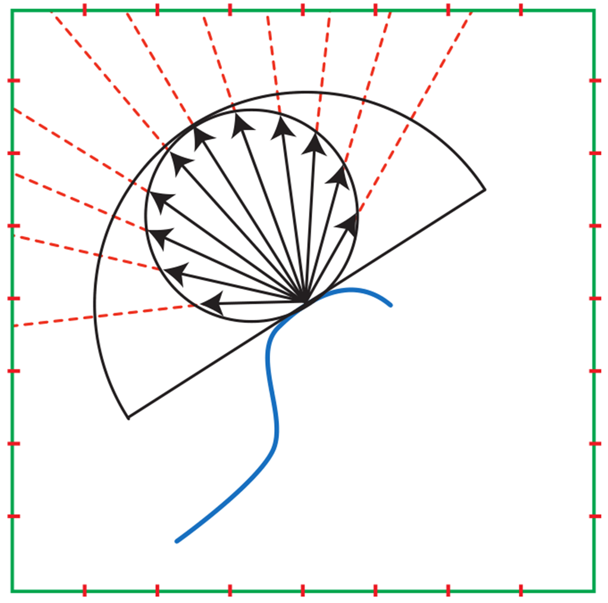
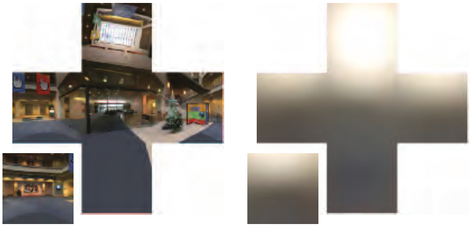

EnvMap不仅能用于光泽反射表面的着色，也可以对漫反射表面着色。相比用来渲染光泽表面的EnvMap存储radiance数值，通过视线反射向量来索引取值，用来渲染漫反射表面的EnvMap存储的是irradiance数值，通过着色点的法线来索引取值。

为什么要存储irradiance而不是像Specular IBL那样存储radiance呢？可以回顾一下理想漫反射表面的渲染方程：

$L_o=\int_\Omega f(l,v)L_i (n·l)dl=\frac{c_{albedo}}{\pi}\int L_i(n·l)dl=\frac{c_{albedo}}{\pi}E$

在渲染时我们只需要irradiance和表面的反照率属性就能通过简单的乘法计算得到最终的着色结果。



预计算这个Irradiance EnvMap的过程就是一个数值积分，可以采用均匀分布或重要性采样进行预估。

```CG

```



可以看到，包含高频信息的RadianceEnvironmentMap生成的IrradianceEnvironmentMap却只有低频信息，整个图像看起来十分模糊。这是必然的，Irradiance是法线半球上对radiance的积分，而环境贴图中相邻的法线间变化很小，两者积分半球区域几乎重叠，RadianceEnvironmentMap大部分radiance贡献都是共用（n·l有一些变化），最终导致了Irradiance变化缓慢，没有高频信息。

没有高频信息的IrradianceEnvironmentMap十分适合投影到球谐函数，在预处理时利用数值积分求解球谐系数存储，实时渲染中通过球谐系数来重建IrradianceEnvironmentMap用于渲染漫反射表面。相比CubeMap存储，投影IrradianceEnvironmentMap到球谐函数只需要存储少量系数就能达到差不多的效果，并且极大节省空间。实际上这也是大多数游戏引擎的做法。


