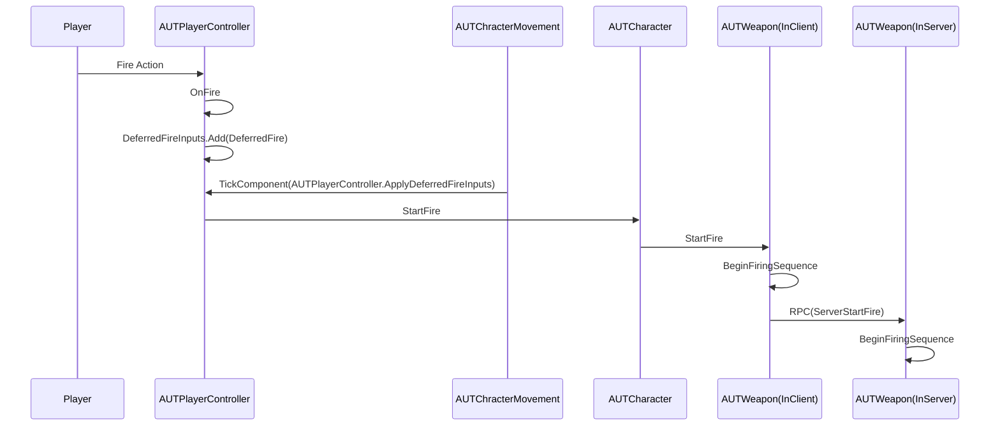

# 从虚幻竞技场分析下延迟补偿的实现

EPIC公布了[虚幻竞技场](https://github.com/EpicGames/UnrealTournament)的源码.这个项目在Unreal内置的同步方式下额外实现了针对FPS游戏的延迟补偿技术,这里也就针对这项技术分析下具体实现.

## 为什么要延迟补偿


考虑这样一种情况,联机模式下在本机瞄准一个正在匀速向右移动的玩家,由于网络传输有延迟,大部分情况下本地上看到的其他玩家的位置是落后于服务器上这个玩家的位置的.如果不做额外的处理,那么将难以命中移动的敌人.


## 具体实现

### 开火流程

虚幻竞技场发射子弹的流程大致可以描述为,客户端按键->客户端开火->RPC通知服务器->服务器开火,调用细节如下图:



基于这个流程实现了两种类型子弹的延迟补偿技术,一种是有弹道飞行轨迹的子弹,另一种是无弹道直接射线判定命中的子弹,这两种子弹的实现都依赖于一个十分关键的函数GetPredictionTime()

### PredictionTime

```cpp
float AUTPlayerController::GetPredictionTime()
{
	// exact ping is in msec, divide by 1000 to get time in seconds
	return (PlayerState && (GetNetMode() != NM_Standalone)) ? (0.0005f*FMath::Clamp(PlayerState->ExactPing - PredictionFudgeFactor, 0.f, MaxPredictionPing)) : 0.f;
}
```

这里的ExactPing实际上是网络的RTT,因此这个函数的返回值可以理解为`(单向延迟-配置数值)`.有轨迹的子弹依赖PredictionTime来进行追帧,射线子弹则需要根据PredictionTime回滚位置,进行射线命中判定.

### 轨迹子弹

有飞行轨迹子弹的延迟补偿的实现方式为接受到玩家开火指令后,客户端立即生成模拟投射物

FireShot->FireProjectile->SpawnNetPredictedProjectile

```cpp
AUTProjectile* AUTWeapon::SpawnNetPredictedProjectile(TSubclassOf<AUTProjectile> ProjectileClass, FVector SpawnLocation, FRotator SpawnRotation)
{
    //本端控制的玩家,CatchupTickDelta>0
    AUTPlayerController* OwningPlayer = UTOwner ? Cast<AUTPlayerController>(UTOwner->GetController()) : NULL;
	float CatchupTickDelta = 
		((GetNetMode() != NM_Standalone) && OwningPlayer)
		? OwningPlayer->GetPredictionTime()
		: 0.f;
    ...
    //生成投射物
    FActorSpawnParameters Params;
	Params.Instigator = UTOwner;
	Params.Owner = UTOwner;
	Params.SpawnCollisionHandlingOverride = ESpawnActorCollisionHandlingMethod::AlwaysSpawn;
	AUTProjectile* NewProjectile = 
		((Role == ROLE_Authority) || (CatchupTickDelta > 0.f))
		? GetWorld()->SpawnActor<AUTProjectile>(ProjectileClass, SpawnLocation, SpawnRotation, Params)
		: NULL;
    ...
    if (Role == ROLE_Authority)
	{
        //Server逻辑
        ...
    }
    else
    {
        //设置属性,并让这个投射物的最大生命周期不超过一个RTT(理论上一个RTT后此客户端会得到服务器生成的投射物的RPC)
        NewProjectile->InitFakeProjectile(OwningPlayer);
		NewProjectile->SetLifeSpan(FMath::Min(NewProjectile->GetLifeSpan(), 2.f * FMath::Max(0.f, CatchupTickDelta)));
    }
}
```

服务器在接受到客户端的RPC也进执行开火逻辑时,会使用GetPredictionTime()的返回值来进行追帧:
```cpp
AUTProjectile* AUTWeapon::SpawnNetPredictedProjectile(TSubclassOf<AUTProjectile> ProjectileClass, FVector SpawnLocation, FRotator SpawnRotation)
{
    ...
    //生成投射物
    FActorSpawnParameters Params;
	Params.Instigator = UTOwner;
	Params.Owner = UTOwner;
	Params.SpawnCollisionHandlingOverride = ESpawnActorCollisionHandlingMethod::AlwaysSpawn;
	AUTProjectile* NewProjectile = 
		((Role == ROLE_Authority) || (CatchupTickDelta > 0.f))
		? GetWorld()->SpawnActor<AUTProjectile>(ProjectileClass, SpawnLocation, SpawnRotation, Params)
		: NULL;
    if (Role == ROLE_Authority)
    {
    	NewProjectile->HitsStatsName = HitsStatsName;
    	if ((CatchupTickDelta > 0.f) && NewProjectile->ProjectileMovement)
    	{
    		// server ticks projectile to match with when client actually fired
    		if (NewProjectile->PrimaryActorTick.IsTickFunctionEnabled())
    		{
    			NewProjectile->TickActor(CatchupTickDelta * NewProjectile->CustomTimeDilation, LEVELTICK_All, NewProjectile->PrimaryActorTick);
    		}
			//TickActor进行追帧
    		NewProjectile->ProjectileMovement->TickComponent(CatchupTickDelta * NewProjectile->CustomTimeDilation, LEVELTICK_All, NULL);
    		NewProjectile->SetForwardTicked(true);
            //生命周期减去CatchupTickDelta
    		if (NewProjectile->GetLifeSpan() > 0.f)
    		{
    			NewProjectile->SetLifeSpan(0.1f + FMath::Max(0.01f, NewProjectile->GetLifeSpan() - CatchupTickDelta));
    		}
    	}
    	else
    	{
    		NewProjectile->SetForwardTicked(false);
    	}
    }
}
```

本地客户端从服务器同步创建的投射物也会在BeginPlay和Actor的PostNetReceiveLocationAndRotation回调中根据延迟进行追帧:

```cpp
//创建时
void AUTProjectile::BeginPlay()
{
    ...
    // Move projectile to match where it is on server now (to make up for replication time)
	float CatchupTickDelta = MyPlayer->GetPredictionTime();
	if (CatchupTickDelta > 0.f)
	{
		CatchupTick(CatchupTickDelta);
	}
    ...
}
void AUTProjectile::CatchupTick(float CatchupTickDelta)
{
	if (ProjectileMovement)
	{
		ProjectileMovement->TickComponent(CatchupTickDelta, LEVELTICK_All, NULL);
	}
}

//接受到网络同步时
void AUTProjectile::PostNetReceiveLocationAndRotation()
{
    ...
    // forward predict to get to position on server now
    AUTPlayerController* MyPlayer = Cast<AUTPlayerController>(InstigatorController ? InstigatorController : GEngine->GetFirstLocalPlayerController(GetWorld()));
    if (MyPlayer)
    {
    	float CatchupTickDelta = MyPlayer->GetPredictionTime();
    	if ((CatchupTickDelta > 0.f) && ProjectileMovement)
    	{
    		ProjectileMovement->TickComponent(CatchupTickDelta, LEVELTICK_All, NULL);
    	}
    }   
}


```

### 射线子弹

射线子弹的逻辑则稍微复杂一点.首先客户端执行开火后,会立刻进行一次射线检测判断该子弹是否命中本机上`实时`的其他Character,如果有命中,则将命中的Character通知Server:
```cpp
void AUTWeapon::FireShot()
{
	...
	FHitResult OutHit;
	FireInstantHit(true, &OutHit);
	if (bTrackHitScanReplication && (UTOwner == nullptr || !UTOwner->IsLocallyControlled() || Cast<APlayerController>(UTOwner->GetController()) != nullptr))
    {
    	HitScanHitChar = Cast<AUTCharacter>(OutHit.Actor.Get());
    	if ((Role < ROLE_Authority) && HitScanHitChar)
    	{
			//RPC通知Server
    		ServerHitScanHit(HitScanHitChar, FireEventIndex);
    	}
    	...
    }
}

```

服务器则会记录上报的Character:
```cpp
//sever
bool AUTWeapon::ServerHitScanHit_Validate(AUTCharacter* HitScanChar, uint8 HitScanEventIndex)
{
	return true;
}

void AUTWeapon::ServerHitScanHit_Implementation(AUTCharacter* HitScanChar, uint8 HitScanEventIndex)
{
	ReceivedHitScanHitChar = HitScanChar;
	ReceivedHitScanIndex = HitScanEventIndex;
}
```

根据前面提到的开火流程,在客户端执行开火后,Server经过Client的RPC通知也会同样执行AUTWeapon::FireShot进行射线检测,此时服务器就会将其他的所有Character回退到PredictionTime之前:

(调用过程是AUTWeapon::FireShot->FireInstantHit->HitScanTrace)
```cpp
void AUTWeapon::HitScanTrace(const FVector& StartLocation, const FVector& EndTrace, float TraceRadius, FHitResult& Hit, float PredictionTime)
{
	...
	AUTCharacter* ClientSideHitActor = (bTrackHitScanReplication && ReceivedHitScanHitChar && ((ReceivedHitScanIndex == FireEventIndex) || (ReceivedHitScanIndex == FireEventIndex - 1))) ? ReceivedHitScanHitChar : nullptr;
	AUTCharacter* BestTarget = NULL;
	FVector BestPoint(0.f);
	FVector BestCapsulePoint(0.f);
	float BestCollisionRadius = 0.f;
	for (FConstPawnIterator Iterator = GetWorld()->GetPawnIterator(); Iterator; ++Iterator)
	{
		AUTCharacter* Target = Cast<AUTCharacter>(*Iterator);
		if (Target && (Target != UTOwner) && (bTeammatesBlockHitscan || !GS || GS->bTeamProjHits || !GS->OnSameTeam(UTOwner, Target)))
		{
			//客户端上报命中,额外补偿判定
			float ExtraHitPadding = (Target == ClientSideHitActor) ? 40.f : 0.f;
			// find appropriate rewind position, and test against trace from StartLocation to Hit.Location
			FVector TargetLocation = ((PredictionTime > 0.f) && (Role == ROLE_Authority)) ? Target->GetRewindLocation(PredictionTime) : Target->GetActorLocation();
			...
			//用TargetLocation判定命中
		}
	...
}
```

可以看到除了回滚位置之外,还有针对客户端上报命中结果的额外补偿,回滚位置的实现大概可以理解为服务器在Character每次移动后都会根据时间从小到大保存每一帧的位置,回滚只需要找到对应时间点的位置就行了.
```cpp
UTCharacter.h
struct FSavedPosition
{
	...
	/** Position of player at time Time. */
	UPROPERTY()
	FVector Position;
	/** true if teleport occurred getting to current position (so don't interpolate) */
	UPROPERTY()
	bool bTeleported;
	/** Current server world time when this position was updated. */
	float Time;
	...
};

/** Stored past positions of this player.  Used for bot aim error model, and for server side hit resolution. */
UPROPERTY()
TArray<FSavedPosition> SavedPositions;	
```

完整实现如下:

```cpp
UTCharacter.cpp
FVector AUTCharacter::GetRewindLocation(float PredictionTime, AUTPlayerController* DebugViewer)
{
	FVector TargetLocation = GetActorLocation();
	FVector PrePosition = GetActorLocation();
	FVector PostPosition = GetActorLocation();
	//当前时间-回退时间
	float TargetTime = GetWorld()->GetTimeSeconds() - PredictionTime;
	float Percent = 0.999f;
	bool bTeleported = false;
	if (PredictionTime > 0.f)
	{
		//反向遍历SavedPositions
		for (int32 i=SavedPositions.Num()-1; i >= 0; i--)
		{
			TargetLocation = SavedPositions[i].Position;
			//找到对应的时间节点,如果精确对应就直接取值,否则就插值
			if (SavedPositions[i].Time < TargetTime)
			{
				if (!SavedPositions[i].bTeleported && (i<SavedPositions.Num()-1))
				{
					PrePosition = SavedPositions[i].Position;
					PostPosition = SavedPositions[i + 1].Position;
					if (SavedPositions[i + 1].Time == SavedPositions[i].Time)
					{
						//精确对应就直接取值
						Percent = 1.f;
						TargetLocation = SavedPositions[i + 1].Position;
					}
					else
					{
						//插值计算位置
						Percent = (TargetTime - SavedPositions[i].Time) / (SavedPositions[i + 1].Time - SavedPositions[i].Time);
						TargetLocation = SavedPositions[i].Position + Percent * (SavedPositions[i + 1].Position - SavedPositions[i].Position);
					}
				}
				else
				{
					bTeleported = SavedPositions[i].bTeleported;
				}
				break;
			}
		}
	}
	return TargetLocation;
}
```

保存每次移动后的数据则是在UTCharacterMovement执行PerformMovement后:

```cpp
//Server接受Client的移动包后执行PerformMovement
void UTCharacterMovement::PerformMovement(float DeltaSeconds)
{
	...
	if (UTOwner != NULL)
	{
		UTOwner->PositionUpdated(bShotSpawned);
		...
	}
}

void AUTCharacter::PositionUpdated(bool bShotSpawned)
{
	const float WorldTime = GetWorld()->GetTimeSeconds();
	if (GetCharacterMovement())
	{
		//保存位置信息
		new(SavedPositions)FSavedPosition(GetActorLocation(), GetViewRotation(), GetCharacterMovement()->Velocity, GetCharacterMovement()->bJustTeleported, bShotSpawned, WorldTime, (UTCharacterMovement ? UTCharacterMovement->GetCurrentSynchTime() : 0.f));
	}

	// maintain one position beyond MaxSavedPositionAge for interpolation
	if (SavedPositions.Num() > 1 && SavedPositions[1].Time < WorldTime - MaxSavedPositionAge)
	{
		SavedPositions.RemoveAt(0);
	}
}
```