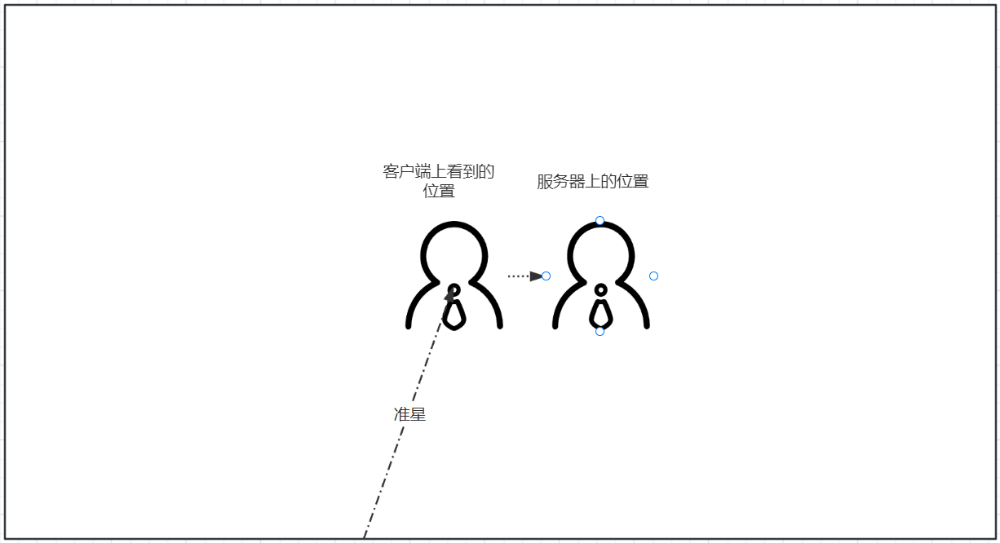

# 从虚幻竞技场分析下延迟补偿的实现

EPIC公布了[虚幻竞技场](https://github.com/EpicGames/UnrealTournament)的源码.这个项目在Unreal内置的同步方式下额外实现了针对FPS游戏的延迟补偿技术,这里也就针对这项技术分析下具体实现.

## 为什么要延迟补偿



考虑这样一种情况,联机模式下在本机瞄准一个正在匀速向右移动的玩家,由于网络传输有延迟,大部分情况下本地上看到的其他玩家的位置是落后于服务器上这个玩家的位置的.如果不做额外的处理,那么将难以命中移动的敌人.


## 具体实现


首先需要了解一个关键函数GetPredictionTime(),延迟补偿的实现需要依赖这个数值来进行追帧,回滚位置:

```cpp
float AUTPlayerController::GetPredictionTime()
{
	// exact ping is in msec, divide by 1000 to get time in seconds
	return (PlayerState && (GetNetMode() != NM_Standalone)) ? (0.0005f*FMath::Clamp(PlayerState->ExactPing - PredictionFudgeFactor, 0.f, MaxPredictionPing)) : 0.f;
}
```

这里的ExactPing实际上是网络的RTT,因此这个函数的返回值可以理解为`(单向延迟-配置数值)`

在虚幻竞技场中主要实现了两种类型武器的延迟补偿技术,一种是有弹道飞行轨迹的子弹,另一种是无弹道直接射线判定命中的子弹.

这些逻辑都实现在UTWeapon.cpp中,因此下面的调用过程若无说明都是在AUTWeapon类中实现.

### 轨迹子弹

有飞行轨迹子弹的延迟补偿的实现方式为接受到玩家开火指令后,客户端立即生成假的投射物

FireShot->FireProjectile->SpawnNetPredictedProjectile

```cpp
AUTProjectile* AUTWeapon::SpawnNetPredictedProjectile(TSubclassOf<AUTProjectile> ProjectileClass, FVector SpawnLocation, FRotator SpawnRotation)
{
    //本端控制的玩家,CatchupTickDelta>0
    AUTPlayerController* OwningPlayer = UTOwner ? Cast<AUTPlayerController>(UTOwner->GetController()) : NULL;
	float CatchupTickDelta = 
		((GetNetMode() != NM_Standalone) && OwningPlayer)
		? OwningPlayer->GetPredictionTime()
		: 0.f;
    ...
    //生成投射物
    FActorSpawnParameters Params;
	Params.Instigator = UTOwner;
	Params.Owner = UTOwner;
	Params.SpawnCollisionHandlingOverride = ESpawnActorCollisionHandlingMethod::AlwaysSpawn;
	AUTProjectile* NewProjectile = 
		((Role == ROLE_Authority) || (CatchupTickDelta > 0.f))
		? GetWorld()->SpawnActor<AUTProjectile>(ProjectileClass, SpawnLocation, SpawnRotation, Params)
		: NULL;
    ...
    if (Role == ROLE_Authority)
	{
        //Server逻辑
        ...
    }
    else
    {
        //设置属性,并让这个投射物的最大生命周期不超过一个RTT(理论上一个RTT后此客户端会得到服务器生成的投射物的RPC)
        NewProjectile->InitFakeProjectile(OwningPlayer);
		NewProjectile->SetLifeSpan(FMath::Min(NewProjectile->GetLifeSpan(), 2.f * FMath::Max(0.f, CatchupTickDelta)));
    }
}
```

服务器在接受到客户端的RPC也进执行开火逻辑时,会使用GetPredictionTime()的返回值来进行追帧:
```cpp
AUTProjectile* AUTWeapon::SpawnNetPredictedProjectile(TSubclassOf<AUTProjectile> ProjectileClass, FVector SpawnLocation, FRotator SpawnRotation)
{
    ...
    //生成投射物
    FActorSpawnParameters Params;
	Params.Instigator = UTOwner;
	Params.Owner = UTOwner;
	Params.SpawnCollisionHandlingOverride = ESpawnActorCollisionHandlingMethod::AlwaysSpawn;
	AUTProjectile* NewProjectile = 
		((Role == ROLE_Authority) || (CatchupTickDelta > 0.f))
		? GetWorld()->SpawnActor<AUTProjectile>(ProjectileClass, SpawnLocation, SpawnRotation, Params)
		: NULL;
    if (Role == ROLE_Authority)
    {
    	NewProjectile->HitsStatsName = HitsStatsName;
    	if ((CatchupTickDelta > 0.f) && NewProjectile->ProjectileMovement)
    	{
    		// server ticks projectile to match with when client actually fired
    		if (NewProjectile->PrimaryActorTick.IsTickFunctionEnabled())
    		{
                //TickActor进行追帧
    			NewProjectile->TickActor(CatchupTickDelta * NewProjectile->CustomTimeDilation, LEVELTICK_All, NewProjectile->PrimaryActorTick);
    		}
    		NewProjectile->ProjectileMovement->TickComponent(CatchupTickDelta * NewProjectile->CustomTimeDilation, LEVELTICK_All, NULL);
    		NewProjectile->SetForwardTicked(true);
            //生命周期减去CatchupTickDelta
    		if (NewProjectile->GetLifeSpan() > 0.f)
    		{
    			NewProjectile->SetLifeSpan(0.1f + FMath::Max(0.01f, NewProjectile->GetLifeSpan() - CatchupTickDelta));
    		}
    	}
    	else
    	{
    		NewProjectile->SetForwardTicked(false);
    	}
    }
}
```

从服务器同步创建的投射物也会在BeginPlay和Actor的PostNetReceiveLocationAndRotation回调中根据延迟进行追帧:

```cpp
//创建时
void AUTProjectile::BeginPlay()
{
    ...
    // Move projectile to match where it is on server now (to make up for replication time)
	float CatchupTickDelta = MyPlayer->GetPredictionTime();
	if (CatchupTickDelta > 0.f)
	{
		CatchupTick(CatchupTickDelta);
	}
    ...
}
void AUTProjectile::CatchupTick(float CatchupTickDelta)
{
	if (ProjectileMovement)
	{
		ProjectileMovement->TickComponent(CatchupTickDelta, LEVELTICK_All, NULL);
	}
}

//接受到网络同步时
void AUTProjectile::PostNetReceiveLocationAndRotation()
{
    ...
    // forward predict to get to position on server now
    AUTPlayerController* MyPlayer = Cast<AUTPlayerController>(InstigatorController ? InstigatorController : GEngine->GetFirstLocalPlayerController(GetWorld()));
    if (MyPlayer)
    {
    	float CatchupTickDelta = MyPlayer->GetPredictionTime();
    	if ((CatchupTickDelta > 0.f) && ProjectileMovement)
    	{
    		ProjectileMovement->TickComponent(CatchupTickDelta, LEVELTICK_All, NULL);
    	}
    }   
}


```

### 射线子弹


