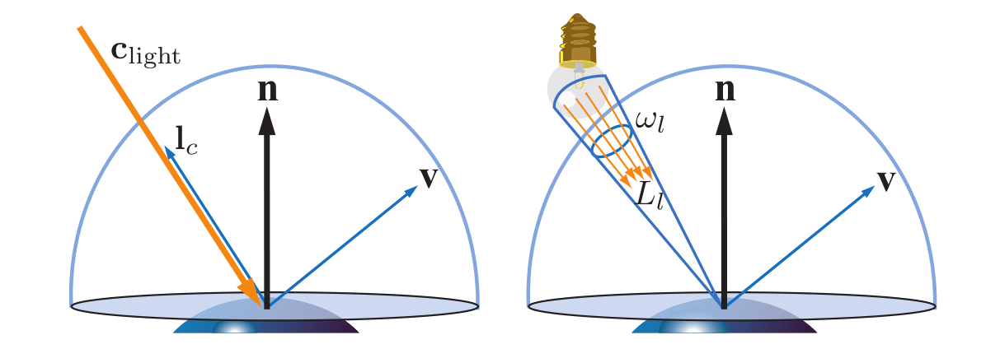
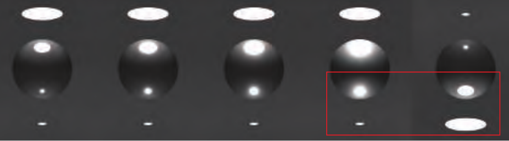

## 局部光照

局部光照指的是只考虑光源与物体表面进行交互的着色模型，并不是精确的光照结果。实际上，物体表面不仅会接受来自光源的直接光照，还会受到来自其他物体的间接光照，因此，若是想得到物理正确的结果，需要在着色点的法线半球面进行积分运算求解渲染方程了）也就是$L_o=\int_\Omega f_{brdf}(l,v)L_i(n ·l)^+d\omega$，在实时渲染中求解该方程是不现实的，所以需要寻求一些看起来正确的近似方法。

## 精确光源(Punctual Light Source)

精确光源定义为立体角无限小的球面光源。在这无限小的立体角中，光线的radiance为$L_c$，定义其光源的颜色$c_{light}$为其垂直照射在反照率为$(1,1,1)$的Lambertian表面所得到的出射光radiance，即

$c_{light}=\lim_{\Omega \to 0} \frac{1}{\pi}\int_\Omega L_cd\omega$。

对任意表面，精确光源对出射角度为$v$的radiance的贡献为:

$L_o=\int_\Omega f_{brdf}(l,v)L_c(n ·l)^+d\omega$

实际上整个半球面只有精确光源所在的立体角内有入射光，因此

$\int_\Omega f_{brdf}(l,v)L_c(n ·l)^+d\omega=\lim_{\Omega \to 0}\int_\Omega f_{brdf}(l,v)L_c(n ·l)^+d\omega$

而极小立体角可视为l无变化

$L_o=f_{brdf}(n ·l)^+lim_{\Omega \to 0}\int_\Omega L_cd\omega=\pi f_{brdf}(n ·l)^+c_{light}$

## 面积光(Area Light Source)
面积光源则是在立体角$w_l$内有恒定的入射radiance $L_l$的光源，其对出射光方向$v$的radiance贡献则是在这个立体角范围内的积分：

$L_o=\int_{l \in w_l} f_{brdf}(l,v)L_l(n ·l)^+dl$

一个在实时渲染中的近似解决方案是用精确光源替代面积光

$L_o \approx \pi f_{brdf}(n ·l)^+c_{light}$

这个近似方案必然是有误差的，因为面积光源与物体表面点的立体角并不是精确光源那种理想化的极小值。不过这个误差可以把控，其主要受两个因素影响：一为源与物体表面点的立体角，二为物体表面的粗糙度，因此，我们可以在仅用精确光源的情况下通过增加物体表面粗糙度来模拟物体被面积光源照射的结果：

不过对于特例理想漫反射表面-Lambertian，用精确光源来替换面积光源是精确的(?这里不还是有个近似吗)，其出射radiance可以通过iradiance得到：

$L_o(v)=\frac{\rho_{ss}}{\pi}E$

$\rho_{ss}$是表面材质属性中的反照率，irradiance $E$则可以通过积分计算：

$E=\int_{l\in w_l} L_l(n·l)^+dl \approx \pi c_{light}(n·l_c)^+$