# 联机GamePlay

## 技能

技能细分的话由可以分为主动技能,被动技能,各种游戏中也常将这两个概念分开来理解.不过从Gameplay的开发来说,被动其实可以理解为需要条件触发的主动技能.

无论是主动技能还是被动技能,通常都是由多个游戏逻辑组合而成,譬如一个技能会让角色播放动画,对命中的敌人造成伤害,给自己添加Buff...这些逻辑在游戏世界中通常需要一个逻辑承载体，在项目中这个承载体是AGE Action， Unreal的Gameplay Ability System框架下这个承载体是Gameplay Ability。程序实现Gameplay的原子（接口）提供给承载体，策划使用这些接口来实现最终的主动技能效果。

如果是单机模式，释放一个技能只需要将这个逻辑承载体创建在场景中并执行。

联机模式下，技能就需要根据情况选择不同的处理模式：

### 本地预表现

技能的预表现与移动的预表现逻辑类似，先在本地客户端执行技能逻辑，再把释放技能的指令发送到权威服务器进行校验(对应Unreal Gameplay Ability System的GameplayAbility::NetExecutionPolicy::LocalPredicted).

- 如果校验成功可以释放技能，那么就在服务器上执行技能逻辑，并用RPC通知其他客户端该角色释放了技能，在其他的客户端上也执行技能逻辑。

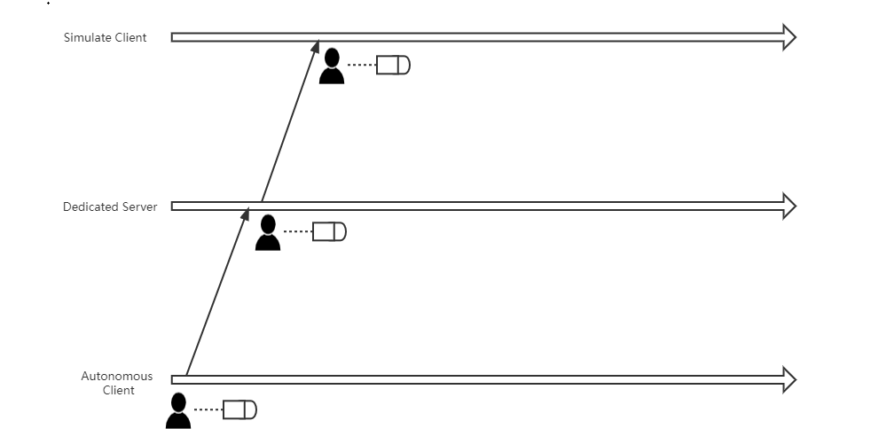  

- 如果校验失败，那么权威服务器和其他客户端都不会执行技能逻辑，权威服务器还会通知本地客户端校验失败，回滚本地执行的逻辑。

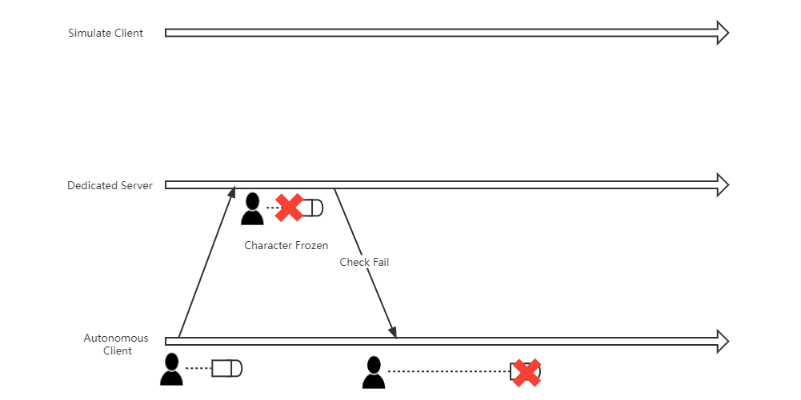

因为有预表现，玩家输入指令后本地客户端的角色能够立刻做出反应，手感是较为优秀的，但是问题在于可能会有客户端和服务器的逻辑不一致。

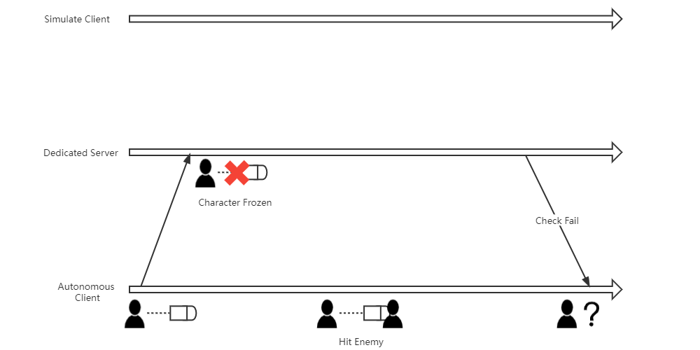

图中对时间轴进行了拉伸

设想这样一种情况，某个时刻玩家释放主动技能，这个主动技能的效果是立刻发射出一颗带轨迹的子弹，但在这个时刻，服务器认为该角色已经被其他玩家冰冻了，不应该释放技能。如果不做任何处理，权威服务器会命令本地客户端回滚技能效果。

从主动技能释放，到最终被服务器的RPC纠正回滚，至少会有一个RTT的延时，如果在这段时间内这个子弹命中了敌人，就会有本地客户端观察到子弹命中了，但却没有照成伤害。

### 服务器启动

服务器启动则是释放技能后,客户端并不立刻执行技能逻辑,而是发送RPC请求到服务器,等待服务器校验通过并通知客户端可以释放,本地客户端才执行技能逻辑(对应Unreal Gameplay Ability System的GameplayAbility::NetExecutionPolicy::ServerInitiated).

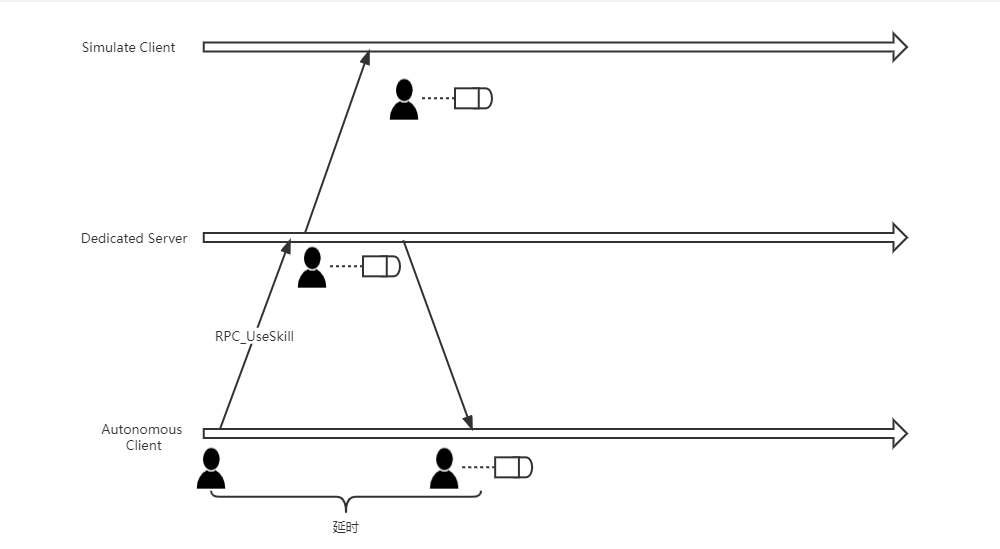

这样做的优势在于,客户端等待服务器的确认才能释放技能,技能逻辑不会出现与本地预表现那样逻辑不一致的情况.但是缺点也很明显,玩家从输入释放技能到最终看到技能的表现,中间至少有一个RTT的延时,手感通常较差.

根据个人的经验,蓄力释放的技能使用服务器启动的方式是较为合适的,客户端RPC通知服务器开始蓄力,服务器RPC通知客户端释放技能的延时感受都会被融合在蓄力中.

### 更复杂的模式

实际的开发中仅使用上述模式并不能处理所有的Gameplay,Bungie在GDC [Halo中的联机Gameplay](https://www.youtube.com/watch?v=h47zZrqjgLc)中提到了一个无敌护盾的例子:

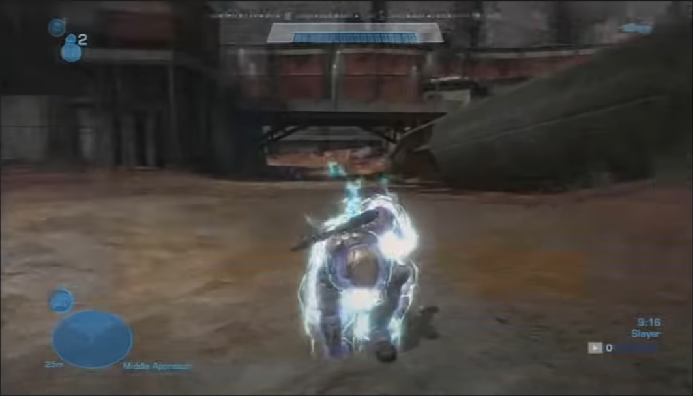

这个技能的效果是在短暂的准备动画后,角色身上添加护盾特效并进入无敌状态.

简单的想法是使用本地预表现来实现:

- 本地客户端按下按钮,通知服务器释放技能,并播放前摇动画,随后添加护盾特效.
- 服务器接收到释放技能的消息后,播放动画,并让角色进入无敌状态.

不过这样实现是有问题的,如果在服务器播放动画期间受到了伤害,很有可能会导致客户端本地已经播放了护盾特效表明进入无敌状态,但还是能受到敌方的伤害.

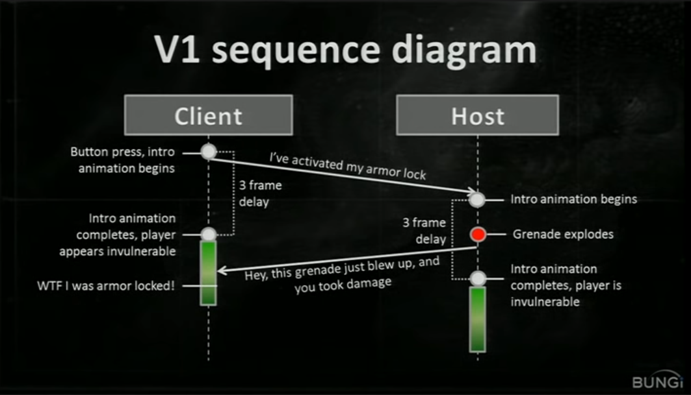

那么为了逻辑保持一致,是否应该使用服务器启动的模式? Bungie指出这也不是一个最优解,在播放完准备动画后,玩家至少需要等待1个RTT的延迟才能看到自己身上添加了护盾特效:

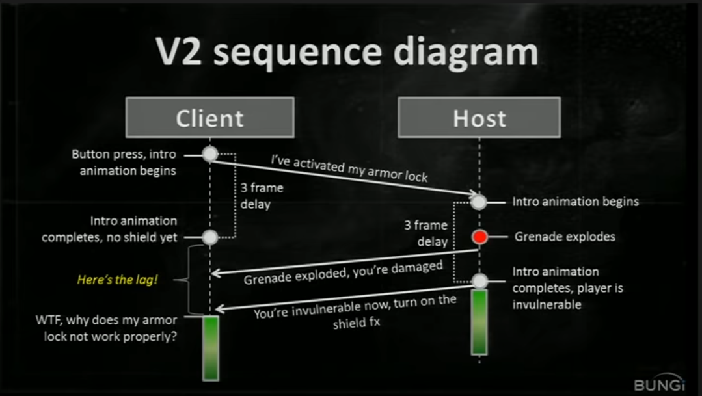

最终Bungie的解决方式是该技能本地客户端执行动画前摇,服务器则缩短前摇时长到1个RTT:

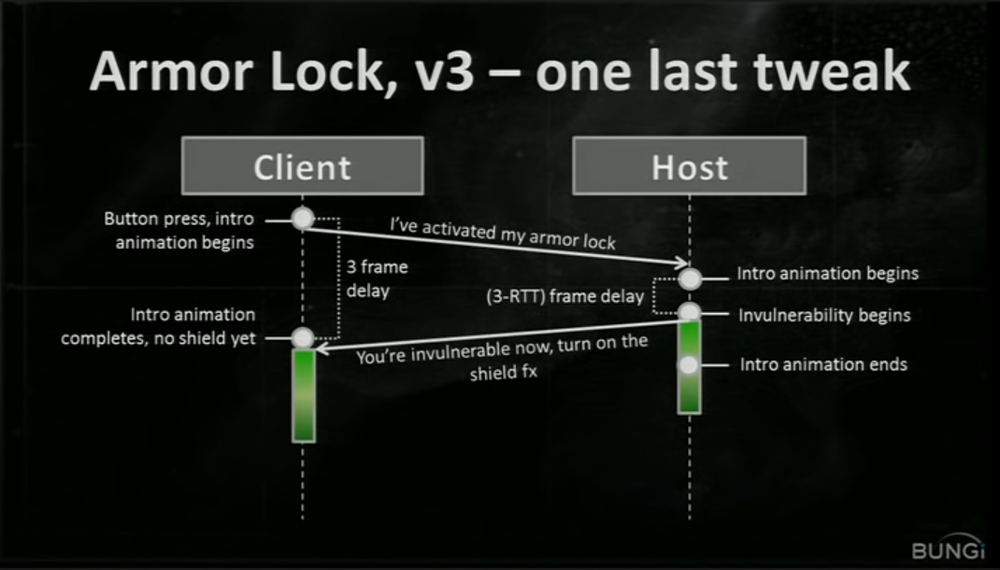

- 如果在服务器前摇期间受到了伤害,伤害发送到客户端时角色正在播放准备动画,受伤可以理解.
- 如果在服务器进入无敌后受到攻击,无论客户端正在播放准备动画还是激活了护盾特效,角色都不会受到伤害,技能效果表现与逻辑达成一致.

### 一点理解

总的来说技能的联机实现没有一个通用的解法能够处理所有情况,更多的是根据需要选择不同的方案,或是对通用解法进行优化,掩盖其缺点.

## Buff

玩家对角色移动,技能特效这些的延时比较敏感.但对于大部分逻辑都是修正属性的Buff来说却不是那么敏感.因此一个简单却好用的实现方式就是客户端完全听从服务器对Buff的添加和移除:

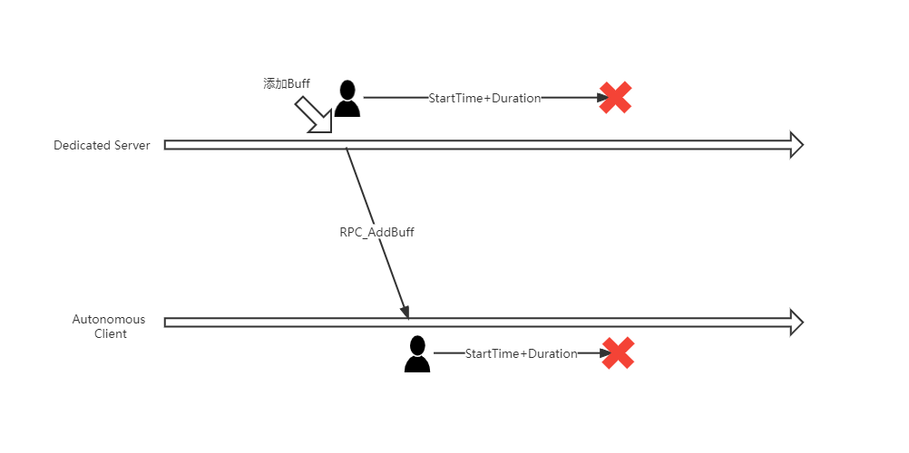

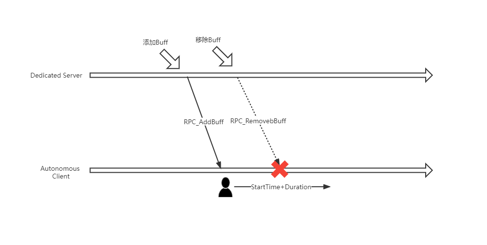

不过Unreal在GAS中对Gameplay Effect也进行了预表现:

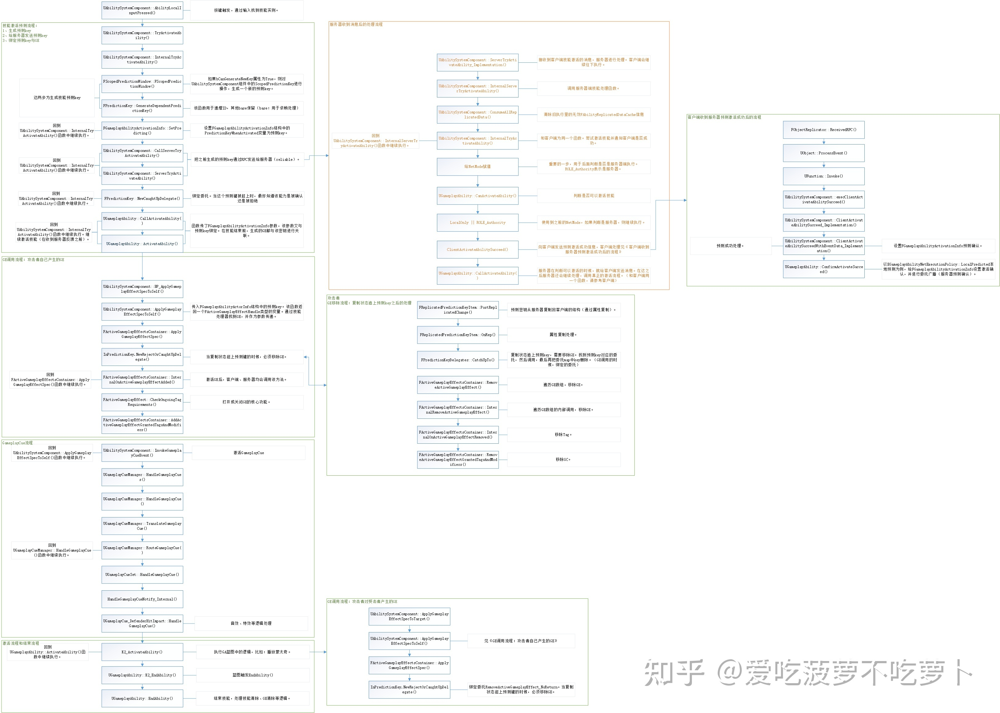