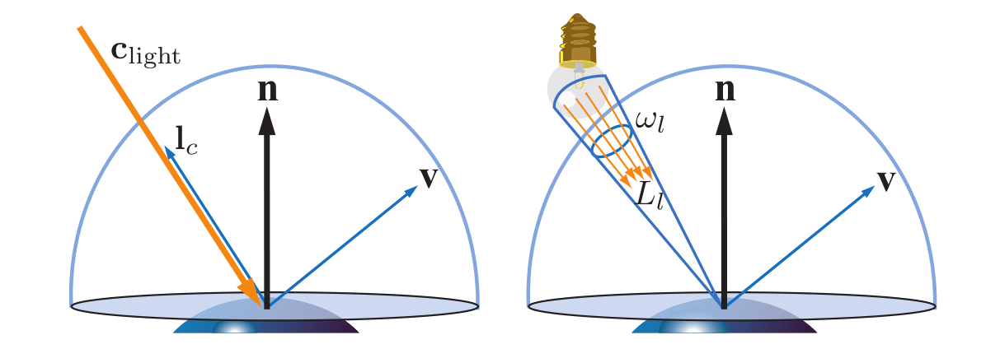
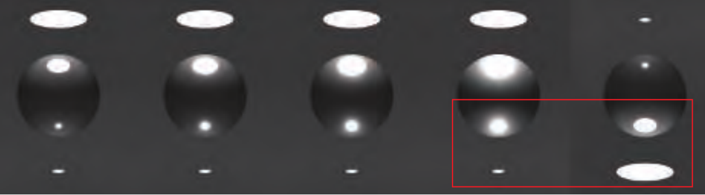
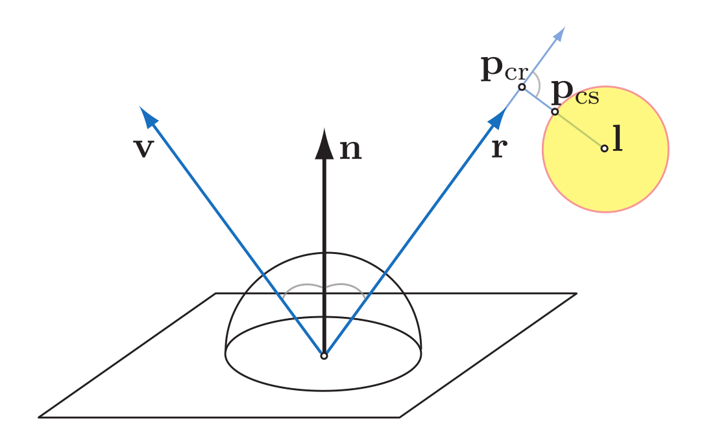
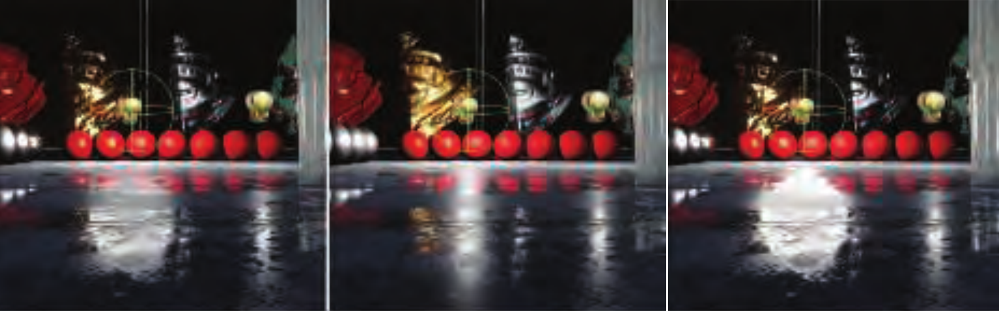

## 精确光源(Punctual Light Source)



精确光源定义为立体角无限小的球面光源。在这无限小的立体角中，光线的radiance为$L_c$，定义其光源的颜色$c_{light}$为其垂直照射在反照率为$(1,1,1)$的Lambertian表面所得到的出射光radiance，即

$c_{light}=\lim_{\Omega \to 0} \frac{1}{\pi}\int_\Omega L_cd\omega$。

对任意表面，精确光源对出射角度为$v$的radiance的贡献为:

$L_o=\int_\Omega f_{brdf}(l,v)L_c(n ·l)^+d\omega$

实际上整个半球面只有精确光源所在的立体角内有入射光，因此

$\int_\Omega f_{brdf}(l,v)L_c(n ·l)^+d\omega=\lim_{\Omega \to 0}\int_\Omega f_{brdf}(l,v)L_c(n ·l)^+d\omega$

而极小立体角可视为l无变化

$L_o=f_{brdf}(n ·l)^+lim_{\Omega \to 0}\int_\Omega L_cd\omega=\pi f_{brdf}(n ·l)^+c_{light}$

## 面积光(Area Light Source)
面积光源则是在立体角$w_l$内有恒定的入射radiance $L_l$的光源，其对出射光方向$v$的radiance贡献则是在这个立体角范围内的积分：

$L_o=\int_{l \in w_l} f_{brdf}(l,v)L_l(n ·l)^+dl$

在实时渲染中对一个区域进行数值积分是不现实的，一个近似解决方案是用精确光源替代面积光

$L_o \approx \pi f_{brdf}(n ·l)^+c_{light}$


这个近似方案必然是有误差的，因为面积光源与着色点的立体角并不是精确光源那种理想化的极小值。不过这个误差可以人为把控，其主要受两个因素影响：一为源与物着色点的立体角，二为物体表面的粗糙度，因此，我们可以在仅用精确光源的情况下通过增加表面粗糙度来模拟面积光源照射的结果：



### 漫反射表面的面积光着色

对于理想Lambertian漫反射表面，用点光源来替换面积光源是不会引入误差的，其出射radiance可以通过iradiance得到：

$L_o(v)=\frac{\rho_{ss}}{\pi}E$

$\rho_{ss}$是表面材质属性中的反照率，irradiance $E$则可以通过积分计算：

$E=\int_{l\in w_l} L_l(n·l)^+dl \approx \pi c_{light}(n·l_c)^+$

即

$L_o(v)=c_{light}\rho_{ss} (n·l_c)^+$

也就是

```CG

lightDiff=lightColor*albedo*max(0,dot(n,l))

```

### 光泽表面的面积光着色

对光泽表面而言，最重要的视觉效果便是高光，我们在现实中可以观察到光泽表面的高光区域形状和大小与面积光源的形状大小类似，而其边缘会随着物体表面的粗糙度变化而有不同程度的模糊，这个现象引出了一些经验模型来近似面积光的照射结果。

一种近似方法是根据物体和光源的位置来修正材质的粗糙度属性:

$\alpha_g^·=(\alpha_g+\frac{r_l}{|p_l-p|})$

这个近似是十分高效的，只修改了粗糙度的数值，不需要加入额外的计算过程，在大多数时候可以得到比较好的视觉效果。不过当物体表面十分光滑类似于镜面时，这个近似的效果就不那么好了，粗糙度变大并不能模拟镜面反射面积光源的结果，反而会让镜面看起来有一些模糊。

另一种近似方法则是修正着色点到光源的向量，例如，球面光源可以选取距离视线反射向量最近的点代表整个光源，与着色点之间的向量作为光源向量参与计算：



设着色点为$p_{shade}$，那么修正后的光源向量$l_{light}=p_{cs}-p_{shade}$

取代表点的思路看起来像是蒙特卡洛方法中的重要性采样，当要计算区域中某个函数的积分值时，可以着重采样概率分布比较大的区域。更为严格的解释则是

[积分中值定理]：当函数$f(x)$在区间D内连续时,$\int_D f(x)dx=f(c)\int_D dx$

对于光照而言，函数f(x)为$f(x)=f_{brdf}(l,v)L_i(n·l)^+$,区域D则是着色点上半球面中面积光源与着色点形成的立体角。



从左到右依次为数值积分，修正粗糙度，修正光源向量的渲染结果。