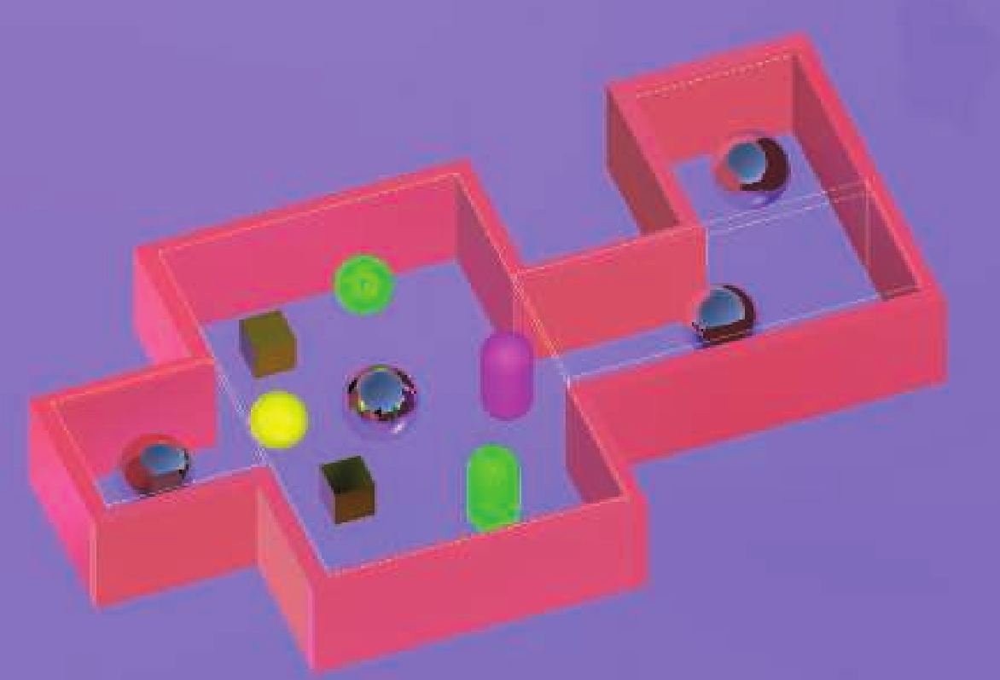
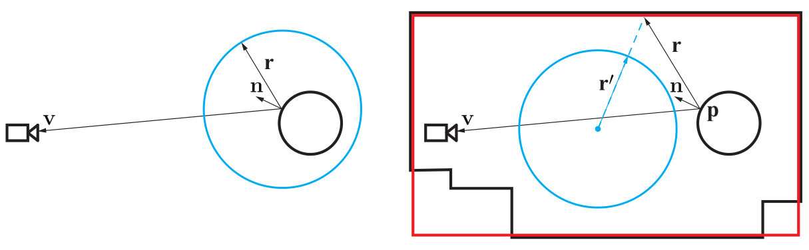
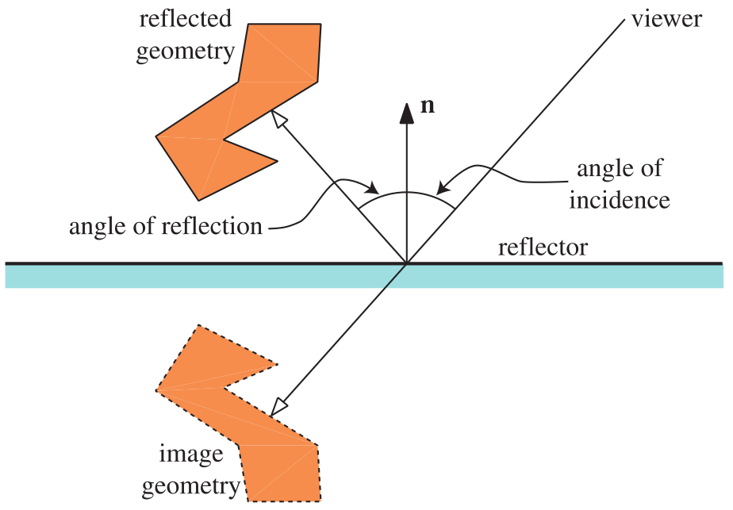

镜面材质的全局光照实现方式大致也可以分为预计算和近似计算两种实现方式。

## Localized Environment Maps

在Unity被称作Reflection Probe。

这种实现方式的原理与局部光照中的Specular IBL十分类似，主要有两点不同：

1.Specular IBL采样radiance的贴图是全局的EnvMap，LocalizedEnvMap则是在指定空间区域（多为立方体）内收集周围的radiance信息，在这个区域内的镜面材质物体着色才会使用这个LocalizedEnvMap。

2.Specular IBL中环境光被认为是从无穷远点入射到表面，因此直接使用视线反射向量来采样环境贴图并不会带来误差——相对于无穷远处，场景中的任意物体都可以视作在环境贴图的中心。但LocalizedEnvMap并不能这样处理，除非着色点正好位于作用区域的中心位置，越是偏离中心位置的着色点直接使用视线反射向量来采样LocalizedEnvMap产生的误差就会越大。

采样LocalizedEnvMap向量的计算方式如右图，首先根据视线向量$v$以及着色点法线$n$计算反射向量$r$，计算$r$与作用区域几何体的交点$p$，最终的采样向量$r`$为作用区域中心到交点$p$的向量。

除此之外，在Specular IBL中一些预处理的方法都可以用在LocalizedEnvMap，比如MipMap建立不同粗糙度的贴图，split-integral approximation等...

## Planar Reflections

当要渲染的物体是一个平面时，可以通过直接渲染场景中其他物体与此平面的镜像来模拟镜面材质，这种方法十分简单易于理解，不仅能渲染完美镜面的反射效果，也能模拟带有一定粗糙度的光泽表面。缺陷在于消耗很大，相当于场景中的物体要被渲染两次。

## Screen Space Methods

最常见的算法就是SSR以及基于这个算法的一系列改进和衍生算法。算法原理不难理解，大致的步骤为：

1.根据视线向量和着色点法线计算反射向量$r$

2.从着色点的空间位置（世界空间，视线空间，改进算法有投影到屏幕空间）开始，沿着反射向量$r$步进。

3.根据步进后迭代点投影到屏幕空间的坐标$P_{screenSpace}^i$在深度缓存中采样，判断缓存的深度是否比采样点的深度小，若是则认为光线与物体产生了交点，用$P_{screenSpace}^i$采样颜色缓存，作为入射方向$-r$的radiance贡献；反之则继续迭代步骤2，直到脱离场景。

原理虽然看起来比较简单，但如果就按这个思路去实现的话会发现效果几乎不能看，需要经过额外的优化算法才能有不错的效果，比如步进时不是每次增加固定长度而是二分查找，投影到屏幕空间进行迭代，对追踪起点做一些抖动...
有时间的话可以实现一下SSR算法。