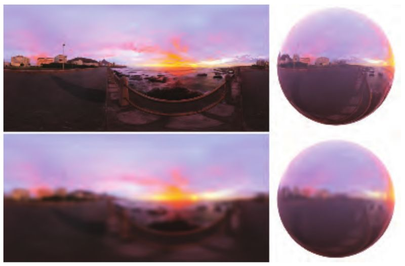
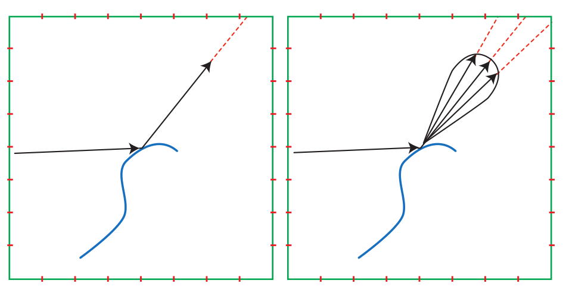
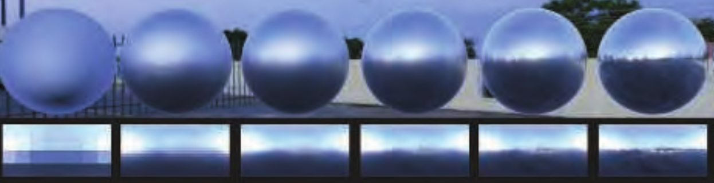

Environment Map原本用于渲染镜面反射（roughness=0），经过一些改造，也能够用于渲染粗糙度不为0的光泽表面。
通过采集空间中给定点周围所有方向的radiance信息并存储到EnvMap中，对这个EnvMap进行一些处理就能模拟各种粗糙光泽表面。

## Prfilter Environment Map

将原本用于渲染纯镜面的环境贴图进行模糊操作就能让使用这个环境贴图来渲染反射的表面看起来有'粗糙'的感觉：



模糊的方式有很多种(均值，高斯滤波...)，不过在进行模糊处理的时候并没有考虑表面的BRDF，更为合理的做法应该是根据表面的粗糙度，法线和视线方向生成一个Specular Lobe，并基于此对EnvMap进行模糊。



不过这样一来就会有多个参数共同控制Specular Lobe的形状，为每个参数存储一个预处理过的贴图是不现实的。因此，在实际应用中需要假设BRDF独立于视线方向和法线方向(各向同性？)，这样就只需要选择不同粗糙度预计算几张环境贴图，并在实时渲染中选取合适粗糙度的贴图使用。这个结构和GPU的MipMap十分贴合，现在的实现也都是用不同级的MipMap存储粗糙度不同的贴图。



## Split-Integral Approximation For Microfact BRDF

在微表面模型用环境贴图来渲染反射时，渲染方程有如下形式：

$f_{smf}(l,v)=\frac{F(h,l)G(l,v,h)D(h)}{4|n·l||n·v|}$

$L_{specularIBL}=\int_{l \in \Omega} f_{smf}(l,v)L_i(l)(n·l)dl$

数值积分求解在实时渲染中消耗太大，那么就需要近似方法：

$L_{specularIBL}=(\int_{l \in \Omega} D(r)L_i(l)(n·l)dl)(\int_{l \in \Omega}f_{smf}(l,v)(n·l))dl$

$r$是要采样的环境贴图的方向，这个方法也叫做split-integral approximation（这个近似看起来不那么物理，感觉上是看起来好就行的经验公式？）

经过分解后，第一个积分$\int_{l \in \Omega} D(r)L_i(l)(n·l)dl$只与表面粗糙度和反射向量相关，因为在预处理阶段无法确定法线方向n和视线方向v，只能假定$n=v=r$，在UE中的实现方式是：

``` CG
float3 PrefilterEnvMap( float Roughness, float3 R )
{
    float3 N = R;
    float3 V = R;
    float3 PrefilteredColor = 0;
    const uint NumSamples = 1024;
    for( uint i = 0; i < NumSamples; i++ )
    {
        float2 Xi = Hammersley( i, NumSamples );
        float3 H = ImportanceSampleGGX( Xi, Roughness, N );
        float3 L = 2 * dot( V, H ) * H - V;
        float NoL = saturate( dot( N, L ) );
        if( NoL > 0 )
        {
            PrefilteredColor += EnvMap.SampleLevel( EnvMapSampler , L, 0 ).rgb * NoL;
            TotalWeight += NoL;
        }
    }
    return PrefilteredColor / TotalWeight;
}
```
这个计算过程大致的思路是对法线方向用GGX分布进行重要性采样得到中间向量$H$，基于向量$H$计算视线向量$V$的反射向量$L$，所有采样点计算生成的$L$向量也就构成了在指定粗糙度(Roughness)和反射方向(R)的Specular Lobe，用$L$从EnvMap中采样取值平均，就得到了第一个积分式的数值积分结果。

第二个积分式$\int_{l \in \Omega}f_{smf}(l,v)(n·l)dl$ 在菲涅尔项使用Schlick近似时，$F_0$可以从积分中抽离出来：

$\int_{l \in \Omega}f_{smf}(l,v)(n·l)dl=F_0\int_{\Omega}\frac{f_{smf}(l,v)}{F(v,h)}(1-(1-v·h)^5)cos\theta_{l}dl+\int_{\Omega}\frac{f_{smf}(l,v)}{F(v,h)}(1-v·h)^5cos\theta_{l}dl=F_0*scale+bias$

抽离后可以发现在scale和bias的积分式中只有Roughness和$n·v$是变量：

$\frac{f_{smf}(l,v)}{F(v,h)}=\frac{D(h)G(l,v,h)}{4(n·l)(n·v)}$

UE中分别取不同的Roughness和$n·v$值预先计算这个数值积分并存放在一个2D LUT中，实时渲染时直接用Roughness和$n·v$索引取出scale和bias项，预计算的过程如下：

```CG
float2 IntegrateBRDF( float Roughness, float NoV )
{
    float3 N=float3(0,0,1)
    float3 V;
    //BRDF各向同性，所以在NoV给定时，所有V值得到的结果是一样的，这里就是任取一个向量V
    V.x = sqrt( 1.0f - NoV * NoV ); // sin
    V.y = 0;
    V.z = NoV; // cos
    float A = 0;
    float B = 0;
    const uint NumSamples = 1024;
    for( uint i = 0; i < NumSamples; i++ )
    {
        float2 Xi = Hammersley( i, NumSamples );
        float3 H = ImportanceSampleGGX( Xi, Roughness, N );
        float3 L = 2 * dot( V, H ) * H - V;
        float NoL = saturate( L.z );
        float NoH = saturate( H.z );
        float VoH = saturate( dot( V, H ) );
        if( NoL > 0 )
        {
            float G = G_Smith( Roughness, NoV, NoL );
            float G_Vis = G * VoH / (NoH * NoV);
            float Fc = pow( 1 - VoH, 5 );
            A += (1 - Fc) * G_Vis;
            B += Fc * G_Vis;
        }
    }
    return float2( A, B ) / NumSamples;
}
```

综合两个分解积分式，实时渲染时IBL的着色就是：
```CG
float3 ApproximateSpecularIBL( float3 SpecularColor , float Roughness, float3 N, float3 V )
{
    float NoV = saturate( dot( N, V ) );
    float3 R = 2 * dot( V, N ) * N - V;
    float3 PrefilteredColor = PrefilterEnvMap( Roughness, R );
    float2 EnvBRDF = IntegrateBRDF( Roughness, NoV );
    return PrefilteredColor * ( SpecularColor * EnvBRDF.x + EnvBRDF.y );
}
```
