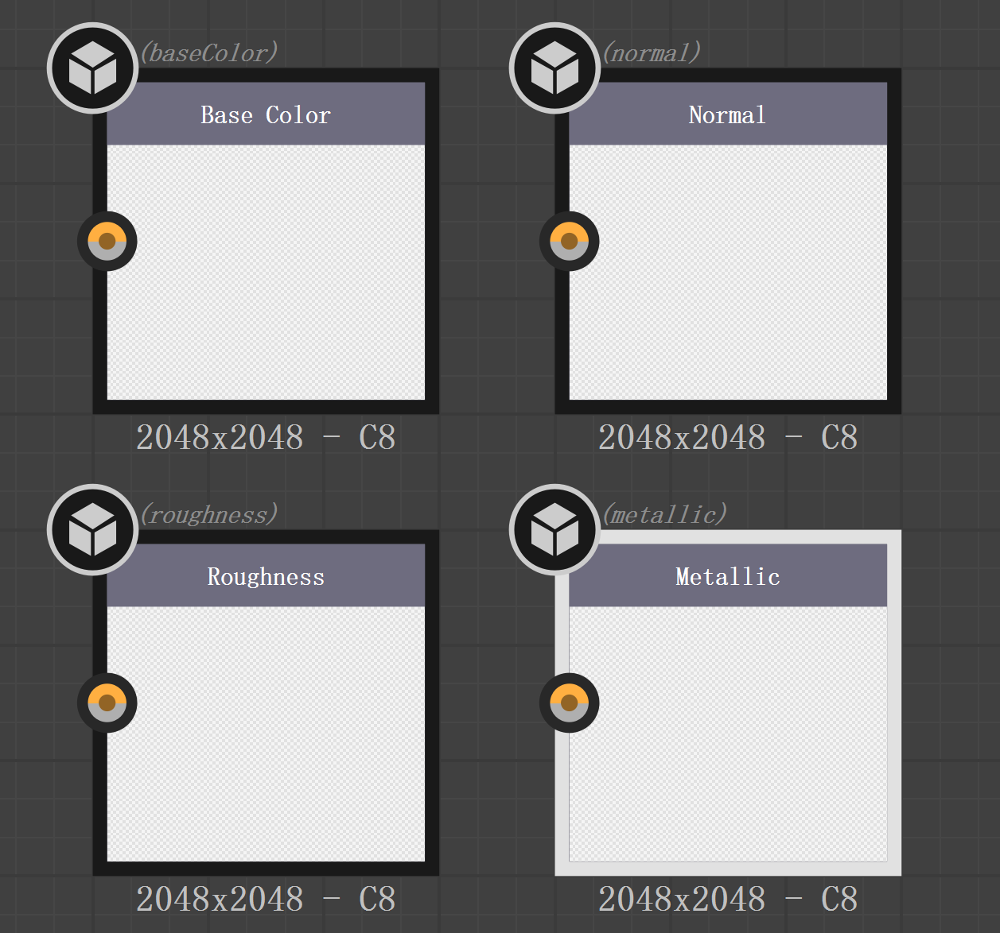

# Substance Designer

在听过几场关于程序化内容生成的技术分享后，对PCG管线的工具链产生了一些兴趣，就尝试着学了一点Substance Designer。

SD主要用于生成程序化的纹理贴图，在广泛使用的PBR着色模型下，SD通常会有下面四种输出：



分别是基础色、法线贴图、粗糙度和金属度，与虚幻引擎的Metallic/Roughness工作流可以完美对接。

SD的工作内容就是用数据流编程的方式来生成这些贴图，工具默认提供了很多方便使用的节点:

最基础也是最常用的就是各种Generator了，用于生成各种类型的高度图：


每种类型的节点都会提供很多参数供调节：


调节旋转参数后可以生成这样的图案：


另一类则是运算节点，可以理解为都是Pixel Processor的子类：


Pixel Processor与渲染中的Fragment Shader十分类似，都是对所有像素执行一个函数，并输出结果。

```
foreach pixel_in in input
    pixel_out = ProcessFunc(pixel_in1,pixel_in2...)
```

以节点Blend为例:


这个节点的作用是将Background和Foreground通过操作参数(add,sub,multiply...)混合得到结果，Blend的ProcessFunc可以简单的表示为：

```
ProcessFunc = Background op (Foreground * Opacity)
```

类似的，Transformation 2D节点则是将输入的节点进行位置变换，可以进行旋转平移缩放等操作:


其实就是对每一个像素进行了矩阵乘法：

$P^·=Matrix_{transform} · P$

这些节点类似于编程语言中的各种原子操作，实现这些基本原子后，就可以组合实现各种纹理。

以一个最简单的金属材质为例：


这些节点组合就会生成这样一张污渍被刮花的金属贴图：


基础色直接用金属的颜色与噪声图进行混合，看起来就像是金属被氧化了。法线贴图则是用进行一些加减操作后的高度图来实现指定形状的图案。粗糙度贴图则是由一张噪声贴图减去高度图，这样做的话金属突出的部分粗糙度较低，比较符合暴露在外的金属经常被摩擦污渍较少，同时噪声中黑色的部分粗糙度也比较低，看起来就像是污渍被清掉了。

这些数据流图也可以简单的用几句代码来描述：

```
distanceMap = DistanceMap(TileGenerator)
rotate45 = rotate(distanceMap)
rotate_45 = rotate("distanceMap)
detailMap = max(rotate45-rotate_45,0)

BaseColor = noise1*uniformColor*opacity;
Normal = detailMap
Roughness = noise2-detailMap*opacity
Metallic = 1

```

//TODO use in ue and unity
