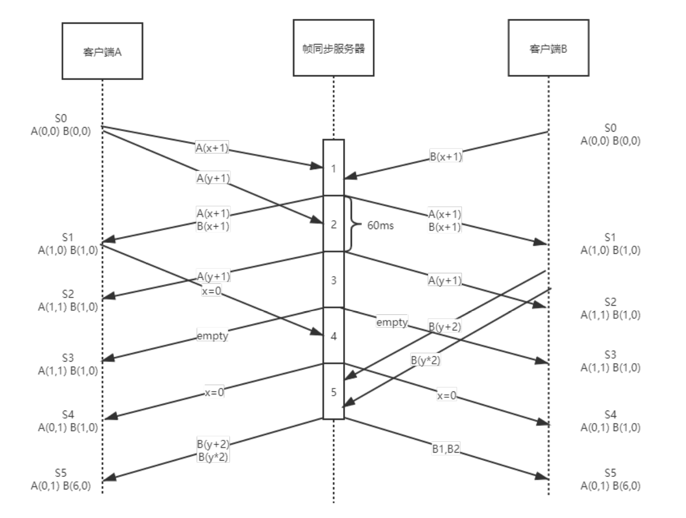

# 网络游戏同步

## 基本概念

网络游戏中，无论是多人pvp还是pve，都需要让所有玩家在除自己以外的玩家的客户端有表现，但由于网络延迟有可能会造成玩家游戏内容不同步，因此需要同步机制来确保所有玩家游戏内容的一致性。同步算法发展至今，大体可分为帧同步和状态同步两种方式。

## 帧同步

帧同步也被称作lockstep，锁步同步，原理十分简单：

相同的状态，接受相同的输入，执行相同的流程，到达新的相同状态。

可以从一个回合制游戏初步理解一下：

视频来自于宝可梦剑盾的联机对战，可以看到，游戏的每个回合双方玩家需要做出输入（选择宝可梦释放技能，使用道具或者交换上场...），在对战的双方确定输入后才会播放技能演示，进行逻辑处理（造成伤害，添加buff/debuff效果）并将游戏进程推进到下一个回合。

可以设想一下玩家可以控制宝可梦移动，不需要点选屏幕上的ui而是使用手柄按键来释放技能，做出输入的时间限制不是60秒而是60毫秒，游戏会变成什么样？显然，玩家移动摇杆后游戏内的角色能“立刻”走动，按下技能按钮也几乎能立刻看到技能效果，这也就是最原始的帧同步。

（顺带一提，暗黑破坏神2最开始也是设计成回合制游戏，后期通过减少回合的时长变成即时战斗）

### 如今的帧同步

经过多年的演化，现在的帧同步实现通常会设置一个转发服务器来接受所有客户端的指令，并下发数据包驱动客户端更新逻辑。

一个简单的例子，假设我们需要进行同步的是一个坐标，客户端A,B都有相同的初始状态A(0,0) B(0,0)。客户端A短时间连续操作，向服务器发出了A坐标x+1,y+1的指令，B客户端则向服务器发送了B坐标x+1的指令。在帧同步服务器的第一个逻辑帧内，A(x+1),B(x+1)的指令被服务器收到，服务器在帧末尾向A，B两个客户端转发这两条指令，客户端接受到服务器的驱动更新指令后进行逻辑更新，进入到一个新的状态S1 [A(1,0),B(1,0)] ，可以看到，虽然AB两个客户端进入到S1状态的时间不一样，但最终在逻辑更新后会达到同样的状态。

后续的逻辑帧更新类似，每一帧内服务器收到客户端的输入都会在帧末将这些指令转发到所有的客户端进行逻辑更新，如果游戏会在第N个逻辑帧结束，那么以这个算法来同步，可以保证AB两个客户端在所有的逻辑帧拥有相同的状态。

### 逻辑帧和渲染帧

这里需要注意区分逻辑帧和渲染帧，帧同步通常会将逻辑与渲染分离，逻辑更新指的是更新游戏内各种可交互实体的属性，比如角色位置，血量，技能CD，子弹位置...而渲染更新则是将显卡渲染好的一帧图像输出到显示器上进行展示。

为了让渲染帧的位置变化看起来顺畅自然，也需要使用一些预测算法，根据两个逻辑帧的状态插值过渡。人物运动行走有经典的航程算法(DeadRocking).

### 帧同步的优点

- 游戏逻辑没有服务器的概念，
- 网络传输只需要传输指令，相比状态同步十分节省网络流量。

### 帧同步的缺点

1.浮点数

相同的初始化状态和每帧相同的输入是容易保证的，但代码接受到同样的输入后有同样的状态变化却不是那么简单。

以根源的浮点数举例，不同平台的浮点数运算规则不一样，导致了物理引擎无法保证相同的物理逻辑更新在所有的客户端上有相同的结果，如果使用现成的物理引擎来实现帧同步游戏的物理计算，就很有可能违背代码接受到同样的输入后有同样的状态变化这一原则。

在windows和ubuntu平台下用同一份代码计算$x_{n+1}=f(x_n)=sin(x_n)$ 20次。

2.难以断线重连

帧同步的机制要求所有客户端都以初始状态从第一帧开始算，若玩家中途断线并且客户端没有了游戏当前的状态（杀进程），那么客户端需要从第一帧开始追帧，因为这个原因，帧同步也不太适合单局时长很长的游戏。

3.无法实现MMO类游戏

设想这样一个地图内可能有成百上千个玩家的MMORPG，在一帧内接受几百个输入并在客户端同时计算所有实体的游戏逻辑，无论是网络还是性能都是扛不住的。

4.没有办法反全图挂

虽然帧同步所有的逻辑都会运行在客户端，但一般的作弊帧同步也能够做得很好，可以看这篇文章

[帧同步中的反外挂](https://zhuanlan.zhihu.com/p/34014063)

大体的思路是服务器不仅承担收集转发指令的任务，还需要在游戏中或者结算的时候也运行游戏逻辑，来校验客户端的状态，不过因为单一的客户端拥有所有玩家的状态，面对全图挂是没有办法的。

## 快照同步

快照同步，只在服务器运行游戏逻辑，服务器运算得到结果后向所有的客户端广播。在这种同步算法下，客户端只是一个向服务器发请求并展示结果的纯表现终端，也有人认为这也算做状态同步的一种。

游戏体验时，玩家输入指令后明显感受到一段时间后才会有技能动画。对游戏响应性要求不高的游戏，比如棋牌，回合制通常会采用这种同步策略。

## 状态同步

帧同步通过同步操作，并根据操作进行相同的运算得到相同的结果，状态同步则直接同步状态。多数使用状态同步方案的游戏客户端和服务器都要运行游戏逻辑，不过客户端除了运行gameplay相关的逻辑还会有画面渲染，音效表现，服务器运行的是剔除了表现的纯逻辑。

客户端有丰富的表现：人物、枪械、场景，DS上只有各种碰撞框。

有预表现的状态同步的大致流程如下：

- 接受到玩家的输入后，客户端直接执行逻辑代码。
- 将运算的结果和玩家输入同时发送给服务器。
- 服务器收到客户端的输入后执行与客户端相同的逻辑代码。
- 服务器校验运算结果与客户端的运算结果，如果服务器与玩家客户端发送的运算结果一样，那么无事发生，如果不一样，服务器就会用服务器的运算结果修正客户端的状态。
- 将服务器的运算结果推送给第三方客户端。

### 状态同步的优点

- 相比帧同步需要等待服务器驱动，状态同步可以对输入做预表现，响应迅速。
- 天然支持断线重连，DS上拥有所有的信息，断线后只需要将这些信息发送给客户端。
- 性能优化容易，比如AI逻辑可以完全在DS上执行，客户端只需要表现位置变更动画表现以及放技能，一些复杂的逻辑也可以放在DS上做，客户端只做表现。

### 状态同步的缺点

- 流量较大，相比简单传输指令的帧同步，传输状态信息显然是需要更大的网络流量。
- 开发效率较低，每一个gameplay玩法都需要考虑客户端该怎么做，ds该怎么做，是否需要额外同步。
- 服务器开销较大，服务器通常要跑所有的游戏逻辑。
