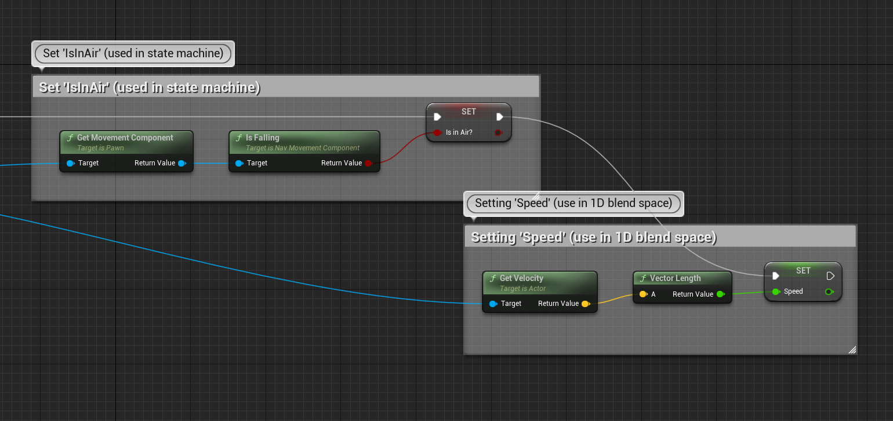
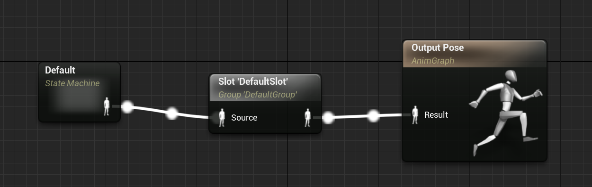
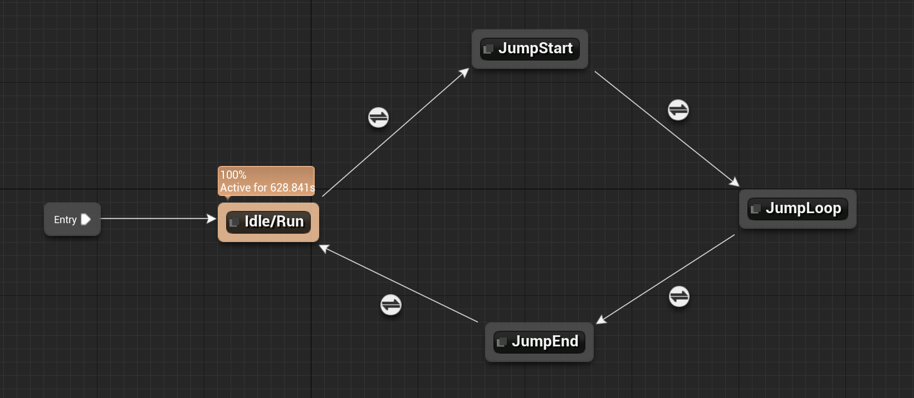
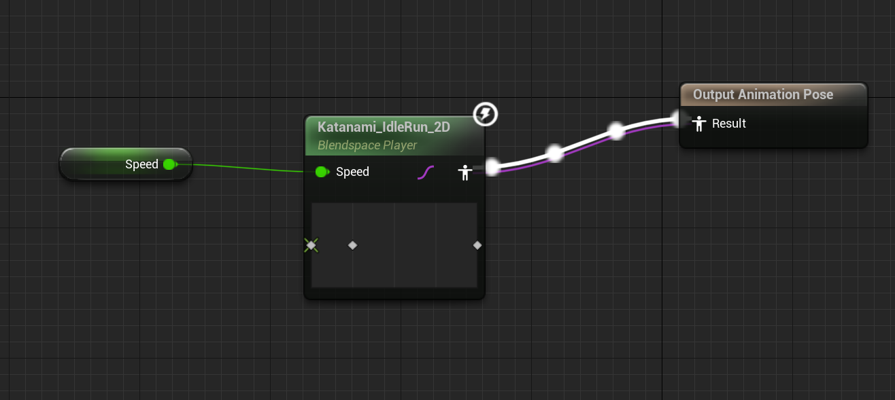
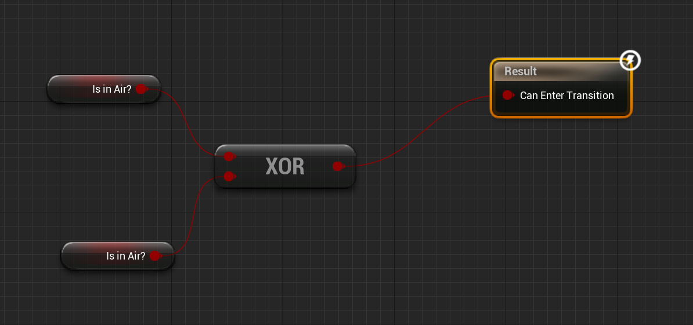
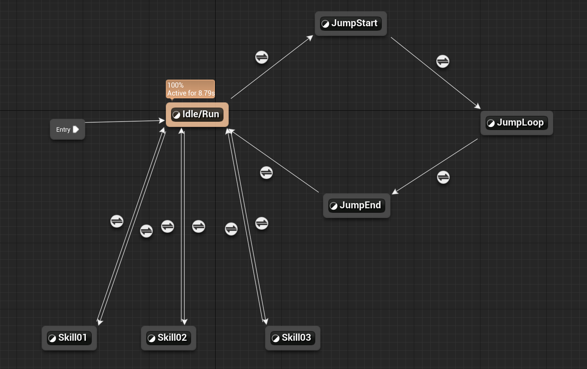
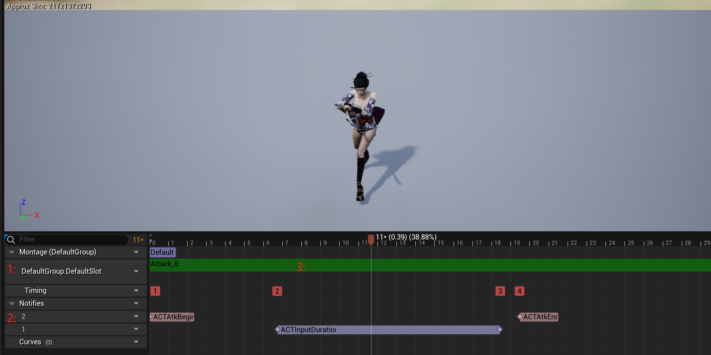

## Animation BluePrint

AnimationBP类似于Unity中的Animator,主要功能就是用状态机的形式播放动画.

打开动画蓝图的编辑窗口后，左下角可以看到EventGraph，AnimationGraph,AnimationLayers,Functions,Macros,Variables,EventDispatchers几个部分,比较关键的是EventGraph和AnimationGraph两个部分.


### EventGraph



初始工程角色的动画蓝图中EventGraph每帧都会从Pawn的Movement组件中获取角色移动状态，并根据这些状态的数值来设置动画蓝图中的预设变量(Variables).可以理解为根据游戏逻辑设置动画蓝图的参数，AnimationGraph中的状态机就会根据这些变量选取合适的动画进行播放.

上图就是从Pawn的MovementComponent中获取速度和下落状态,并设置sInAir,Speed变量.

### AnimationGraph

最简单的AnimationGraph，一个状态机决定最终播放的动画




展开状态机,可以看到状态机中状态的切换规则



每个State都会输出一个动画,如何输出也可以自定义蓝图来实现.

Idle/Run这个状态的输出动画,就是用EventGraph中设置的Speed变量对多个动画进行融合:



除了State可以用蓝图来定义输出,State间的Transition条件也可以用蓝图来描述:



可以用两个变量的异或值来决定是否切换状态.

### Anim Montage

动画蒙太奇个人觉得是个巧妙的设计.设想一下,用状态机实现了人物的行走跳跃翻滚后,如果想要实现按下某个键位后播放技能,动画状态机应该怎么加入技能动画呢?

如果只使用状态机,可能会这样实现:



在Variables中添加变量Skill,分别用Skill=1,Skill=2,Skill=3进入对应的状态播放技能动画.实际上应该也有项目是这样做的)

在技能比较少,状态机相对简单时,这样实现无可厚非.当状态机变得复杂时,技能状态与常驻状态耦合在同一个图中,开发新内容时需要改动AnimationGraph,技能变多时密密麻麻的连线也会增加理解成本.(不过用Unity的Animator只能这样实现,可以说是很难受了)

AnimationGraph中的蒙太奇插槽就很好的解决了这个问题.


StateMachine和OutputPose中的节点就是蒙太奇插槽,'DefaultSlot'是插槽的命名,是可以自定义的.正常情况可以认为这个节点不存在,此时

```
OutputPose = StateMachine
```

如果使用C++代码或者蓝图调用接口ACharacter::PlayAnimMontage(),OutputPose就会变成PlayAnimMontage中传入的动画:

```
OutputPose = Slot'DefaultSlot' Animation
```

也就是说,蒙太奇插槽能用指定动画覆盖在这个节点之前的所有动画.用这个功能来实现新增技能就很方便了,只需要新增一个AnimMontage,使用蓝图或者C++代码在合适的时机调用PlayAnimMontage接口播放,不需要更改AnimationGraph,逻辑分工也十分清晰.

AnimMontage则是由一个或多个动画片段组成,一个简单的蒙太奇示例:



大致可以分为三个部分:

- 1:指定插槽播放,蒙太奇资源必须预设好其在AnimationGraph中的对应的Slot,播放蒙太奇时会用该动画片段覆盖Slot前的动画.
- 2:动画回调事件,可以在动画回调事件中进行诸如播放音效,粒子效果计算伤害等功能.
- 3:动画片段,一个或多个AnimationSequence拼接而成,可以指定从什么位置播放.

ACT游戏中的搓招技能,连招也是通过蒙太奇来实现.
