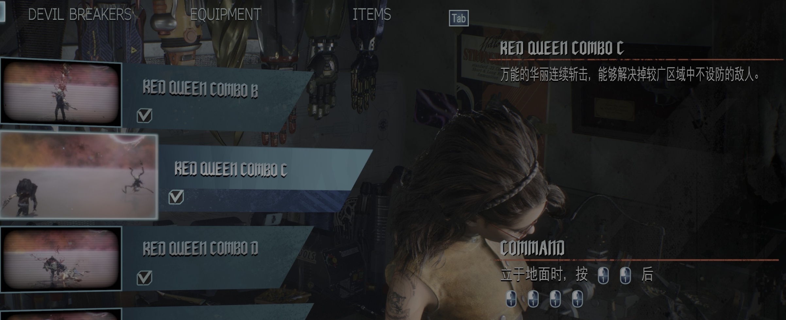
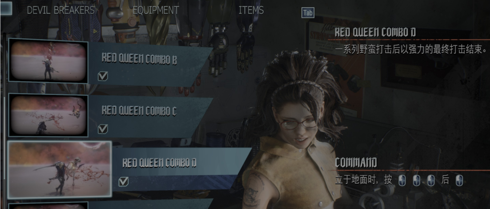
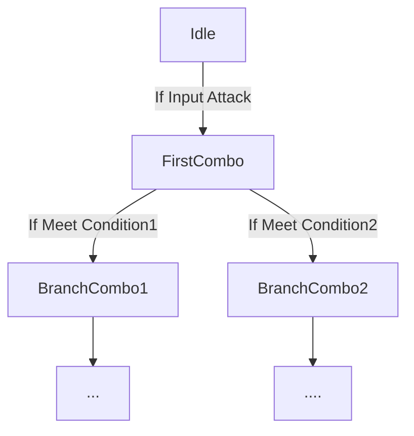

ACT常有攻击动作后根据下一次输入时机和按键进行变招的设计,也就是常说的连招了.以游戏鬼泣5中的角色尼禄为例,普攻的时机不同会有不同的连招:

Red QueueCombo C 前两次短间隔输入攻击键停顿后再输入四次攻击键

Red QueueCombo D 前三次短间隔输入攻击键停顿后再输入攻击键

当然这个连击变招还可以更复杂一点,比如攻击后不仅会根据输入时机生成连击,还会根据输入键位的不同产生新的连击.

这种多条件分支的连招形式,用数据结构中的树来描述是十分合适的.

## ComboTree

上面的两个连招就可以用二叉树表示为:

一般而言,连击树有如下形式:

当我们把连招抽象成树的结构后,树的每个节点由什么组成呢?

### ComboTreeNode

### ComboCondition