ACT常有攻击动作后根据下一次输入时机和按键进行变招的设计,以游戏鬼泣5中的角色尼禄为例,普攻的时机不同会有不同的连招:

<video src='UEACTCombo/ComboC.mp4' type='video/mp4' controls='controls'  width='50%' height='50%'> </video>

连续两次普攻后暂停一会再接四次普攻(Red QueenCombo C)

<video src='UEACTCombo/ComboD.mp4' type='video/mp4' controls='controls'  width='50%' height='50%'> </video>

连续三次普通后暂停一会再接一次普通(Red QueenCombo D)

这也就是动作游戏和格斗游戏中常说的(["目押"](https://zh.moegirl.org.cn/index.php?title=%E7%9B%AE%E6%8A%BC))系统.

## 目押

>目押是指将一系列出招指令按照一定的节奏，间隔输入以达成连段的技巧。是格斗游戏中一类重要的出招，连段技巧。目押被认为是格斗游戏玩家必练的，共通的基本功项目之一。目前市面上存在的各款主流格斗游戏不论采用什么样式风格的按键出招系统，过硬的目押功夫基本都是进阶玩家不可或缺的能力要求。

以攻击动作的动画蒙太奇为例来说明其原理:

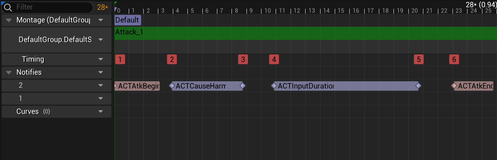

- Timing1 动画开始后禁止输入和移动操作
- Timing2-Timing3 处理伤害
- Timing4-Timing5 开放输入操作,允许玩家在此帧域内进行输入,如果有输入则打断当前动画,根据规则进行下一步Combo,否则进入后摇(不可输入)
- Timing5-Timing6 后摇,禁止输入
- Timing6 动画结束,开放输入和移动操作

理解了攻击动画片段进行连击原理,那么我们该如何描述多个攻击动画片段组成的连招呢?如果把视频中的两个连招的流程画出来,可以看到这样一张图:

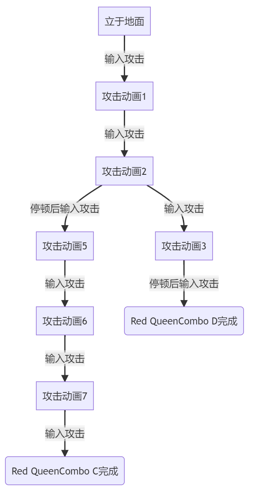

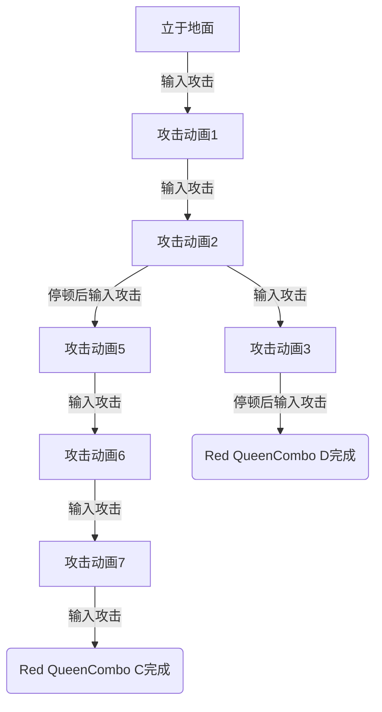

是不是很像数据结构中的二叉树?实际上用树来描述连招是十分合适的.

## 连击树

一般而言,连击树有如下形式:

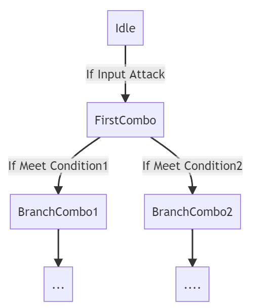

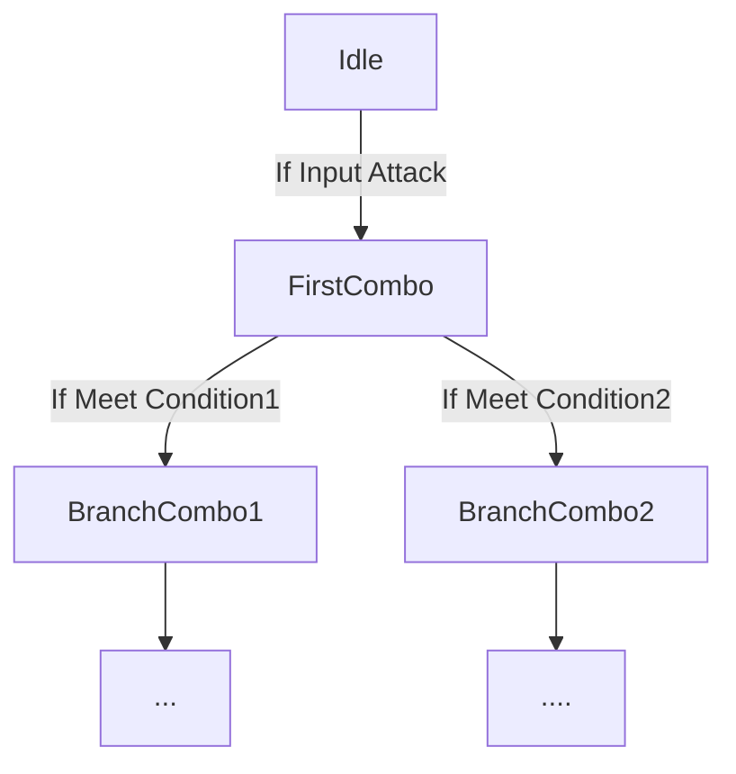

树的每个节点则包含了攻击的动画,分支以及分支条件信息,在UE中的定义为:

```cpp
//连击树实际上只需要一个根节点
UCLASS()
class ACTGAME_API UACTComboTree : public UACTDataItemBase
{
	GENERATED_BODY()

public:
	UPROPERTY(BlueprintReadOnly, EditDefaultsOnly)
	FName ComboName="None";
    //连击树的根节点
	UPROPERTY(BlueprintReadOnly, EditDefaultsOnly)
	FComboNodeStruct Root;
};
//连击树节点
UCLASS()
class ACTGAME_API UACTComboData : public UACTDataItemBase
{
	GENERATED_BODY()
public:
	//动画参数,用于播放蒙太奇
	UPROPERTY(BlueprintReadOnly, EditDefaultsOnly)
	TObjectPtr<UAnimMontage> MontageToPlay;
	UPROPERTY(BlueprintReadOnly, EditDefaultsOnly)
	FName StartSection = FName("None");
	UPROPERTY(BlueprintReadOnly, EditDefaultsOnly)
	float StartPosition = 0.f;
	UPROPERTY(BlueprintReadOnly, EditDefaultsOnly)
	float PlayRate=1.f;
    //分支信息
	UPROPERTY(BlueprintReadOnly, EditDefaultsOnly)
	FComboNodeStruct Next;
	UPROPERTY(BlueprintReadOnly, EditDefaultsOnly)
	FComboNodeStruct Branch;
};
//分支信息结构体
USTRUCT(BlueprintType)
struct FComboNodeStruct
{
	GENERATED_USTRUCT_BODY()
    //下一个分支
	UPROPERTY(BlueprintReadOnly, EditDefaultsOnly)
	TObjectPtr<UACTComboData> Combo;
    //下一个分支的进入条件
	UPROPERTY(BlueprintReadOnly, EditDefaultsOnly)
	TSubclassOf<AACTComboCondition> Condition;
};
```

基于此就可以生成一个资源文件来描述连击树中的一个节点:

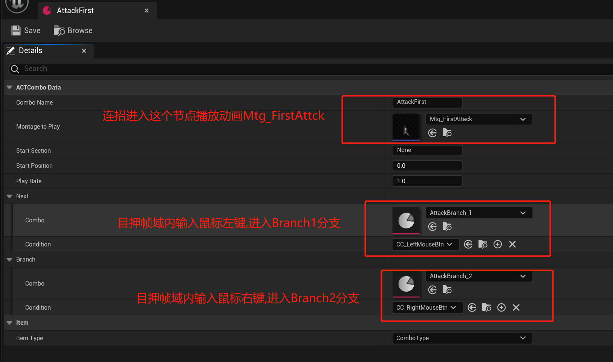

FComboNodeStruct中的Condition变量个人觉得是实现得比较有意思的点,最初的想法Condition应该是个返回布尔值的函数,使用的时候就能直接调用决定是否进入下一个分支:

```cpp
auto nowCombo=GetCurrentComboNode();
if((nowCombo->Next)->Condition())
    PlayCombo(now->Next);
if((nowCombo->Branch)->Condition())
    PlayCombo(now->Branch);
```

但是问题在于并没有找到能将函数序列化的方法.因此只能让Condition继承自Actor并定义接口MeetCondition,调用MeetCondition接口来决定分支逻辑,使用方式变成了:

```cpp
auto nowCombo=GetCurrentComboNode();
if((nowCombo->Next)->ConditionActor.MeetCondition())
    PlayCombo(now->Next);
if((nowCombo->Branch)->ConditionActor.MeetCondition())
    PlayCombo(now->Branch);

```

AACTComboCondition类定义和实现如下:

```cpp
UCLASS()
class ACTGAME_API AACTComboCondition : public AActor
{
	GENERATED_BODY()
public:
    AACTComboCondition();
	bool MeetCondition(AACTCharacter* _Owner)
    {
        return BP_MeetCondition(_Owner);
    }
protected:
	UFUNCTION(BlueprintImplementableEvent)
	bool BP_MeetCondition(AACTCharacter* _Owner);
};
```

节点中的CC_LeftMouseBtn(按下鼠标左键时进入分支)就是蓝图继承自AACTComboCondition,对BP_MeetCondition实现就是简单的判断按键是否输入:

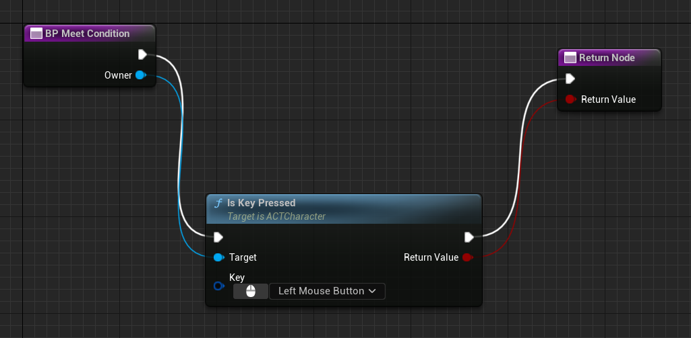

## 生成连击树

有了这些定义就能配置生成一个角色的连击树了,首先是把攻击动画剪辑成多个动画蒙太奇:

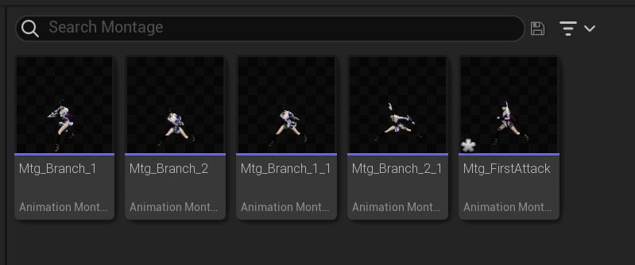

每个蒙太奇中NotifyTrack都包含有动画开始结束,造成伤害,目押帧域这些必备的功能,当然可以按照需求加上播放特效,播放音效,震镜等效果.

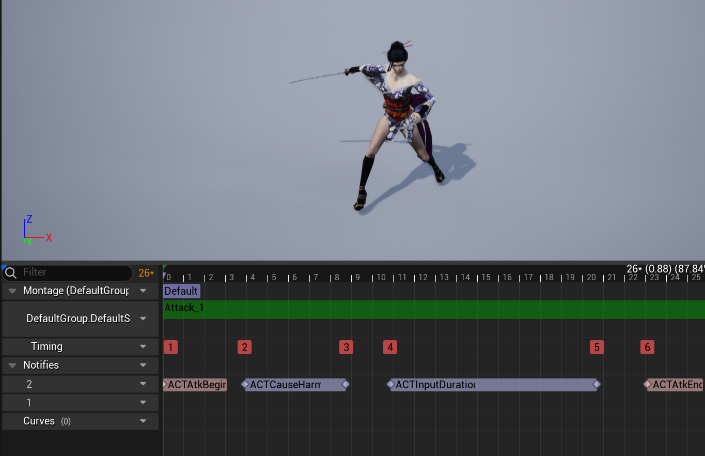

不过每个Notify实际上是需要实现的,主要分为Tick和Duration两种,Tick继承自AnimNotify,Duration继承自AnimNotifyState,在蓝图中实现对应的接口就好.以目押帧域的ACTInputDuration为例,Recived_NotifyBegin打开Character的输入,Recived_NotifyEnd关闭Character输入:

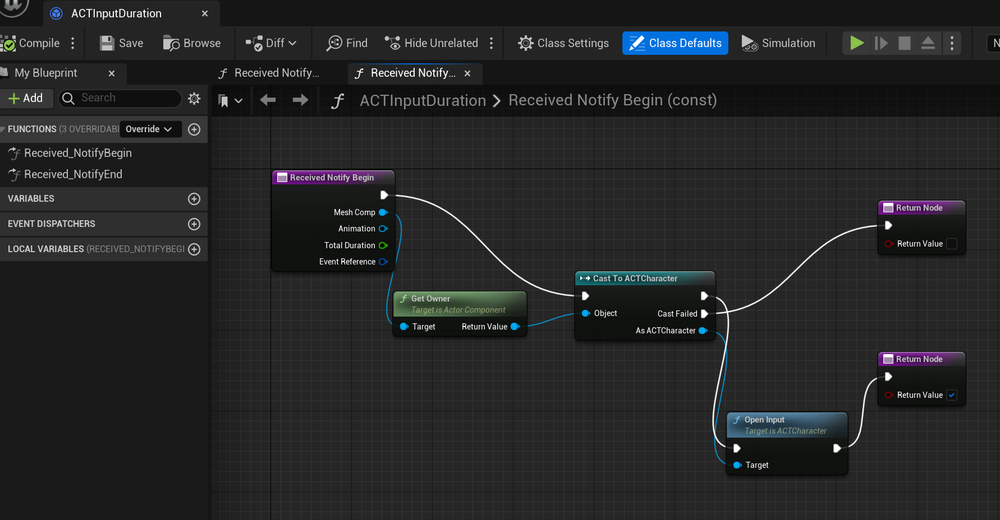

接下来就是配置连击树节点:

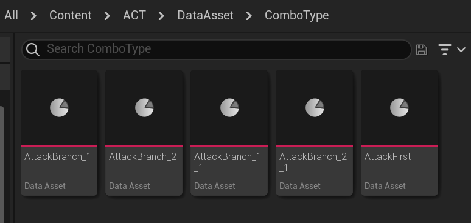

并按照规划的路径分配好每个动画后续分支动画,组合成连击树:

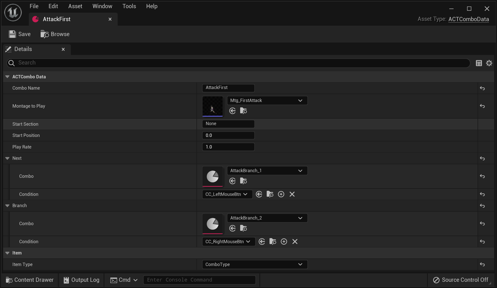
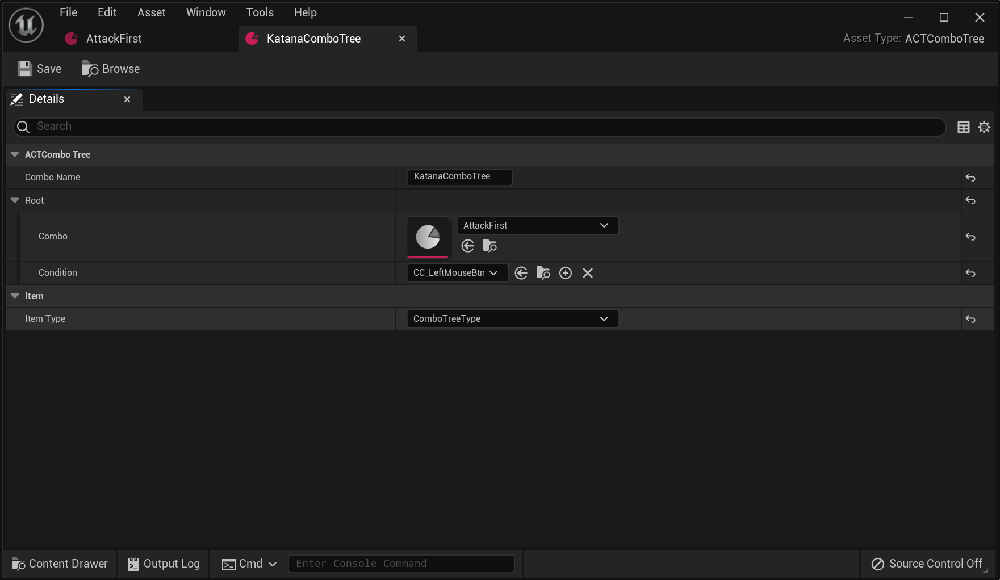

## ComboComponent

类似的,最后一步就是实现ComboComponent为Character提供Combo连击的能力了,定义如下:

```cpp
class AACTCharacter;
class ACTGAME_API UACTComboComponent : public UActorComponent
{
	GENERATED_BODY()
protected:
	//节点是否满足连击条件
	bool NodeMeetCondition(const FComboNodeStruct& node);
	//进入节点,开始播放动画
	void PlayNodeCombo(const FComboNodeStruct& node);
private:
	void InitComboTree();
public:	
	void OnKeyDown(const FKey& key);
	void ResetCurrentComboNode();
private:
	UPROPERTY()
	TObjectPtr<AACTCharacter> Owner;
	UPROPERTY()
	TArray<TObjectPtr<UACTComboTree>> ComboTreeList;
	UPROPERTY()
	TObjectPtr<UACTComboTree> ActiveComboTree;
	UPROPERTY()
	FComboNodeStruct CurrentComboNode;
};
```

每当有输入时,将根据当前节点以及对应的分支条件进行连招:
```cpp
void UACTComboComponent::OnKeyDown(const FKey& key)
{
	if (Owner == nullptr || ActiveComboTree == nullptr)
		return;
	if (!Owner->GetCanInput())
		return;
	//空闲状态,检查第一个节点
	if (CurrentComboNode.Combo==nullptr && NodeMeetCondition(ActiveComboTree->Root))
	{
		CurrentComboNode = ActiveComboTree->Root;
		PlayNodeCombo(CurrentComboNode);
		return;
	}
	//连击状态,检查连击树上的节点
	if (CurrentComboNode.Combo != nullptr)
	{
		auto comboData = CurrentComboNode.Combo;
		if (comboData == nullptr)
			return;
		bool currentNodeForward = false;
		if (NodeMeetCondition(comboData->Next))
		{
			CurrentComboNode = comboData->Next;
			currentNodeForward = true;
		}
		if (NodeMeetCondition(comboData->Branch))
		{
			CurrentComboNode = comboData->Branch;
			currentNodeForward = true;
		}
		if (currentNodeForward)
		{
			//成功连招
			Owner->AtkForward();
			PlayNodeCombo(CurrentComboNode);
		}
	}
}
```
判断节点满足条件需要根据配置加载一次对应的蓝图,调用蓝图中实现的接口来得到返回值:
```cpp
bool UACTComboComponent::NodeMeetCondition(FComboNodeStruct& node)
{
	if (node.Combo == nullptr)
		return false;
	//无要求,直接触发
	if (node.Condition == nullptr)
		return true;
	//加载蓝图
	if (node.ConditionActor == nullptr)
	{
		TArray<AActor*> conditionActors;
		UGameplayStatics::GetAllActorsOfClass(GetWorld(), node.Condition, conditionActors);
		if (conditionActors.Num() > 0)
			node.ConditionActor = Cast<AACTComboCondition>(conditionActors[0]);
		else
			node.ConditionActor = Cast<AACTComboCondition>(GetWorld()->SpawnActor(node.Condition));
	}
	//调用蓝图中实现的接口
	if (node.ConditionActor == nullptr)
		return false;
	return node.ConditionActor->MeetCondition(Owner);
}
```