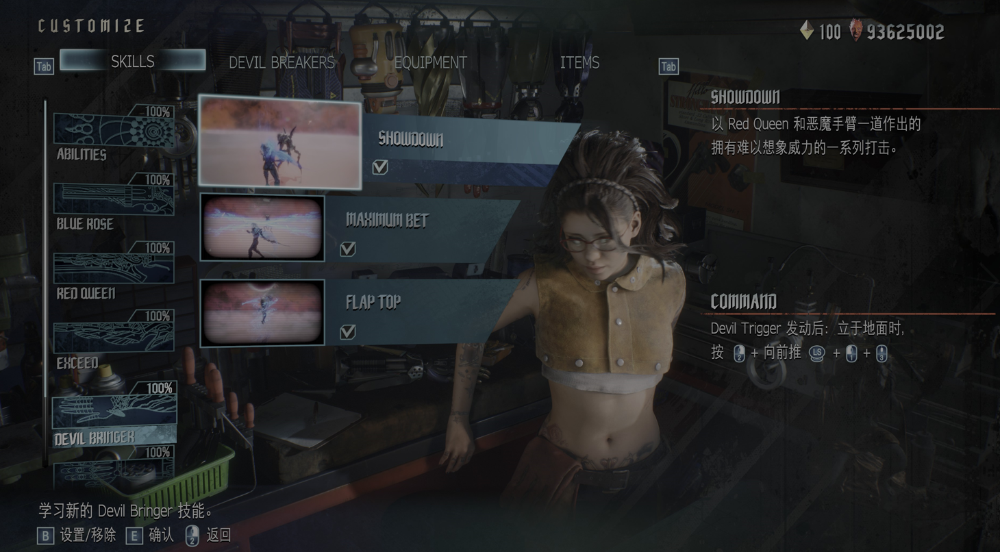
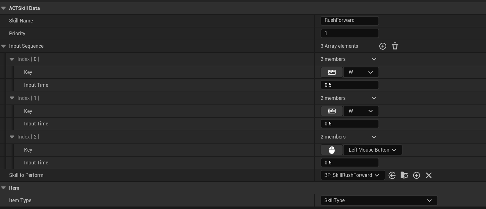
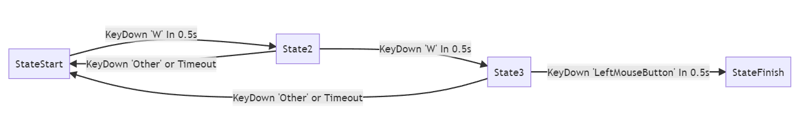
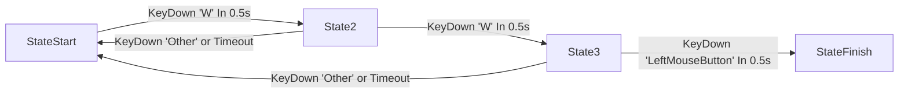
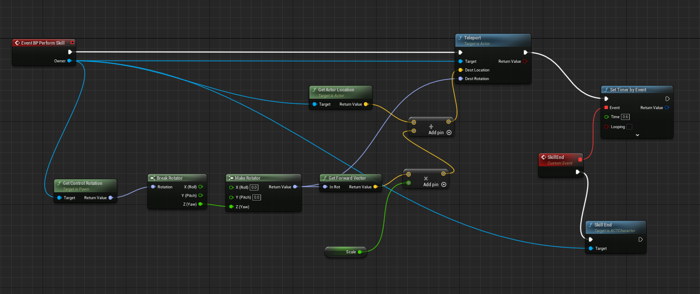

ACT游戏中一个关键的模块就是搓招放技能,鬼泣5一大核心内容就是搓招放技能打出绚丽的连击.



<center>尼禄的ShowDown需要短时间内快速输入4个键位释放</center>

如果抽象成程序代码,搓招放技能该如何实现呢?

## 简单实现

最简单的思路,把连招每个输入做一次if判断,以图中ShowDown技能为例:

```
OnKeyDown()
{
    int inputState=0;
    if(KeyDown(RightMouseBtn)&&inputState==0)
    {
        inputState=1;
        return;
    }
    if(KeyDown(Forward)&&inputState==1)
    {
        inputState=2;
        return;
    }
    if(KeyDown(LeftMouseBtn)&&inputState==3)
    {
        inputState=3;
        return;
    }
    if(KeyDown(MiddleMouseBtn)&&inputState==4)
    {
        PlaySKill(ShowDown);
        return;
    }
    inputState=0;
}
```

在每次接受输入的时顺序检测,直到技能的最后一个键位被输入.不过这样的做法太生硬了,每个技能都得程序实现.按照策划程序分工的原则,最好的做法应该是程序实现框架和原子,策划按照需求配置数据来实现功能.策划只需要配置类似于下方的连招表,程序就能自动读入数据执行.

|连招|技能|优先级|
|----|----|----|
|AA|技能1|1|
|AB|技能2|2|
|ACA|技能3|3|

## 数据准备

首先我们需要定义一个结构存储连招技能的数据,便于后续读取使用.

```cpp
struct FInputSkillStruct
{
	FKey Key; //输入键位
	float InputTime=0.5f; //输入时间
};
class UACTSkillData
{
public:
	FName SkillName = FName("None"); //技能名字
	int Priority = 0; //优先级
	TArray<FInputSkillStruct> InputSequence; //输入序列
	TSubclassOf<AACTSkill> SkillToPerform; //释放的技能
};
```

UE实现了UPrimaryDataAsset类提供了基本的序列化反序列化功能,基础的数据类就可以继承UPrimaryDataAsset,这样就能生成资源文件,并在运行时读入内存.



上图就是快速输入两次W然后输入鼠标左键释放向前传送的技能配置数据.

## 输入处理

以连招W+W+LeftMouseButton为例,画出其执行逻辑,容易得出这是一个状态机模型.





那么应该用有限状态机(finite-state machine,FSM)来实现?实际上还可以更简化一点,因为只有时间内正确输入推进到下一个状态,以及其他情况返回到起点,那么可以考虑只用一个链表保存所有输入,用一个指针cur指向当前状态,正确输入的Transition对应cur=cur->next,错误输入的Transition对应cur=head(当然用数组和index变量也是可以的),最终在UE的实现是:

```cpp
UCLASS()
class ACTGAME_API UACTSkillInputSequenceItem : public UObject
{
	GENERATED_BODY()

public:
	FName InputKeyName;
	float InputTime;

public:
	void Init(FKey inputKey, float inputTime);

};

UCLASS()
class ACTGAME_API UACTSkillInputSequence : public UObject
{
	GENERATED_BODY()
	
protected:
	UPROPERTY()
	FTimerHandle ResetTimeHandle;
	UPROPERTY()
	int NowSequenceIdx = -1;
	UPROPERTY()
	TArray<TObjectPtr<UACTSkillInputSequenceItem>> InputSequence;
public:
	void InitBySkillData(TObjectPtr<UACTSkillData> skillData);
	bool IsSequenceFinish();
	void Reset();
	void OnKeyDown(FKey key);

};

```

InitBySkillData的功能是从配置数据填充InputSequence:

```cpp
void UACTSkillInputSequence::InitBySkillData(TObjectPtr<UACTSkillData> skillData)
{
	if (skillData == nullptr || skillData->InputSequence.Num() == 0)
	{
		return;
	}
	NowSequenceIdx = 0;
	for(auto & itemData : skillData->InputSequence)
	{
		UACTSkillInputSequenceItem* item = NewObject<UACTSkillInputSequenceItem>(this);
		item->Init(itemData.Key, itemData.InputTime);
		InputSequence.Add(item);
	}
}
```

每次键盘输入,都会与当前的状态做判断,决定是否推进到下一个状态:


```cpp
void UACTSkillInputSequence::OnKeyDown(FKey key)
{
	if (InputSequence.Num() <= 0 || IsSequenceFinish())
		return;
	auto nowSequenceItem = InputSequence[NowSequenceIdx];
	if (nowSequenceItem == nullptr)
		return;
	if (nowSequenceItem->InputKeyName == key.GetFName())
	{
		GetWorld()->GetTimerManager().ClearTimer(ResetTimeHandle);
		++NowSequenceIdx;
		GetWorld()->GetTimerManager().SetTimer(ResetTimeHandle, this, &UACTSkillInputSequence::Reset, 1.0f, false, nowSequenceItem->InputTime);
	}
	else
	{
		Reset();
	}
}
```

## Skill定义

Skill是技能对应的实体,继承自UE的Actor基类.也就是说,释放技能会在场景中生成一个Actor,这个Actor执行具体的技能逻辑,类的定义和实现都十分简单:

```cpp
class AACTCharacter;

UCLASS()
class ACTGAME_API AACTSkill : public AActor
{
	GENERATED_BODY()
public:	
	void Perform(AACTCharacter* _Owner)
    {
        PerformSkill(_Owner);
	    BP_PerformSkill(_Owner); 
    }
protected:
	virtual void PerformSkill(AACTCharacter* _Owner);
	UFUNCTION(BlueprintImplementableEvent)
	void BP_PerformSkill(AACTCharacter* _Owner);
};
```

可以看到Perform的实现其实是分别调用了C++的PerformSkill以及提供给蓝图实现接口的BP_PerformSkill.这里的设计思路是,如果技能复杂,或是计算消耗太大,可以继承AACTSkill类C++实现.如果是简单的技能逻辑,可以用蓝图来做.


使用的方式则是SpawnActor后调用Perform接口.

```cpp
PlayingSkill = Cast<AACTSkilI>(GetWorld()->SpawnActor(readySkill->SkillToPerform));
PlayingSkill->Perform(Cast<AACTCharacter>(GetOwner()));
```

一个简单的向前传送技能蓝图实现:



大意是将调用Telport接口,将Actor传送到Actor.LocalLocation+Actor.Rotation.Foward*Length的位置.

## SkillComponent

所有需要的前置模块都实现后就是组装实现SkillComponent为Character提供搓招能力了.

``` cpp
class ACTGAME_API UACTSkillComponent : public UActorComponent
{
	GENERATED_BODY()
protected:
	UPROPERTY()
	TMap<TObjectPtr<UACTSkillData>, TObjectPtr<UACTSkillInputSequence>> SkillMap;
	UPROPERTY()
	TObjectPtr<AACTSkilI> PlayingSkill;
protected:
	void InitSkillMap();
	void AddSkill(TObjectPtr<UACTSkillData> skillData);
public:
	bool IsSkillPlaying();
    void OnKeyDown(FKey& key);
	UFUNCTION(BlueprintCallable)
	void OnSkillEnd();
};
```

InitSkillMap其实就是用序列化成资源文件的SkillData填充SkillMap,逻辑较为简单:

```cpp
void UACTSkillComponent::InitSkillMap()
{
	UACTAssetManager& manager = UACTAssetManager::Get();
	TArray<FPrimaryAssetId> skillAssetIds;
	manager.GetPrimaryAssetIdList(manager.SkillType, skillAssetIds);
	for (auto& id : skillAssetIds)
	{
		TObjectPtr<UACTSkillData> skillData = manager.GetPrimaryAssetObject<UACTSkillData>(id);
		AddSkill(skillData);
	}
}
```

关键的逻辑在于OnKeyDown,每当有输入时,将触发SkillMap中所有技能序列的OnKeyDown,之后找到一个优先级最高并且已经输入完毕的技能释放:

```cpp
void UACTSkillComponent::OnKeyDown(FKey& key)
{
	if (SkillMap.Num() == 0 || IsSkillPlaying())
		return;
	TObjectPtr<UACTSkillData> readySkill = nullptr;
	//find skill to perform
	for (auto iter = SkillMap.begin(); iter != SkillMap.end(); ++iter)
	{
		auto skillData = iter->Key;
		auto skillSeq = iter->Value;
		skillSeq->OnKeyDown(key);
		if (skillSeq->IsSequenceFinish())
		{
			skillSeq->Reset();
			if (readySkill == nullptr || skillData->Priority > readySkill->Priority)
				readySkill = skillData;
		}
    }
	if (readySkill != nullptr)
	{
		PlayingSkill = Cast<AACTSkilI>(GetWorld()->SpawnActor(readySkill->SkillToPerform));
		PlayingSkill->Perform(Cast<AACTCharacter>(GetOwner()));
	}
}
```