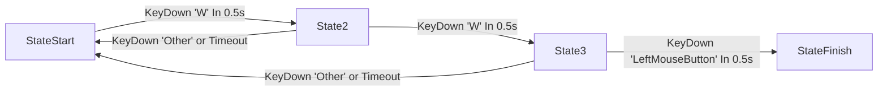

ACT游戏中一个关键的模块就是搓招放技能,鬼泣5一大核心内容就是搓招放技能打出绚丽的连击.


<center>尼禄的ShowDown需要短时间内快速输入4个键位释放</center>

如果抽象成程序代码,搓招放技能该如何实现呢?

## 简单实现

最简单的思路,把连招每个输入做一次if判断,以图中ShowDown技能为例:

```
OnKeyDown()
{
    int inputState=0;
    if(KeyDown(RightMouseBtn)&&inputState==0)
    {
        inputState=1;
        return;
    }
    if(KeyDown(Forward)&&inputState==1)
    {
        inputState=2;
        return;
    }
    if(KeyDown(LeftMouseBtn)&&inputState==3)
    {
        inputState=3;
        return;
    }
    if(KeyDown(MiddleMouseBtn)&&inputState==4)
    {
        PlaySKill(ShowDown);
        return;
    }
    inputState=0;
}
```

在每次接受输入的时顺序检测,直到技能的最后一个键位被输入.不过这样的做法太生硬了,每个技能都得程序实现.按照策划程序分工的原则,最好的做法应该是程序实现框架和原子,策划按照需求配置数据来实现功能.策划配置类似于下方的连招表,程序就能自动读入数据执行.

|连招|技能|优先级|
|----|----|----|
|AA|技能1|1|
|AB|技能2|2|
|ACA|技能3|3|

## 数据准备

首先我们需要定义一个结构存储连招技能的数据,便于后续读取使用.

```cpp
struct FInputSkillStruct
{
	FKey Key; //输入键位
	float InputTime=0.5f; //输入时间
};
class UACTSkillData
{
public:
	FName SkillName = FName("None"); //技能名字
	int Priority = 0; //优先级
	TArray<FInputSkillStruct> InputSequence; //输入序列
	TSubclassOf<AACTSkill> SkillToPerform; //释放的技能
};
```

UE实现了UPrimaryDataAsset类提供了基本的序列化反序列化功能,基础的数据类就可以继承UPrimaryDataAsset,这样就能生成资源文件,并在运行时读入内存.


上图就是快速输入两次W然后输入鼠标左键释放向前传送的技能配置数据.

## 输入处理

以连招W+W+LeftMouseButton为例,把其执行逻辑画出来,很容易就能得出这是一个状态机模型.



那么应该用有限状态机(finite-state machine,FSM)来实现?实际上还可以更简化一点,因为只有时间内正确输入推进到下一个状态,以及其他情况返回到起点,那么可以考虑只用一个链表保存所有输入,用一个指针cur指向当前状态,正确输入的Transition对应cur=cur->next,错误输入的Transition对应cur=head(当然用数组和index变量也是可以的),最终在UE的实现是:

```cpp
UCLASS()
class ACTGAME_API UACTSkillInputSequenceItem : public UObject
{
	GENERATED_BODY()

public:
	FName InputKeyName;
	float InputTime;

public:
	void Init(FKey inputKey, float inputTime);

};

UCLASS()
class ACTGAME_API UACTSkillInputSequence : public UObject
{
	GENERATED_BODY()
	
protected:
	UPROPERTY()
	FTimerHandle ResetTimeHandle;
	UPROPERTY()
	int NowSequenceIdx = -1;
	UPROPERTY()
	TArray<TObjectPtr<UACTSkillInputSequenceItem>> InputSequence;
public:
	void InitBySkillData(TObjectPtr<UACTSkillData> skillData);
	bool IsSequenceFinish();
	void Reset();
	void OnKeyDown(FKey key);

};

```

## Skill定义

