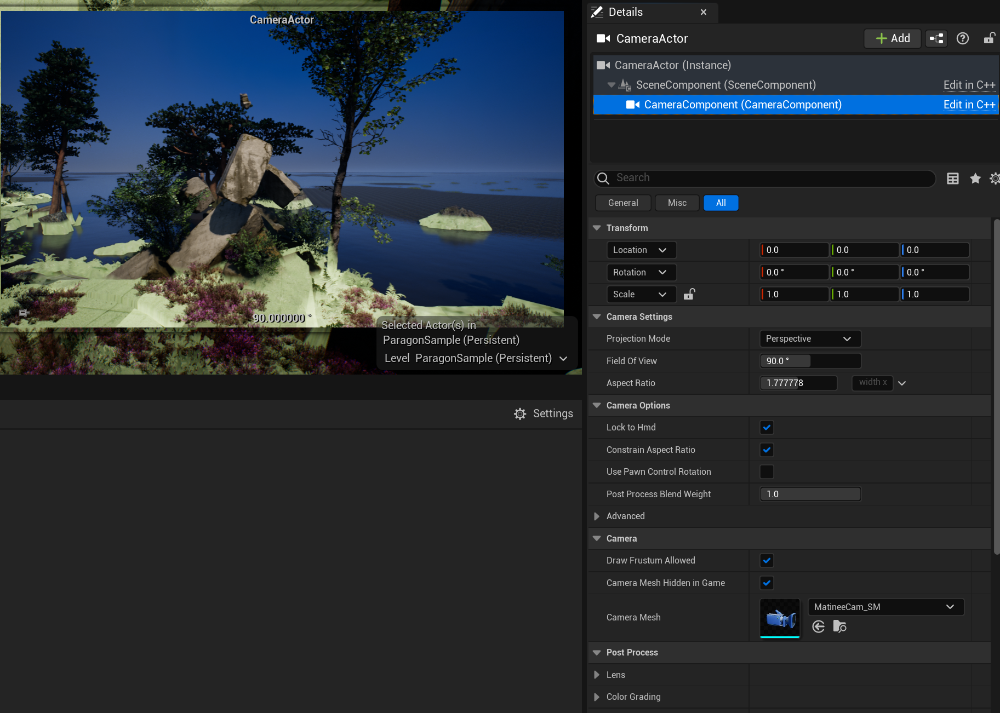
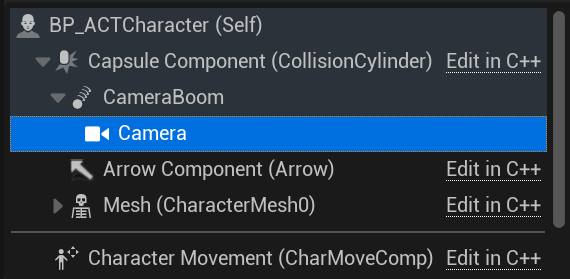
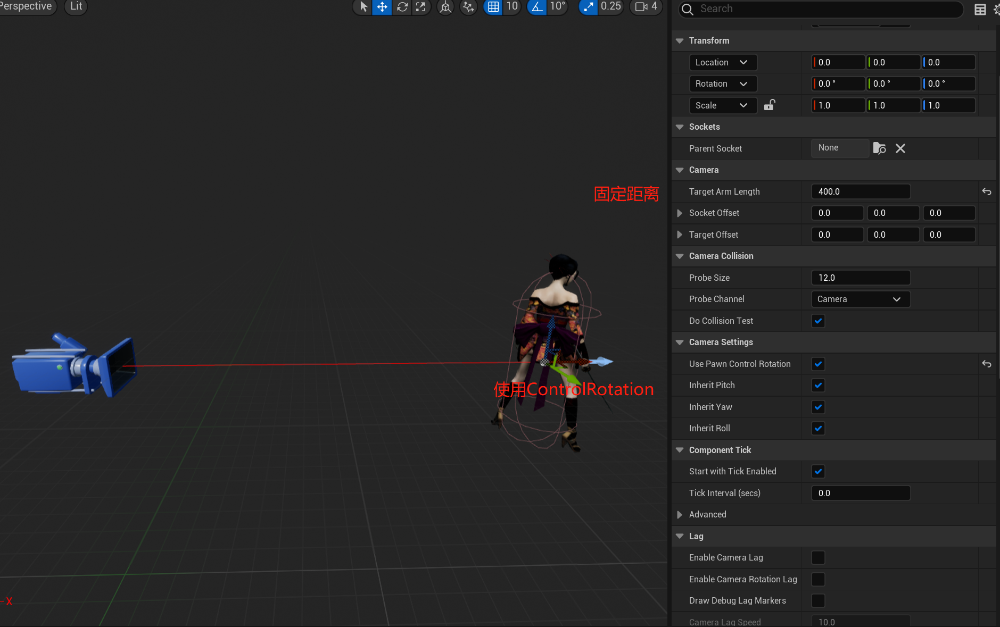
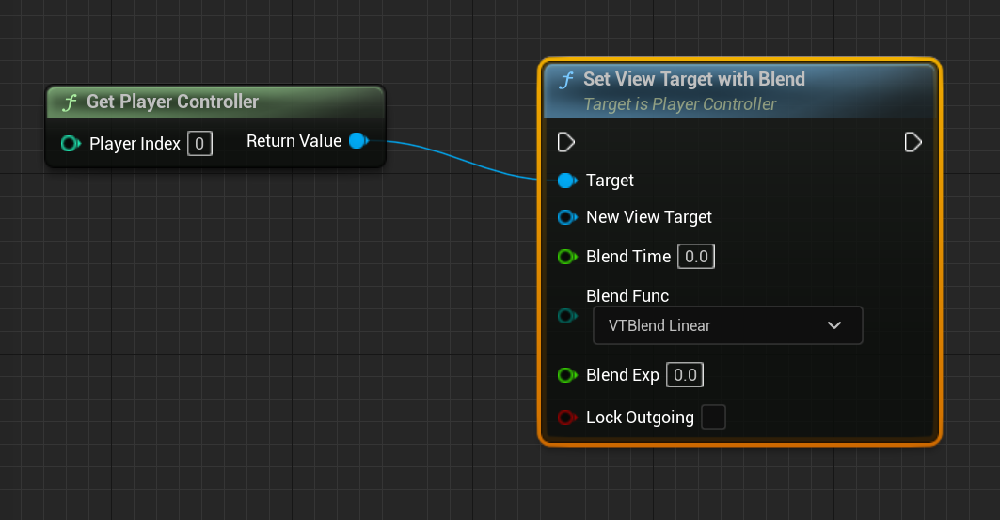
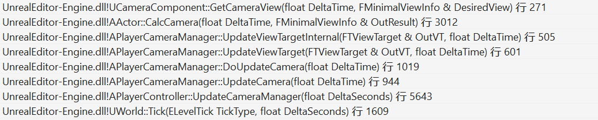
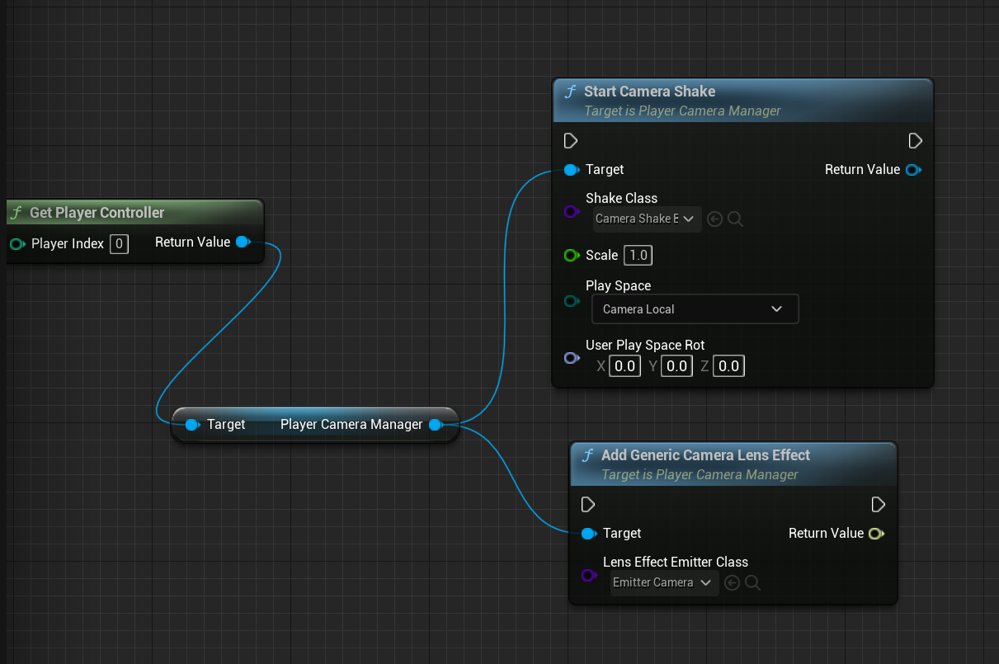

在游戏中，摄像机决定了玩家以什么样的方式来观察游戏世界.游戏的类型有多种,第一人称射击, 第三人称动作/射击,RTS,横版游戏...各种游戏类型对相机的实现也不一样.

UE GamePlay框架下的相机模块功能完备,大部分时候开发者不需要添加代码就可以实现各种类型游戏中的相机系统.

## Point Of View

UE的相机模块有个关键的概念,Point Of View(POV),也就是玩家的视点,其中有位置,旋转,FOV,AspectRation等各种决定渲染变换矩阵的属性.

```cpp
struct FMinimalViewInfo
{
	FVector Location;
	FRotator Rotation;
	float FOV;
	float DesiredFOV;
	float OrthoWidth;
	float OrthoNearClipPlane;
	float OrthoFarClipPlane;
	float AspectRatio;
    ...
}
```

在游戏世界中,POV可能会有多个,但只有一个POV会成为ViewTarget,也就是最终的虚拟相机属性.更直白的说法就是,可以在游戏世界中架设多台相机,但最终渲染结果只会用其中一个相机的摄影结果展示给玩家,这个ViewTarget的定义如下:

```cpp
struct FTViewTarget
{
    TObjectPtr<AActor> Target;
    FMinimalViewInfo POV;
}
```


## CameraComponent



CameraComponent提供了一个POV,一般而言作为ViewTarget的CameraComponent Location,Rotation,FOV等属性会直接传递给POV,可以看引擎中对CameraComponet::GetCameraView()的实现:

```cpp
void UCameraComponent::GetCameraView(float DeltaTime, FMinimalViewInfo& DesiredView)
{
    ...
    DesiredView.Location = GetComponentLocation();
    DesiredView.Rotation = GetComponentRotation();
    DesiredView.FOV = bUseAdditiveOffset ? (FieldOfView + AdditiveFOVOffset) : FieldOfView;
    ...
}
```

第三人称游戏,通常会在玩家角色蓝图上添加CameraComponent,引擎会优先使用角色下的相机作为ViewTarget.



CameraComponent并不是以Character作为父节点,而是以SpringArmComponent作为父节点.

## Spring Arm Component



这个组件的作用是将子节点固定在父节点的相对位置,当玩家行走,控制转向时,作为子节点的CameraComponent会跟随着移动转向.

这里看起来只需要放在子节点然后调节一个RelativePosition就能做到,为什么要多此一举用一个SpringArmComponent呢?实际上SpringArmComponent更重要的功能是检测相机是否与场景发生碰撞,在相机与场景发生交叉时候，弹簧臂将缩短父子节点的距离。遮挡消失后，距离又会变回设置的TargetArmLength.

除此之外,SpringArmComponent还提供了选项用ControlRotation来控制摄像机旋转,以及为了体现速度感和瞬移的Lag插值移动相机功能.

在这些组件的帮助下,第一人称的游戏可以将相机固定在人物的眼睛位置,第三人称则是把相机放在人物背后一段距离,第一/第三人称的切换也可以通过调整SpringArmComponent的属性来实现.RTS或者横版游戏的相机,也可以通过放置一个隐藏模型的Pawn在场景中实现.

## 相机切换

游戏开发中只有玩家身上的相机在有些情况可能满足不了需求.譬如进入副本播放入场动画,到达指定位置触发实时演算的过场可能就需要在多个POV进行切换,UE中实现相机切换也十分简单,在场景中放置多个CameraComponent,通过蓝图或者C++代码进行切换:

(PlayerController（玩家控制器） 是Pawn和控制它的人类玩家间的接口)

```cpp
APlayerController::SetViewTarget(class AActor* NewViewTarget, struct FViewTargetTransitionParams TransitionParams)
{
    if (PlayerCameraManager)
	{
		PlayerCameraManager->SetViewTarget(NewViewTarget, TransitionParams);
	}
}
```



为了让切镜不突兀,UE也预设了一些切换时的Blend效果:

``` cpp
enum EViewTargetBlendFunction
{
	/** Camera does a simple linear interpolation. */
	VTBlend_Linear,
	/** Camera has a slight ease in and ease out, but amount of ease cannot be tweaked. */
	VTBlend_Cubic,
	/** Camera immediately accelerates, but smoothly decelerates into the target.  Ease amount controlled by BlendExp. */
	VTBlend_EaseIn,
	/** Camera smoothly accelerates, but does not decelerate into the target.  Ease amount controlled by BlendExp. */
	VTBlend_EaseOut,
	/** Camera smoothly accelerates and decelerates.  Ease amount controlled by BlendExp. */
	VTBlend_EaseInOut,
	/** The game's camera system has already performed the blending. Engine should not blend at all */
	VTBlend_PreBlended,
	VTBlend_MAX,
};
```

PlayerController实际上会将SetViewTarget的操作转发给PlayerCameraManager执行,也就是唯一的摄像机管理类.

## PlayerCameraManager

```cpp 
class APlayerCameraManager : public AActor
{
    /** Current ViewTarget */
	UPROPERTY(transient)
	struct FTViewTarget ViewTarget;

	/** Pending view target for blending */
	UPROPERTY(transient)
	struct FTViewTarget PendingViewTarget;

	/** Time remaining in viewtarget blend. */
	float BlendTimeToGo;

	/** Current view target transition blend parameters. */
	struct FViewTargetTransitionParams BlendParams;

    //震镜之类的效果在这里
    UPROPERTY(transient)
	TArray<TObjectPtr<UCameraModifier>> ModifierList;
}
```

从PlayerCameraManager的定义来看,PlayerCameraManager决定了观察游戏世界最终的视角是怎样的,除了提供接口用于切换镜头,摄像机效果如震镜,镜头特效也是在其中处理,其更新最终ViewTarget的堆栈如下:



在UWorld中的所有Actor的Tick逻辑执行完毕后,引擎才会驱动PlayerController->PlayerCameraManager更新ViewTarget.

UCameraComponent::GetCameraView()就是用CameraComponent的属性的属性覆写ViewTarget中的POV数值.

更新POV后,一些可能会改动相机最终属性的效果(震镜)会在其后处理,最后会处理镜头效果.
```cpp
APlayerCameraManager::UpdateViewTarget()
{
    //更新POV
    ...
    //震镜
    ApplyCameraModifiers(DeltaTime, OutVT.POV);
    //镜头效果
    UpdateCameraLensEffects(OutVT);
}
```

这些效果也可以在合适的时机用蓝图或者C++代码添加.


