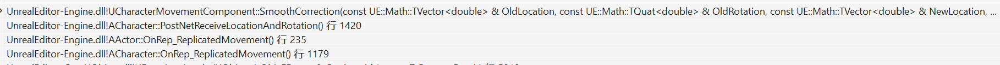

# UECharacterMovement

## SimulateSmoothing



Simulate每次接收到Server的位置信息都需要平滑插值更新,UCharacterMovementComponent::SmoothCorrection在ENetworkSmoothingMode::Linear和ENetworkSmoothingMode::Exponential模式下直接设置Collider的位置和旋转并保存接收的新位置与旧位置的差量:

```cpp
UCharacterMovementComponent::SmoothCorrection()
{
    ...
    FVector NewToOldVector = (OldLocation - NewLocation);
    ...
    ClientData->MeshTranslationOffset = ClientData->MeshTranslationOffset + NewToOldVector;
    if (NetworkSmoothingMode == ENetworkSmoothingMode::Linear)
	{
		...
        const FScopedPreventAttachedComponentMove PreventMeshMove(CharacterOwner->GetMesh());
		UpdatedComponent->SetWorldLocation(NewLocation, false, nullptr, GetTeleportType());
	}
	else
	{
        ...
        const FScopedPreventAttachedComponentMove PreventMeshMove(CharacterOwner->GetMesh());
		UpdatedComponent->SetWorldLocationAndRotation(NewLocation, NewRotation, false, nullptr, GetTeleportType());
	}
}
```

FScopedPreventAttachedComponentMove作用是作用域内将Mesh与Character的相对关系分离,Characer设置位置时不影响Mesh的位置.并在析构时还原相对关系,也就是说Characer的碰撞体已经在新位置了,Mesh还留在原地.

UCharacterMovementComponent::SmoothClientPosition则会用ClientData->MeshTranslationOffset插值计算Mesh位置:


```cpp
void UCharacterMovementComponent::SmoothClientPosition(float DeltaSeconds)
{
    ...
	SmoothClientPosition_Interpolate(DeltaSeconds);
	SmoothClientPosition_UpdateVisuals();
}

void UCharacterMovementComponent::SmoothClientPosition_Interpolate()
{
    ...
    if (NetworkSmoothingMode == ENetworkSmoothingMode::Linear)
	{
        ...
        ClientData->MeshTranslationOffset = FMath::LerpStable(ClientData->OriginalMeshTranslationOffset, FVector::ZeroVector, LerpPercent);
    }
    else if (NetworkSmoothingMode == ENetworkSmoothingMode::Exponential)
    {
        const float SmoothLocationTime = Velocity.IsZero() ? 0.5f*ClientData->SmoothNetUpdateTime : ClientData->SmoothNetUpdateTime;
        ClientData->MeshTranslationOffset = (ClientData->MeshTranslationOffset * (1.f - DeltaSeconds / SmoothLocationTime));
    }
}

void UCharacterMovementComponent::SmoothClientPosition_UpdateVisuals()
{
    ...
    if (NetworkSmoothingMode == ENetworkSmoothingMode::Linear)
    {
        const FVector NewRelLocation = ClientData->MeshRotationOffset.UnrotateVector(ClientData->MeshTranslationOffset) + CharacterOwner->GetBaseTranslationOffset();
        Mesh->SetRelativeLocation_Direct(NewRelLocation);
    }
    else if (NetworkSmoothingMode == ENetworkSmoothingMode::Exponential)
    {
        const FVector NewRelTranslation = UpdatedComponent->GetComponentToWorld().InverseTransformVectorNoScale(ClientData->MeshTranslationOffset) + CharacterOwner->GetBaseTranslationOffset();
		const FQuat NewRelRotation = ClientData->MeshRotationOffset * CharacterOwner->GetBaseRotationOffset();
		Mesh->SetRelativeLocationAndRotation(NewRelTranslation, NewRelRotation, false, nullptr, GetTeleportType());
    }
}
```

SmoothClientPosition_Interpolate会根据插值平滑的方式递减MeshTranslationOffset,线性插值是根据时间线性递减,指数插值则是指数递减直到变成FVector.Zero,也就是追上新位置.SmoothClientPosition_UpdateVisuals则是根据MeshTranslationOffset设置Mesh相对Character碰撞体的位置.

总的来说是想实现这样的效果:

<video src='https://github.com/chaosrings/chaosrings.github.io/blob/master/2022/06/21/UECharacterMovement/shadow.mp4?raw=true' type='video/mp4' controls='controls'  width='50%' height='50%'> </video>

## PerformMovement

一次在地面行走的堆栈:

PerformMovement->StartNewPhysics->(可能分支)PhysWalking->(可能分支)->[CalcVelocity][SafeMoveUpdatedComponent]->MoveUpdatedComponent->USceneComponent::MoveComponent