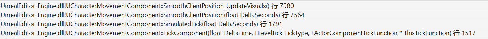
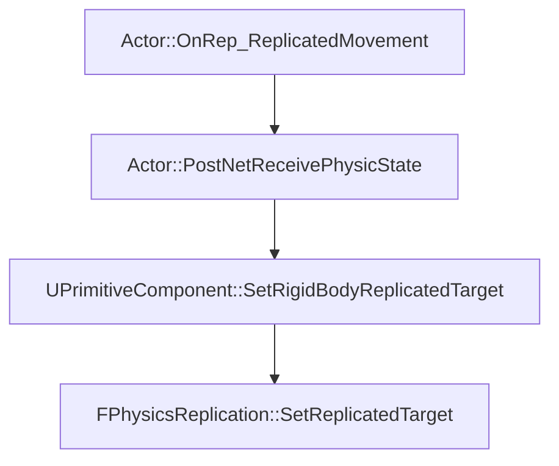

# UE引擎中模拟端的移动同步

虚幻引擎中模拟端(多人游戏中看到的除主角外的其他Actor)的移动同步主要分为两种,一种是没有物理模拟的Actor,玩家控制的Character通常就归于此类.还有一种需要进行物理模拟的Actor.

无论是否需要进行物理模拟,都在Actor的RPC中收到服务器下发的权威位置信息:

```cpp 
//ActorReplication.cpp
void AActor::OnRep_ReplicatedMovement()
{
    if (LocalRepMovement.bRepPhysics)
    {
        ...
		PostNetReceivePhysicState();
    }
    else
    {
        if (!RootComponent->GetAttachParent())
		{
			if (GetLocalRole() == ROLE_SimulatedProxy)
			{
                PostNetReceiveVelocity(LocalRepMovement.LinearVelocity);
				PostNetReceiveLocationAndRotation();
            }
        }
    }
}
```

## 无物理模拟的移动同步

分为两个部分
- 接受网络包设置相应的参数
- Tick中处理预测,平滑插值逻辑

### 接受网络包

无物理模拟的移动同步首先需要将客户端本地CharacterMovementComponent的速度设置为服务器下发的权威速度:

```cpp
//Pawn.cpp
void APawn::PostNetReceiveVelocity(const FVector& NewVelocity)
{
	if (GetLocalRole() == ROLE_SimulatedProxy)
	{
		UMovementComponent* const MoveComponent = GetMovementComponent();
		if ( MoveComponent )
		{
			MoveComponent->Velocity = NewVelocity;
		}
	}
}
```

接下来就是SmoothCorrection,直接将Collider的位置和旋转设置到服务器的权威位置信息,并让显示的Mesh维持在原来的位置,同时,保存接收的新位置与旧位置的差量,用于后续插值Mesh的相对位置.实际上就是影子跟随算法的实现:

<video src='https://github.com/chaosrings/chaosrings.github.io/blob/master/2022/06/21/UECharacterMovement/shadow.mp4?raw=true' type='video/mp4' controls='controls'  width='50%' height='50%'> </video>

```cpp
//Character.cpp
void ACharacter::PostNetReceiveLocationAndRotation()
{
	if(GetLocalRole() == ROLE_SimulatedProxy)
	{
		// Don't change transform if using relative position (it should be nearly the same anyway, or base may be slightly out of sync)
		if (!ReplicatedBasedMovement.HasRelativeLocation())
		{
            ... 
			CharacterMovement->SmoothCorrection(OldLocation, OldRotation, NewLocation, ConstRepMovement.Rotation.Quaternion());
			...
		}
		CharacterMovement->bNetworkUpdateReceived = true;
	}
}

/*
FScopedPreventAttachedComponentMove作用域内将Mesh与Character的相对关系分离,UpdatedComponent设置位置时不影响Mesh的位置,析构时还原相对关系,并保持原位置不变.
*/
UCharacterMovementComponent::SmoothCorrection(const FVector& OldLocation, const FQuat& OldRotation, const FVector& NewLocation, const FQuat& NewRotation)
{
    ...
    FVector NewToOldVector = (OldLocation - NewLocation);
    ...
    ClientData->MeshTranslationOffset = ClientData->MeshTranslationOffset + NewToOldVector;
    if (NetworkSmoothingMode == ENetworkSmoothingMode::Linear)
	{
        ...
        //保持Mesh维持在原地
        const FScopedPreventAttachedComponentMove PreventMeshMove(CharacterOwner->GetMesh());
        //直接设置到服务器的位置
		UpdatedComponent->SetWorldLocation(NewLocation, false, nullptr, GetTeleportType());
	}
	else
	{
        ...
        //保持Mesh维持在原地
        const FScopedPreventAttachedComponentMove PreventMeshMove(CharacterOwner->GetMesh());
        //直接设置到服务器的位置
		UpdatedComponent->SetWorldLocationAndRotation(NewLocation, NewRotation, false, nullptr, GetTeleportType());
	}
}
```


### Tick过程

这个过程分为两个步骤执行
- 1.使用服务器的权威速度继续预测碰撞体的移动.
- 2.插值平滑Mesh.

整个逻辑的入口函数在SimulatedTick.

```cpp
void UCharacterMovementComponent::SimulatedTick(float DeltaSeconds)
{
    ...
    /////////////////////1.使用服务器的权威速度继续预测碰撞体的移动./////////////////////////
    //前面是一些RootMotion同步的逻辑,这里忽略了
    if (CharacterOwner->IsReplicatingMovement() && UpdatedComponent)
    {
		const bool bPreventMeshMovement = !bNetworkSmoothingComplete;
        // Avoid moving the mesh during movement if SmoothClientPosition will take care of it.
        //继续保持Mesh不跟随Collider移动
		{
			const FScopedPreventAttachedComponentMove PreventMeshMovement(bPreventMeshMovement ? Mesh : nullptr);
            //预测移动
            SimulateMovement(DeltaSeconds);
        }
    }
    ...
    /////////////////////2.插值平滑Mesh./////////////////////////
    // Smooth mesh location after moving the capsule above.
	if (!bNetworkSmoothingComplete)
	{
		SmoothClientPosition(DeltaSeconds);
	}
}
```


#### 预测移动Collider

```cpp

//预测移动
void UCharacterMovementComponent::SimulateMovement(float DeltaSeconds)
{
    ...
    //前面是一些复杂的校验,设置参数的逻辑,这里就忽略了
    FStepDownResult StepDownResult;
    //真正执行移动
	MoveSmooth(Velocity, DeltaSeconds, &StepDownResult);
    ...
}

//执行移动
void UCharacterMovementComponent::MoveSmooth(const FVector& InVelocity, const float DeltaSeconds, FStepDownResult* OutStepDownResult)
{
    ...
    FScopedMovementUpdate ScopedMovementUpdate(UpdatedComponent, bEnableScopedMovementUpdates ? EScopedUpdate::DeferredUpdates : EScopedUpdate::ImmediateUpdates);
    //移动的向量
    FVector Delta = InVelocity * DeltaSeconds;
    if (IsMovingOnGround())
	{
		MoveAlongFloor(InVelocity, DeltaSeconds, OutStepDownResult);
	}
    else
    {
        ...
    }
    ...
}
```

#### 插值平滑Mesh

这一部分对应SmoothClientPosition函数,使用ClientData->MeshTranslationOffset插值计算Mesh的相对位置:



```cpp
void UCharacterMovementComponent::SmoothClientPosition(float DeltaSeconds)
{
    //...
    //衰减OriginalMeshTranslationOffset
	SmoothClientPosition_Interpolate(DeltaSeconds);
    //根据OriginalMeshTranslationOffset调整Mesh位置
	SmoothClientPosition_UpdateVisuals();
}
```

SmoothClientPosition_Interpolate对应插值更新MeshTranslationOffset,主要有线性插值与指数插值两种方式:

```cpp
void UCharacterMovementComponent::SmoothClientPosition_Interpolate()
{
    //...
    if (NetworkSmoothingMode == ENetworkSmoothingMode::Linear)
	{
        //...
        //线性衰减到0
        ClientData->MeshTranslationOffset = FMath::LerpStable(ClientData->OriginalMeshTranslationOffset, FVector::ZeroVector, LerpPercent);
    }
    else if (NetworkSmoothingMode == ENetworkSmoothingMode::Exponential)
    {
        //指数衰减到0
        const float SmoothLocationTime = Velocity.IsZero() ? 0.5f*ClientData->SmoothNetUpdateTime : ClientData->SmoothNetUpdateTime;
        ClientData->MeshTranslationOffset = (ClientData->MeshTranslationOffset * (1.f - DeltaSeconds / SmoothLocationTime));
    }
}

```

SmoothClientPosition_UpdateVisuals才是最终更新Mesh的相对位置.

```cpp
void UCharacterMovementComponent::SmoothClientPosition_UpdateVisuals()
{
    //...
    if (NetworkSmoothingMode == ENetworkSmoothingMode::Linear)
    {
        const FVector NewRelLocation = ClientData->MeshRotationOffset.UnrotateVector(ClientData->MeshTranslationOffset) + CharacterOwner->GetBaseTranslationOffset();
        Mesh->SetRelativeLocation_Direct(NewRelLocation);
    }
    else if (NetworkSmoothingMode == ENetworkSmoothingMode::Exponential)
    {
        const FVector NewRelTranslation = UpdatedComponent->GetComponentToWorld().InverseTransformVectorNoScale(ClientData->MeshTranslationOffset) + CharacterOwner->GetBaseTranslationOffset();
		const FQuat NewRelRotation = ClientData->MeshRotationOffset * CharacterOwner->GetBaseRotationOffset();
		Mesh->SetRelativeLocationAndRotation(NewRelTranslation, NewRelRotation, false, nullptr, GetTeleportType());
    }
}
```

## 物理模拟的同步

带物理模拟的Actor的算法更为复杂一点.物理同步的目标是```同一时刻```客户端上的Actor与服务器上的Actor位置尽可能一致.


在预测时需要额外考虑到网络延迟.

### 收包过程

与不需要物理模拟的Character类似,在Actor类中接受同步数据,并绑定Actor的碰撞体与同步数据:



核心逻辑在FPhysicsReplication::SetReplicatedTarget中实现,将信息保存在ComponentToTargets这个Map中.

```cpp
void FPhysicsReplication::SetReplicatedTarget(UPrimitiveComponent* Component, FName BoneName, const FRigidBodyState& ReplicatedTarget, int32 ServerFrame)
{
	if (UWorld* OwningWorld = GetOwningWorld())
	{
		//TODO: there's a faster way to compare this
		TWeakObjectPtr<UPrimitiveComponent> TargetKey(Component);
		FReplicatedPhysicsTarget* Target = ComponentToTargets.Find(TargetKey);
		if (!Target)
		{
			// First time we add a target, set it's previous and correction
			// positions to the target position to avoid math with uninitialized
			// memory.
			Target = &ComponentToTargets.Add(TargetKey);
			Target->PrevPos = ReplicatedTarget.Position;
			Target->PrevPosTarget = ReplicatedTarget.Position;
		}

		Target->ServerFrame = ServerFrame;
		Target->TargetState = ReplicatedTarget;
		Target->BoneName = BoneName;
		Target->ArrivedTimeSeconds = OwningWorld->GetTimeSeconds();
    }
}
    
```

### Tick过程

在每帧的物理模拟之前,都会调用FPhysicsReplication::Tick,
将ComponentToTargets这个Map中所有的Component用收到的同步数据进行一次物理同步预测:


关键的方法是FPhysicsReplication::ApplyRigidBodyState,实现了经典的导航推测算法[Believable Dead Reckoning for Networked Games](https://www.researchgate.net/publication/293809946_Believable_Dead_Reckoning_for_Networked_Games)
这个算法能够在客户端预测错误的情况下通过通过插值不断平滑的逼近服务器上的权威位置.


```cpp
bool FPhysicsReplication::ApplyRigidBodyState(float DeltaSeconds, FBodyInstance* BI, FReplicatedPhysicsTarget& PhysicsTarget, const FRigidBodyErrorCorrection& ErrorCorrection, const float PingSecondsOneWay, bool* bDidHardSnap)
{
	...
	// Get Current state
    FRigidBodyState CurrentState;
    BI->GetRigidBodyState(CurrentState);  //当前客户端的运动状态(速度,位置)
	...
	const FRigidBodyState NewState = PhysicsTarget.TargetState; //接受到服务器的权威运动状态(速度,位置)
	// 下面的 NetPingLimit NetPingExtrapolation MaxLinearHardSnapDistance PositionLerp等都是配置的常量
    const float PingSeconds = FMath::Clamp(PingSecondsOneWay, 0.f, NetPingLimit);
    const float ExtrapolationDeltaSeconds = PingSeconds * NetPingExtrapolation;
    //当前预测的服务器位置 = 服务器下发位置 + 服务器下发线速度*网络单向传输延迟*配置参数 
    const FVector ExtrapolationDeltaPos = NewState.LinVel * ExtrapolationDeltaSeconds;
    const FVector_NetQuantize100 TargetPos = NewState.Position + ExtrapolationDeltaPos; //此处TargetPos就是根据网络延迟预测后的位置
	//预测的服务器位置,与客户端上当前位置的差值
    FVector LinDiff = TargetPos - CurrentPos;
    float LinDiffSize = LinDiff.Size();
	const bool bHardSnap = LinDiffSize > MaxLinearHardSnapDistance||...;  //触发HardSnap,强行使用服务器位置信息
    //NewLinVel实际上就是算法中的V_b,不过UE的计算方式是V_b = 服务器速度 + (预测服务器位置-客户端位置)*配置参数*DeltaTime
	const FVector NewLinVel = bHardSnap? FVector(NewState.LinVel) : FVector(NewState.LinVel) + (LinDiff * LinearVelocityCoefficient * DeltaSeconds);
    //PositionLerp默认的数值是0,大部分情况下这个值应该非常小来避免位置跳变
	const FVector NewPos = FMath::Lerp(FVector(CurrentState.Position), FVector(TargetPos), bHardSnap? 1.0f : PositionLerp);
	BI->SetBodyTransform(FTransform(NewAng, NewPos), ETeleportType::ResetPhysics); //设置RigidBody位置
	BI->SetLinearVelocity(NewLinVel, false); //设置RigidBody线速度
	...
	
}
```

在PositionLerp的数值非常小,或者是默认值0时,实际上大部分修正逻辑依赖于不断修正速度来逼近权威位置

```cpp

/** How much to directly lerp to the correct position. Generally
this should be very low, if not zero. A higher value will
increase precision along with jerkiness. */
UPROPERTY(EditAnywhere, Category = "Replication")
float PositionLerp;

```

这个算法的效果我写了一个testcase来验证,实际上仅修正速度也能很快的逼近权威值:
```csharp

public void TestProjectiveVelocityBlending()
{
    Vector2 clientPos = new Vector2(2, 0);
    Vector2 clientVel = new Vector2(1, 0);
    Vector2 svrPos = new Vector2(1, 1);
    Vector2 svrVel = new Vector2(0, 1);
    float deltaTime = 0.033f;
    float lerp = 3f;
    for (int i = 0; i < 10000;++i)
    {
        var newVel = svrVel + (svrPos - clientPos) * lerp * deltaTime;
        var clientNewPos = clientPos + newVel * deltaTime;
        var svrNewPos = svrPos + svrVel * deltaTime;
        Debug.LogWarning($"svrNewPos {svrNewPos} clientNewPos {clientNewPos} posDiff {svrNewPos-clientNewPos} clientVel {clientVel}");
        clientPos = clientNewPos;
        svrPos = svrNewPos;
        clientVel = newVel;
    }
}

```