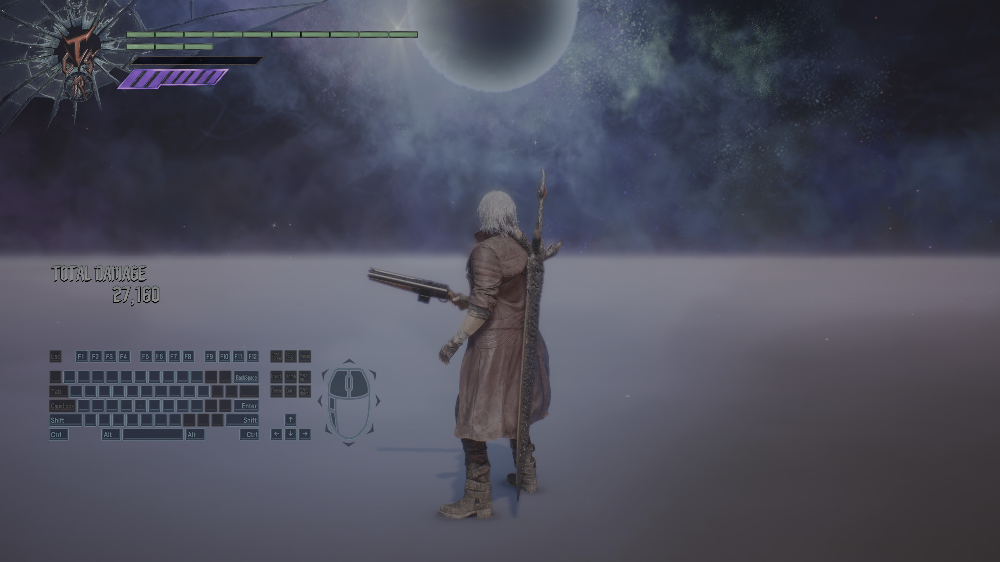
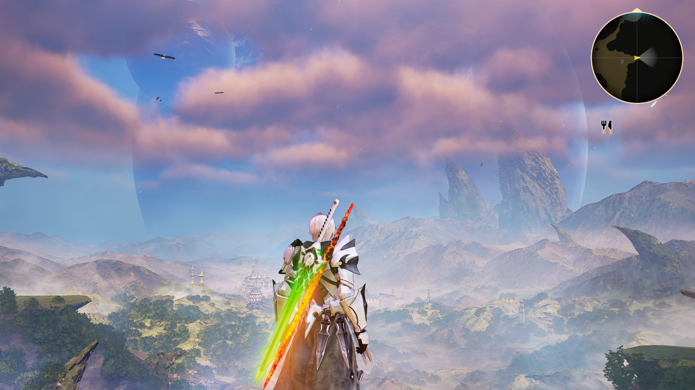
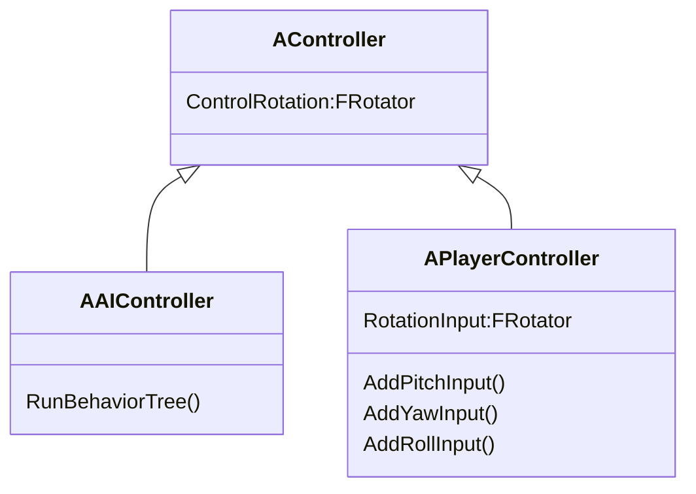

分析现有的第一人称射击游戏可以发现,无论是早期的CS,Half-Life还是最近的使命召唤,战地.基本的操作模式不说有点相像只能说一模一样.玩家角色的面向永远跟随鼠标/控制器的旋转,移动基于视角的面向进行.


<center>泰坦陨落</center>

而第三人称游戏的操作模式又有些变化,从我玩过的大多数游戏来看,角色的面向不一定是视角的面向,移动与第一人称类似,都是基于视角的面向进行移动.


<center>鬼泣5</center>


<center>破晓传说</center>

在大多数游戏需要的移动控制需求都十分类似的情况下,这个功能非常适合在引擎中实现一套功能完善的控制系统,避免游戏开发者重复造轮子,Unreal GamePlay框架实现了一套功能强大的控制系统.

## PlayerController

首先可以看官方文档对PlayerController的解释:

>PlayerController（玩家控制器） 是Pawn和控制它的人类玩家间的接口。PlayerController本质上代表了人类玩家的意愿。当您设置PlayerController时，您需要考虑的一个事情就是您想在PlayerController中包含哪些功能及内容。您可以在 Pawn 中处理所有输入， 尤其是不太复杂的情况下。但是，如果您的需求非常复杂，比如在一个游戏客户端上的多玩家、或实时地动态修改角色的功能，那么最好在PlayerController中处理输入。在这种情况中，PlayerController决定要干什么，然后将命令（比如"开始蹲伏"、"跳跃"）发布给Pawn。

与PlayerController相对的是AIController,两者都继承自Controller.



AIController提供行为树管理AI控制的Pawn,PlayerController则接受输入控制玩家角色Pawn.

PlayerContoller中成员方法众多,这里我们只关注ControlRotaion这个成员.

## ActorRotation与ControlRotation

ActorRotaion容易理解,无论是在第一人称还是第三人称的游戏中,玩家的角色总是会有一个面向,这个面向在Unreal中被称为ActorRotaion.


图中箭头指向的方向可以用来标记这个朝向.

ControlRotation的含义是什么呢?实际上就是视角的面向,第三人称中玩家角色的面向与视角的面向在大部分时候并不一致,玩家可以自由控制视角的面向,我可以只转动视角让角色正对着屏幕,也能让角色背对屏幕,这个过程实际上就是改变了ControlRotation,并且让相机POV根据新的ControlRotation进行位置和旋转面向的调整:


图中的红线方向是角色的面向,蓝线则是转动视角时视角的面向,实现的逻辑如下:


## ControlRotation更新逻辑

ControlRotation接受玩家输入的接口是

- APlayerController::AddPitchInput(float val)
- APlayerController::AddYawInput(float val)
- APlayerController::AddRollInput(float val)
  
大部分游戏只需要考虑Pitch和Yaw的输入,用鼠标作为输入为例,Pitch对应上下瞄准,Yaw对应左右瞄准,同理可以推及手柄(右摇杆上下左右移动)/手机屏幕(上下左右划屏幕).

在ACharacter::SetupPlayerInputComponent的执行过程中可以对输入设备的输入进行回调函数绑定.

```cpp

void AACTCharacter::SetupPlayerInputComponent(UInputComponent* PlayerInputComponent)
{
	Super::SetupPlayerInputComponent(PlayerInputComponent);
	PlayerInputComponent->BindAxis(TEXT("Turn"), this, &ACharacter::AddControllerYawInput);
	PlayerInputComponent->BindAxis(TEXT("LookUp"), this, &ACharacter::AddControllerPitchInput);
}

void APlayerController::AddYawInput(float Val)
{
	RotationInput.Yaw += !IsLookInputIgnored() ? Val : 0;
}
```

在接受到输入后ControlRotation并不会立刻更新,而是等待PlayerController的Tick调用,结束后会将RotationInput中累积的数据清空.
```cpp
void APlayerController::UpdateRotation( float DeltaTime )
{
	// Calculate Delta to be applied on ViewRotation
	FRotator DeltaRot(RotationInput);

	FRotator ViewRotation = GetControlRotation();

	if (PlayerCameraManager)
	{
		PlayerCameraManager->ProcessViewRotation(DeltaTime, ViewRotation, DeltaRot);
	}
    ...
	SetControlRotation(ViewRotation);
    ...
}
```

## Update Camera By ControlRotation

在分析相机的文章中有提到过SpringArmComponent,在Camera Settings的栏位中有UsePawnControlRotation,Inherit Pitch,Inherit Yaw,Inherit Roll四个属性,勾选这些选项后,子节点的相机就能根据鼠标的转动调整位置和朝向,为PlayerCameraManager提供合适的POV.


这些选项体现在代码中就是

```cpp
FRotator USpringArmComponent::GetTargetRotation() const
{
	FRotator DesiredRot = GetDesiredRotation();
	if (bUsePawnControlRotation)
		DesiredRot = PawnViewRotation;
	const FRotator LocalRelativeRotation = GetRelativeRotation();
	if (!bInheritPitch)
		DesiredRot.Pitch = LocalRelativeRotation.Pitch;
	if (!bInheritYaw)
		DesiredRot.Yaw = LocalRelativeRotation.Yaw;
	if (!bInheritRoll)
		DesiredRot.Roll = LocalRelativeRotation.Roll;
	return DesiredRot;
}

void USpringArmComponent::UpdateDesiredArmLocation(bool bDoTrace, bool bDoLocationLag, bool bDoRotationLag, float DeltaTime)
{
    FRotator DesiredRot = GetTargetRotation();
    ...
    // Now offset camera position back along our rotation
	DesiredLoc -= DesiredRot.Vector() * TargetArmLength;
	// Add socket offset in local space
	DesiredLoc += FRotationMatrix(DesiredRot).TransformVector(SocketOffset);
    FVector ResultLoc = DesiredLoc;
    / Form a transform for new world transform for camera
	FTransform WorldCamTM(DesiredRot, ResultLoc);
	// Convert to relative to component
	FTransform RelCamTM = WorldCamTM.GetRelativeTransform(GetComponentTransform());
	// Update socket location/rotation
	RelativeSocketLocation = RelCamTM.GetLocation();
	RelativeSocketRotation = RelCamTM.GetRotation();
	UpdateChildTransforms();
}
```

总结起来就是

相机的位置 = 父节点位置 - ControlRotation * 弹簧臂长

相机旋转 = ControlRotation

## CharacterMovement By ControlRotation

