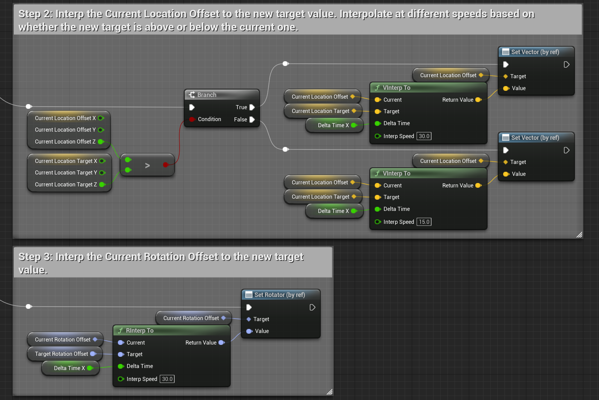
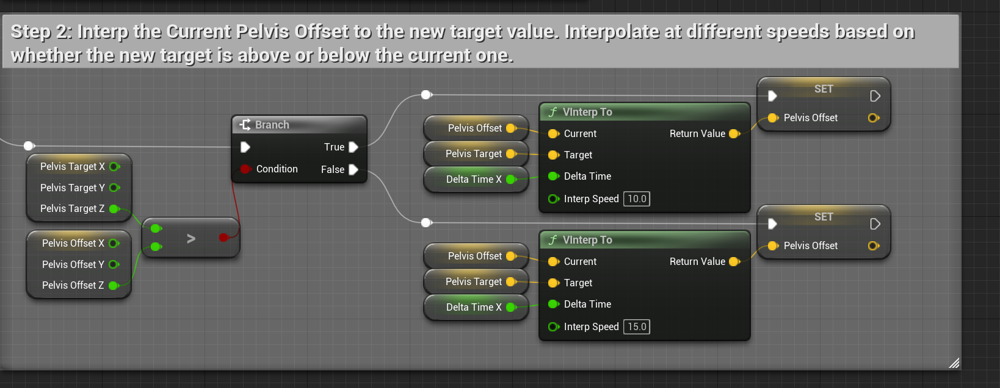
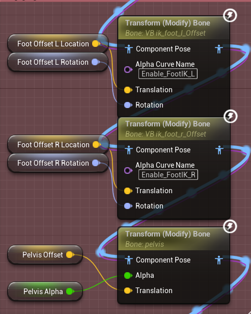
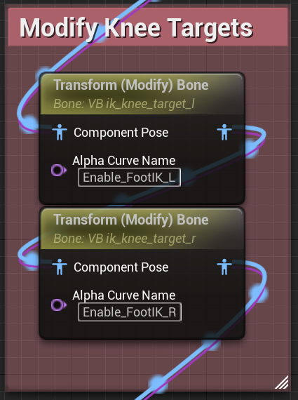
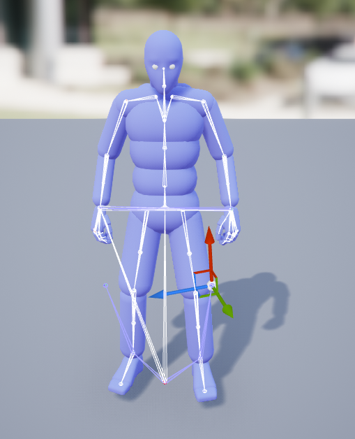
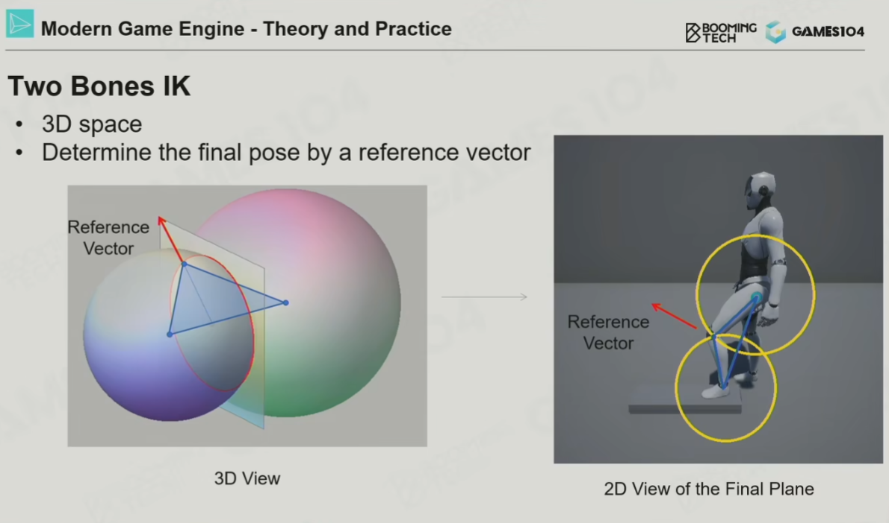
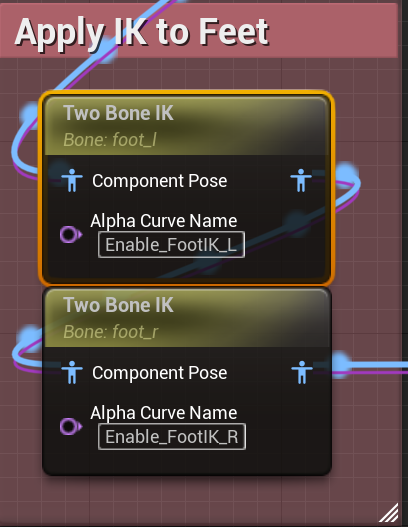
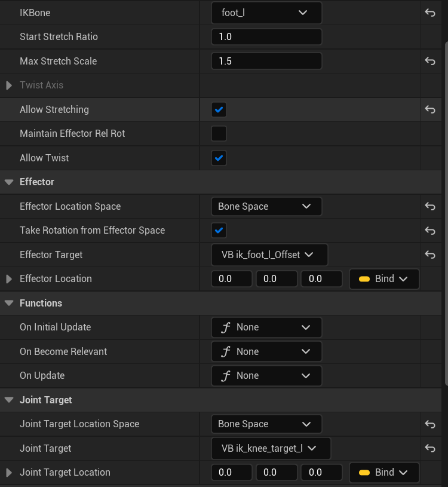
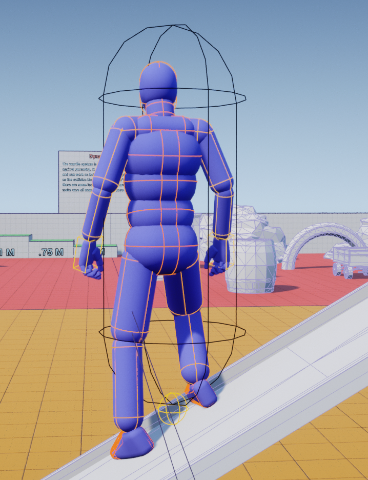

从UE的插件Advanced Locomotion System分析一下腿部IK的实现.

## Virtual Bone

在骨骼树上可以新增Virtual Bone跟随骨骼树上的指定骨骼变换位置旋转缩放:


ALS的骨骼树在左右脚的骨骼末端添加了ik_foot_l_Offset,ik_foot_r_Offset分别跟随SkeletonTree的Foot_L,Foot_R运动,设置腿部IK时会检测腿部与地面的碰撞修正这两个虚拟骨骼的位置.


## 计算偏移

进行脚部IK需要进行检测脚底是否有可以接触的地面,如果人物站立的地方是斜面,需要根据斜面的角度调整一些骨骼的位置,这个逻辑在ALS的动画蓝图的SetFootOffsets函数中,核心在于计算骨骼需要移动的向量:


如图所示,角色站在斜面上,以左脚的检测为例,从左脚所在的位置往上一段距离作为检测起点,往下一段距离作为检测终点,进行射线检测:


如果检测到了地面,那么需要计算Foot_L实际需要在的位置和偏移向量(图中红色虚线):

```cpp
Foot_L_ShouldBePosition = TraceHit+HitNormal*FootHeight;
FootOffset_L_Target = Foot_L_ShouldBePosition-Foot_L_Position;
```

还需要根据碰撞点的法线计算骨骼旋转:


```cpp
targetRotator = MakeRoatator(arctan(hitNormal.y/hitNormal.z),-arctan(hitNormal.x/hitNormal.z),0);
```

计算完毕后并不会直接使用这两个目标偏移和旋转,而是插值到这个目标值,插值偏移时还会根据当前数值和目标数值的z值大小不同进行不同速度的插值:



除了脚部的骨骼需要偏移之外,整个骨架其实也是要往下移动的.ALS中的实现方式是移动SkeletonTree的Pelvis节点,这个移动向量取FootOffset_L_Target,FootOffset_R_Target中z值更小的向量(站在斜坡上,重心往下移).

```cpp
PelvisTarget = FootOffset_L_Target.z<FootOffset_R_Target.z? FootOffset_L_Target:FootOffset_R_Target;
```

当然这个PelvisTarget也是需要渐变插值来使用:



## TwoBoneIK

在EventGraph中计算好了需要的数值后,接下来就是在AnimGraph中使用这些数值来进行骨骼变换和IK了.这个逻辑在BaseLayer的FootIK中.

首先是把左右脚的Virtual Bone(ik_foot_l_Offset,ik_foot_r_Offset)偏移到正确的位置,再向下移动Pelvis骨骼:



然后是向外偏移跟随calf骨骼运动的虚拟骨骼(ik_knee_target_l,ik_knee_target_r),提供极向量:

|
---|---

极向量的作用是为两球求交的TwoBoneIK问题提供一个唯一解,可以参考[Games104](https://www.bilibili.com/video/BV1pY411F7pA?t=2919.5)中IK与动画的课程:



最后就是使用TwoBoneIK节点进行实际的IK求解了,IKBone是需要求解的目标骨骼,这里是(foot_l,foot_r),Effector提供骨骼目标位置(ik_foot_l_Offset,ik_foot_r_Offset),JointTarget则提供目标极向量(ik_knee_target_l,ik_knee_target_r).:

|
---|---

最终效果:

