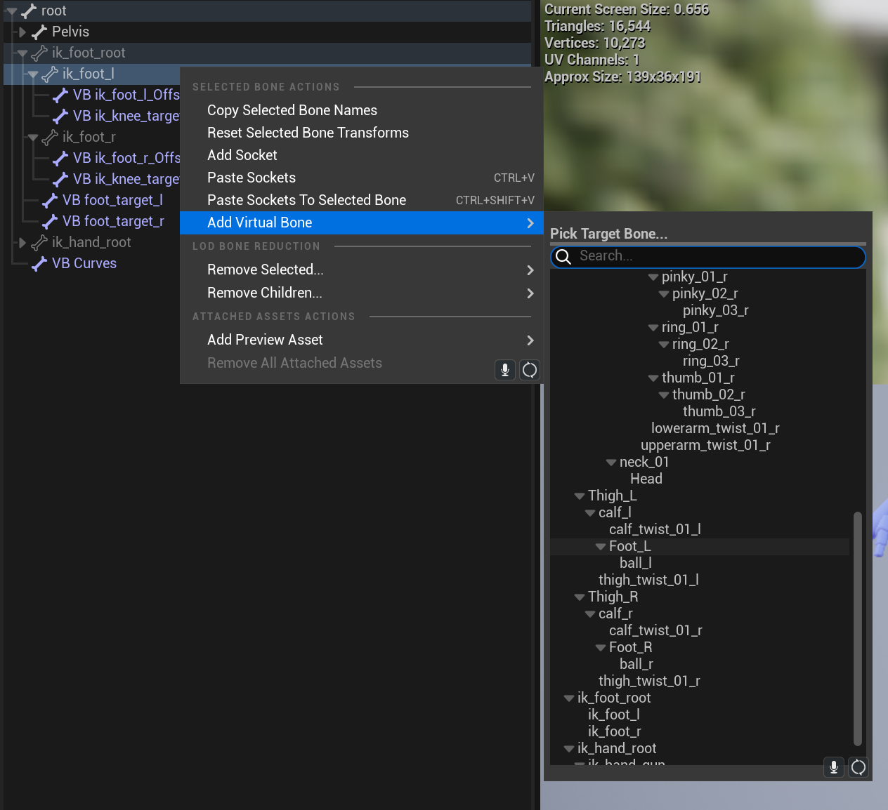
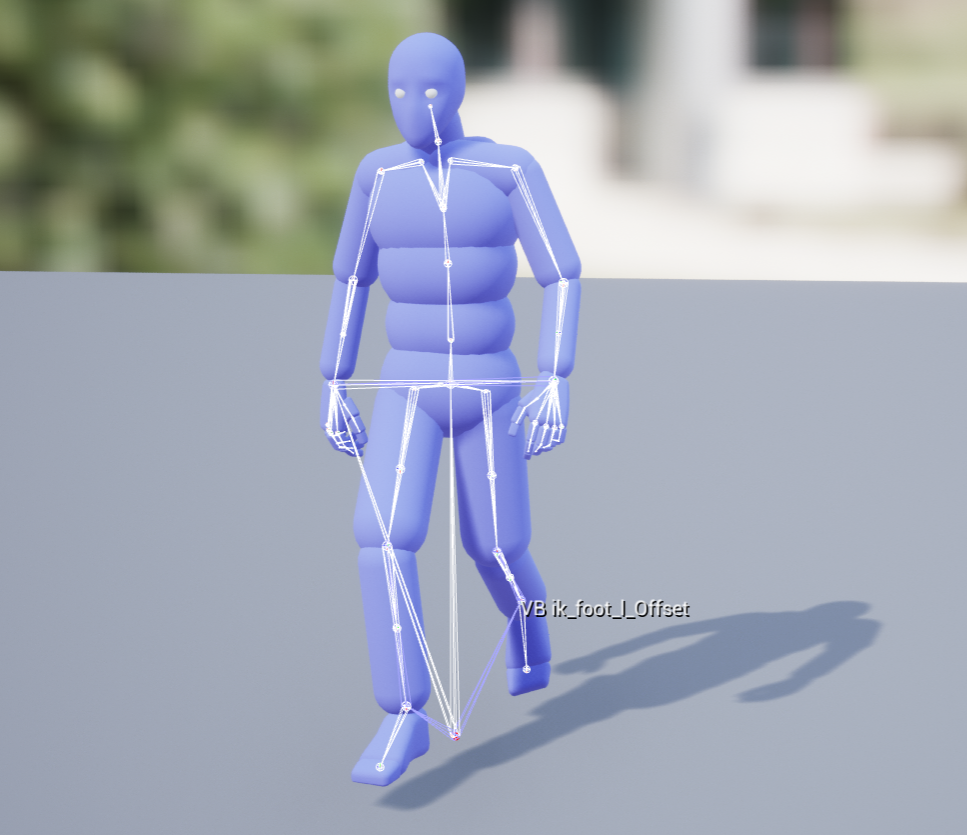
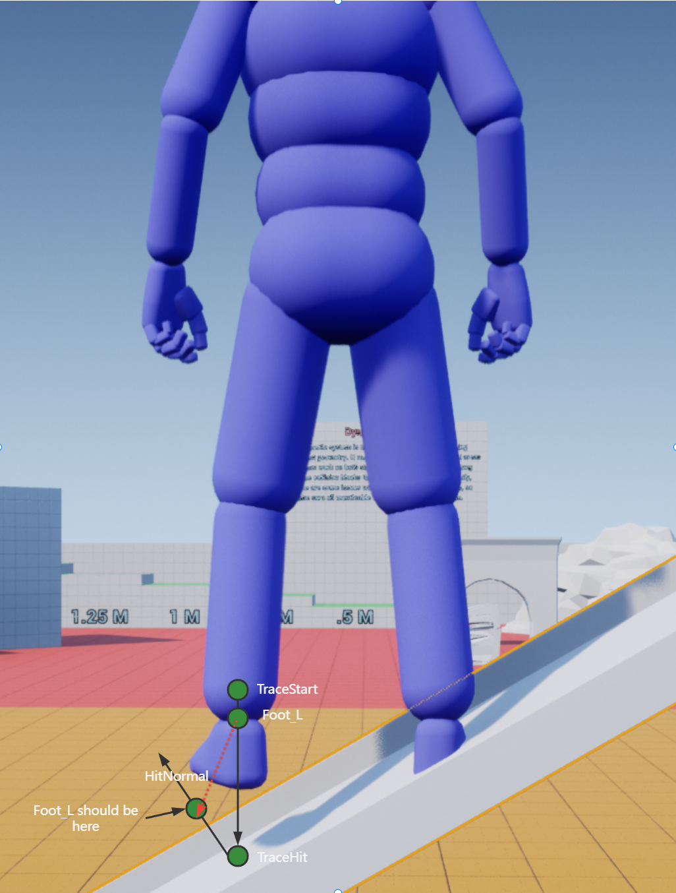
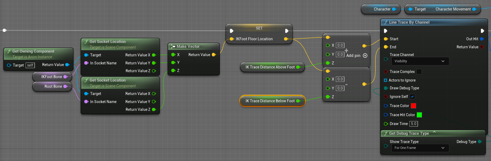
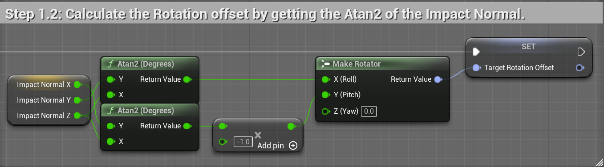

从UE的插件Advanced Locomotion System分析一下腿部IK的实现.

## Virtual Bone

在骨骼树上可以新增Virtual Bone跟随骨骼树上的指定骨骼变换位置旋转缩放:





ALS的骨骼树在左右脚的骨骼末端添加了ik_foot_l_Offset,ik_foot_r_Offset分别跟随SkeletonTree的Foot_L,Foot_R运动,设置腿部IK时会检测腿部与地面的碰撞修正这两个虚拟骨骼的位置.


## 地面检测

进行脚部IK首先需要进行检测脚底是否有可以接触的地面,如果人物站立的地方是斜面,需要根据斜面的角度调整一些骨骼的位置,这个逻辑在ALS的动画蓝图的SetFootOffsets函数中,最核心的逻辑就是计算需要骨骼需要移动的向量:




如图所示,角色站在斜面上,以左脚的检测为例,从左脚所在的位置往上一段距离作为检测起点,往下一段距离作为检测终点,进行射线检测:



如果检测到了地面,那么需要计算Foot_L实际需要在的位置和偏移向量(图中红色虚线):

```cpp
Foot_L_ShouldBePosition = TraceHit+HitNormal*FootHeight;
Foot_L_TargetOffset = Foot_L_ShouldBePosition-Foot_L_Position;
```

还需要根据碰撞点的法线计算骨骼旋转:

