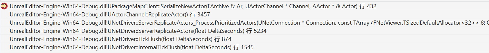
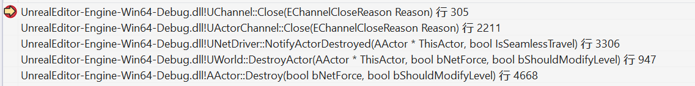
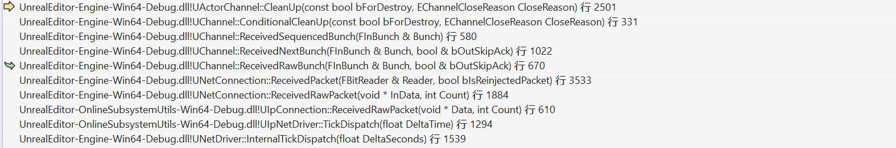

# UE Actor Replication 

## 两种类型UObject

静态:能直接从资源包中加载,如制作好的map,blueprint,CDO,客户端与DS都能通过一个路径或者索引到对应的静态资源
动态:运行时动态生成的UObject.

```cpp
bool FNetGUIDCache::IsDynamicObject( const UObject* Object )
{
	// Any non net addressable object is dynamic
	return !Object->IsFullNameStableForNetworking();
}
bool UObject::IsNameStableForNetworking() const
{
	return HasAnyFlags(RF_WasLoaded | RF_DefaultSubObject | RF_ClassDefaultObject) || IsNative() || IsDefaultSubobject();
}
```

在NetGuid中也有对两种类型的区分,静态为奇数,动态资源为偶数.

```cpp
//NetworkGuid.h
bool IsDynamic() const
{
	return Value > 0 && !(Value & 1);
}

bool IsStatic() const
{
	return Value & 1;
}
```

只考虑单纯的Actor(无动态ActorComponent,无指针),同步创建的思路可以描述为:

- 静态资源直接发送NetGUID对应的资源路径到客户端,客户端维护一个与DS一致的NetGUID到静态资源UObject的字典.
- 动态Spawn的Actor,发送DS上的生成的NetGUID与archetype(对应的静态资源)NetGUID以及生成所需的Transform,客户端接受后便能根据这些信息创建出一样的Actor.

## DS ReplicateActor



关键函数是UPackageMapClient::SerializeNewActor
```cpp
bool UPackageMapClient::SerializeNewActor(FArchive& Ar, class UActorChannel *Channel, class AActor*& Actor)
{
    //OutBunch中序列化Actor
    FNetworkGUID NetGUID;
    UObject *NewObj = Actor;
    SerializeObject(Ar, AActor::StaticClass(), NewObj, &NetGUID);
    ...
}
```

序列化时会先将UObject序列化到OutBunch,如果是静态UObject,在序列化Object时需要执行ExportNetGUID.

```cpp
bool UPackageMapClient::SerializeObject( FArchive& Ar, UClass* Class, UObject*& Object, FNetworkGUID *OutNetGUID)
{
    if (Ar.IsSaving())
    {
        InternalWriteObject( Ar, NetGUID, Object, TEXT( "" ), NULL );
        if (!NetGUID.IsDefault() && ShouldSendFullPath(Object, NetGUID))
        {
            ExportNetGUID( NetGUID, Object, TEXT(""), NULL );
        }
    }
    ...
}
```

ExportNetGUID会将静态资源的NetGUID,ExportFlags.bHasPath,ObjectPathName,NetworkChecksum等信息写入CurrentExportBunch:
```cpp
bool UPackageMapClient::ExportNetGUID( FNetworkGUID NetGUID, UObject* Object, FString PathName, UObject* ObjOuter )
{
    ...
    GuidCache->IsExportingNetGUIDBunch = true;
	InternalWriteObject( *CurrentExportBunch, NetGUID, Object, PathName, ObjOuter );
	GuidCache->IsExportingNetGUIDBunch = false;
    ...
}

void UPackageMapClient::InternalWriteObject(FArchive & Ar, FNetworkGUID NetGUID, UObject* Object, FString ObjectPathName, UObject* ObjectOuter)
{
    ...
    Ar << NetGUID;
    Ar << ExportFlags.Value;
    Ar << ObjectPathName;
    Ar << NetworkChecksum;
}
```

如果是动态UObject就会序列化生成UObject需要的GetArchetype,Level,Transform等信息.

```cpp
bool UPackageMapClient::SerializeNewActor(FArchive& Ar, class UActorChannel *Channel, class AActor*& Actor)
{
    ...
    FNetworkGUID NetGUID;
    UObject *NewObj = Actor;
    SerializeObject(Ar, AActor::StaticClass(), NewObj, &NetGUID);
    if ( NetGUID.IsDynamic() )
    {
        SerializeObject(Ar, UObject::StaticClass(), Archetype, &ArchetypeNetGUID);
        SerializeObject(Ar, ULevel::StaticClass(), ActorLevel);
        ConditionallySerializeQuantizedVector(Location, FVector::ZeroVector, GbQuantizeActorLocationOnSpawn, bSerializeLocation);
        ConditionallySerializeQuantizedVector(Scale, FVector::OneVector, GbQuantizeActorScaleOnSpawn, bSerializeScale);
        ConditionallySerializeQuantizedVector(Velocity, FVector::ZeroVector, GbQuantizeActorVelocityOnSpawn, bSerializeVelocity);
    }
}
```


## 客户端从DS同步Actor过程


NetConnection:ReceivedPacket,判断是否有已有Channel,没有的话需要创建

```cpp
Channel = CreateChannelByName( Bunch.ChName, EChannelCreateFlags::None, Bunch.ChIndex );
```

创建后使用此Channel读取和处理Bunch.

```cpp
Channel->ReceivedRawBunch(Bunch, bLocalSkipAck);
void UChannel::ReceivedRawBunch( FInBunch & Bunch, bool & bOutSkipAck )
{
    if ( Bunch.bHasPackageMapExports && !Connection->IsInternalAck() )
    {
        Cast<UPackageMapClient>( Connection->PackageMap )->ReceiveNetGUIDBunch( Bunch );
    }
}
```

如果Bunch中有NetGUID相关数据,首先会处理NetGUID,创建NetGUID到CachedObject的Map:
```cpp
void UPackageMapClient::ReceiveNetGUIDBunch( FInBunch &InBunch )
{
    ...
    while( NumGUIDsRead < NumGUIDsInBunch )
    {
        const FNetworkGUID LoadedGUID = InternalLoadObject( InBunch, Obj, 0 );
        NumGUIDsRead++;
    }
}
```

服务器序列化UObject的函数SerializeObject向OutBunch写入NetGUID,ExportFlags,OuterObj,ObjectName等数据,InternalLoadObject实际上就是反过来从InBunch中读取的过程:
```cpp
FNetworkGUID UPackageMapClient::InternalLoadObject( FArchive & Ar, UObject *& Object, const int32 InternalLoadObjectRecursionCount )
{
    FNetworkGUID NetGUID;
    Ar << NetGUID;
    f ( NetGUID.IsDefault() || GuidCache->IsExportingNetGUIDBunch )
	{
		Ar << ExportFlags.Value;
    }
    if ( ExportFlags.bHasPath )
    {
        FNetworkGUID OuterGUID = InternalLoadObject( Ar, ObjOuter, InternalLoadObjectRecursionCount + 1 );
        Ar << ObjectName;
        Ar << NetworkChecksum;
    }
    ...
    GuidCache->RegisterNetGUIDFromPath_Client( NetGUID, ObjectName, OuterGUID, NetworkChecksum, ExportFlags.bNoLoad, bIgnoreWhenMissing );
    Object = GuidCache->GetObjectFromNetGUID( NetGUID, GuidCache->IsExportingNetGUIDBunch );
}
```

读取成功注册到Cahce中方便使用.
```cpp
void FNetGUIDCache::RegisterNetGUIDFromPath_Client( const FNetworkGUID& NetGUID, const FString& PathName, const FNetworkGUID& OuterGUID, const uint32 NetworkChecksum, const bool bNoLoad, const bool bIgnoreWhenMissing )
{
    ...
    FNetGuidCacheObject CacheObject;
    CacheObject.PathName			= FName( *PathName );
    CacheObject.OuterGUID			= OuterGUID;
    CacheObject.NetworkChecksum		= NetworkChecksum;
    CacheObject.bNoLoad				= bNoLoad;
    CacheObject.bIgnoreWhenMissing	= bIgnoreWhenMissing;
    RegisterNetGUID_Internal( NetGUID, CacheObject );
}
```

GetObjectFromNetGUID会依次查找UPackageMapClient.ObjectLookup,全局UObject,磁盘加载,来找到对应的UObject.
UPackage,CDO这种静态资源(NetGUID.IsStatic()),GetObjectFromNetGUID会直接得到对应的UObject.
如果是动态创建的,那么就需要后续的SerializeNewActor,SerializeObject才会赋值.
```cpp
UObject* FNetGUIDCache::GetObjectFromNetGUID( const FNetworkGUID& NetGUID, const bool bIgnoreMustBeMapped )
{
    UObject* Object = CacheObjectPtr->Object.Get();
    if ( Object != NULL )
    {
        return Object;
    }
    // See if this object is in memory
    Object = FindObjectFast<UObject>(ObjOuter, CacheObjectPtr->PathName);
    //Load From package
    ...
    CacheObjectPtr->Object = Object;
    return Object;
}
```

整批Bunch都读到可以提交时,会判断ActorChannel对应的Actor是否存在,如果不存在需要SerializeNewActor
```cpp
UActorChannel::ProcessBunch(FInBunch & Bunch)
{
    if( Actor == NULL )
    {
        AActor* NewChannelActor = NULL;
        bSpawnedNewActor = Connection->PackageMap->SerializeNewActor(Bunch, this, NewChannelActor);
    }
}
```

SerializeNewActor会从Bunch中依次读取Actor的NetGUID,ArchetypeNetGUID,Location,Scale,Velocity,从World中Spawn后再注册到GuidCache中,其实也就是DS上调用SerializeNewActor的反序列化:

```cpp
//Ar就是InBunch
bool UPackageMapClient::SerializeNewActor(FArchive& Ar, class UActorChannel *Channel, class AActor*& Actor)
{
    FNetworkGUID NetGUID;
    UObject *NewObj = Actor;
    SerializeObject(Ar, AActor::StaticClass(), NewObj, &NetGUID);
    if ( NetGUID.IsDynamic() )
    {
        UObject* Archetype = nullptr;
        UObject* ActorLevel = nullptr;
        FNetworkGUID ArchetypeNetGUID;
        SerializeObject(Ar, UObject::StaticClass(), Archetype, &ArchetypeNetGUID);
        ConditionallySerializeQuantizedVector(Location, FVector::ZeroVector, GbQuantizeActorLocationOnSpawn, bSerializeLocation);
        ConditionallySerializeQuantizedVector(Scale, FVector::OneVector, GbQuantizeActorScaleOnSpawn, bSerializeScale);
        ConditionallySerializeQuantizedVector(Velocity, FVector::ZeroVector, GbQuantizeActorVelocityOnSpawn, bSerializeVelocity);
        // Spawn actor if necessary (we may have already found it if it was dormant)
        if ( Actor == NULL )
        {
	        if ( Archetype )
	        {
                ...
                Actor = World->SpawnActorAbsolute(Archetype->GetClass(), FTransform(Rotation, SpawnLocation), SpawnInfo);
                GuidCache->RegisterNetGUID_Client(NetGUID, Actor);
            }
        }
    }
}
```

动态生成的NetGUID会在RegisterNetGUID_Client最终将Object指针赋值.

```cpp
void FNetGUIDCache::RegisterNetGUID_Client( const FNetworkGUID& NetGUID, const UObject* Object )
{
    ...
    FNetGuidCacheObject CacheObject;
    CacheObject.Object = MakeWeakObjectPtr(const_cast<UObject*>(Object));
    RegisterNetGUID_Internal( NetGUID, CacheObject );
}
```


## 销毁过程

这里描述普通情况(非NetDormancy,StreamLevel,ReplicationGraph),也就是DS上Actor销毁了,通知客户端同步销毁.

- UWorld销毁Actor时通知NetDriver.
- 如果NetDriver判断该Actor在当前NetDriver上同步
- 遍历NetDriver上对所有的Connection,找到对应的ActorChannel,在此Channel上发送CloseBunch.

服务器销毁:



客户端销毁:

