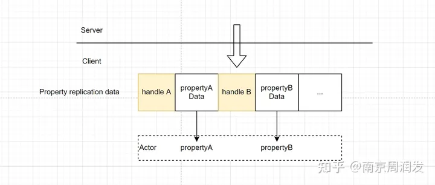

# UE 属性同步

在ActorChannel将Actor序列化后,或者每次NetDriver的TickFlush,下一部分就是就是属性同步,对Actor的本体,以及Actor上的ActorComponent,Channel会依次调用ObjectReplicator::ReplicateProperties,将属性同步的内容写入OutBunch.


## FObjectReplicator

初始化过程:


几个关键属性:


- ChangelistMgr 属性对比的关键结构,所有连接共享UObject的ChangeListMgr,在NetDriver这一层有缓存TMap< UObject*, FReplicationChangelistMgrWrapper >	ReplicationChangeListMap;
- RepLayout 描述UObject同步变量的内存布局,每个类对应一个.
- RepState 维护发送状态,Repliactor独有

### ReplicationChangelistMgr

ReplicationChangelistMgr是属性对比的关键类,结构如下:


属性对比过程就是在填充ChangeHistory:

```cpp
ERepLayoutResult FRepLayout::CompareProperties(
	FSendingRepState* RESTRICT RepState,
	FRepChangelistState* RESTRICT RepChangelistState,
	const FConstRepObjectDataBuffer Data,
	const FReplicationFlags& RepFlags) const
{
    RepChangelistState->CompareIndex++;
    FRepChangedHistory& NewHistoryItem = RepChangelistState->ChangeHistory[HistoryIndex];
    TArray<uint16>& Changed = NewHistoryItem.Changed;

    ...
    //属性对比
    CompareParentProperties(SharedParams, StackParams);

    // Move end pointer
    RepChangelistState->HistoryEnd++;
}
```


### RepLayout

Unreal为每个需要同步的类生成RepLayout,主要描述了所有需要同步的属性,关键的是两个结构

```cpp
/** Top level Layout Commands. */
TArray<FRepParentCmd> Parents;
/** All Layout Commands. */
TArray<FRepLayoutCmd> Cmds;
```

RepParentCmd数组为最顶层的成员,RepLayoutCmd则是将属性完全展开扁平化后的结果.

- 如果需要同步的变量都是基础类型,那么RepParantCmd的数量与RepLayoutCmd的数量其实是一致的.
- 如果需要同步的变量有结构体,或者动态数组,那么RepParentCmd需要对这些变量生成变化RepLayoutCmd.


### RepState

RepState主要用于维护发送/接受状态.
```cpp
class FRepState : public FNoncopyable
{
    /** May be null on connections that don't receive properties. */
    TUniquePtr<FReceivingRepState> ReceivingRepState;

    /** May be null on connections that don't send properties. */
    TUniquePtr<FSendingRepState> SendingRepState;
}

class FSendingRepState : public FNoncopyable
{
    /** Index in the buffer where changelist history starts (i.e., the Oldest changelist). */
    int32 HistoryStart;
    /** Index in the buffer where changelist history ends (i.e., the Newest changelist). */
    int32 HistoryEnd;
    /** Circular buffer of changelists. */
    FRepChangedHistory ChangeHistory[MAX_CHANGE_HISTORY];
    /**
    * The last change list history item we replicated from FRepChangelistState.
    * (If we are caught up to FRepChangelistState::HistoryEnd, there are no new changelists to replicate).
    */
    int32 LastChangelistIndex;
}
```

FSendingRepState的结构看起来与FRepChangelistState有相似的地方,都是用一个环形队列来维护FRepChangedHistory,不过两者的作用并不相同.

FSendingRepState.LastChangelistIndex记录了最近从FRepChangelistState.Changelist中同步Changed的下标，而FRepChangelistState.HistoryEnd记录了Changelist中最新Changed下标。

因此```[FSendingRepState.LastChangelistIndex,FRepChangelistState.HistoryEnd)```就是这次需要发送的新产生Changed。

```cpp
bool FRepLayout::ReplicateProperties(...) const
{
    ...
    // Gather all change lists that are new since we last looked, and merge them all together into a single CL
    for (int32 i = RepState->LastChangelistIndex; i < RepChangelistState->HistoryEnd; ++i)
    {
    	const int32 HistoryIndex = i % FRepChangelistState::MAX_CHANGE_HISTORY;
    	FRepChangedHistory& HistoryItem = RepChangelistState->ChangeHistory[HistoryIndex];
    	TArray<uint16> Temp = MoveTemp(Changed);
    	MergeChangeList(Data, HistoryItem.Changed, Temp, Changed);
    }
    RepState->LastChangelistIndex = RepChangelistState->HistoryEnd;
}
```

当收集要发送的Changed后，会把它们存储于FSendingRepState.ChangeHistory中。


为什么要存下来呢?一个作用是为了属性同步丢包时,将丢包的Handle合并到最新的Changed发送:

```cpp
void FRepLayout::UpdateChangelistHistory(
	FSendingRepState* RepState,
	UClass* ObjectClass,
	const FConstRepObjectDataBuffer Data,
	UNetConnection* Connection,
	TArray<uint16>* OutMerged) const
{
    ...
    for (int32 i = RepState->HistoryStart; i < RepState->HistoryEnd; i++)
    {
    	const int32 HistoryIndex = i % FSendingRepState::MAX_CHANGE_HISTORY;
    	FRepChangedHistory& HistoryItem = RepState->ChangeHistory[HistoryIndex];
        if (HistoryItem.Resend || bDumpHistory)
        {
			// Merge in nak'd change lists
			TArray<uint16> Temp = MoveTemp(*OutMerged);
			MergeChangeList(Data, HistoryItem.Changed, Temp, *OutMerged);
        }
    }
}
```


## 具体实现

Server: CompareProperties_r

### 简单Property

这里的简单Property指基础类型,或者Replicated结构体中的成员.

数据下发Handle+Property序列化后的结果



找到对应的Handle的RepLayoutCmd,用RepLayoutCmd中的Offset找到Property在UObject中的内存偏移,从InBunch中读取反序列化到对应的内存地址中.

### 动态数组

以简单测试的数组为例:

```cpp
USTRUCT(BlueprintType)
struct FFireInfo
{
	GENERATED_USTRUCT_BODY()

	UPROPERTY()
	int32 Index;

	UPROPERTY()
	int32 Num;
};

class AUnrealCppTestCharacter : public ACharacter
{
    UPROPERTY(ReplicatedUsing = OnRep_FireInfo)
    TArray<FFireInfo> FireInfoArray;
}

```

在DS的RPC实现中增加数组第二项的计数:
```cpp
void AUnrealCppTestCharacter::DoFire_Implementation()
{
    if (FireInfoArray.Num() > 1)
    {
  	    ++FireInfoArray[1].Num;
    }
}
```

单次变更了FireInfoArray[1].Num,客户端接受BunchData:


除去UEChracter默认的同步变量,RepParentCmds与Cmds中可以看到这个Property的描述:


以其中一次变更的下发数据为例:


接受Bunch后,先读取Handle:

```cpp

bool FRepLayout::ReceiveProperties(
	UActorChannel* OwningChannel,
	UClass* InObjectClass,
	FReceivingRepState* RESTRICT RepState,
	UObject* Object,
	FNetBitReader& InBunch,
	bool& bOutHasUnmapped,
	bool& bOutGuidsChanged,
	const EReceivePropertiesFlags ReceiveFlags) const
{
    ...
    ReadPropertyHandle(Params);
    ReceiveProperties_r(Params, StackParams);
    ...
}
```
此处读取Handle=47,实际上Handle大部分情况都是Cmds数组的下标+1:


找到对应的Cmd,也就是Cmds[46],判断为动态数组,进入数组的读取逻辑.

```cpp
static bool ReceiveProperties_r(FReceivePropertiesSharedParams& Params, FReceivePropertiesStackParams& StackParams)
{
    for (int32 CmdIndex = StackParams.CmdStart; CmdIndex < StackParams.CmdEnd; ++CmdIndex)
    {
        const FRepLayoutCmd& Cmd = Params.Cmds[CmdIndex];
        ++StackParams.CurrentHandle;
        if(StackParams.CurrentHandle ==  Params.ReadHandle)
        {
            if(ERepLayoutCmdType::DynamicArray == Cmd.Type)
            {
                //定义StackParams CmdIndex + 1到Cmd.EndCmd - 1也就是结构体的成员数量
                //这个例子中结构体有两个元素,所以是[47,49) 左闭右开
                //LocalHandle为4,意思就是LocalHandle=1x2+2,变更数组中index=1的元素中的第二项
                FReceivePropertiesStackParams ArrayStackParams{
    				nullptr,
    				nullptr,
    				nullptr,
    				CmdIndex + 1,
    				Cmd.EndCmd - 1,
    				StackParams.RepNotifies,
    				0 /*ArrayElementOffset*/,
    				0 /*CurrentHandle*/,
    				StackParams.bShadowDataCopied
                };
                //读取数组长度
                uint16 ArrayNum = 0;
                Params.Bunch << ArrayNum;
                //读取LocalHandle 这里是4 
                ReadPropertyHandle(Params);
                const int32 ObjectArrayNum = ObjectArray->Num();
                for (int32 i = 0; i < ObjectArrayNum; ++i)
                {
                    ...
                    //关键函数,对每个成员依次累加 ArrayStackParams.CurrentHandle直到等于4
    	            ReceiveProperties_r(Params, ArrayStackParams)
                    ...
                }
            }
            else
            {
                //将Bunch中的数据反序列化到UObject中对应的位置
                //Cmd.Property->NetSerializeItem(Bunch, Bunch.PackageMap, Data + SwappedCmd);
                ReceivePropertyHelper(...);
            }
        }
    }
}
```
